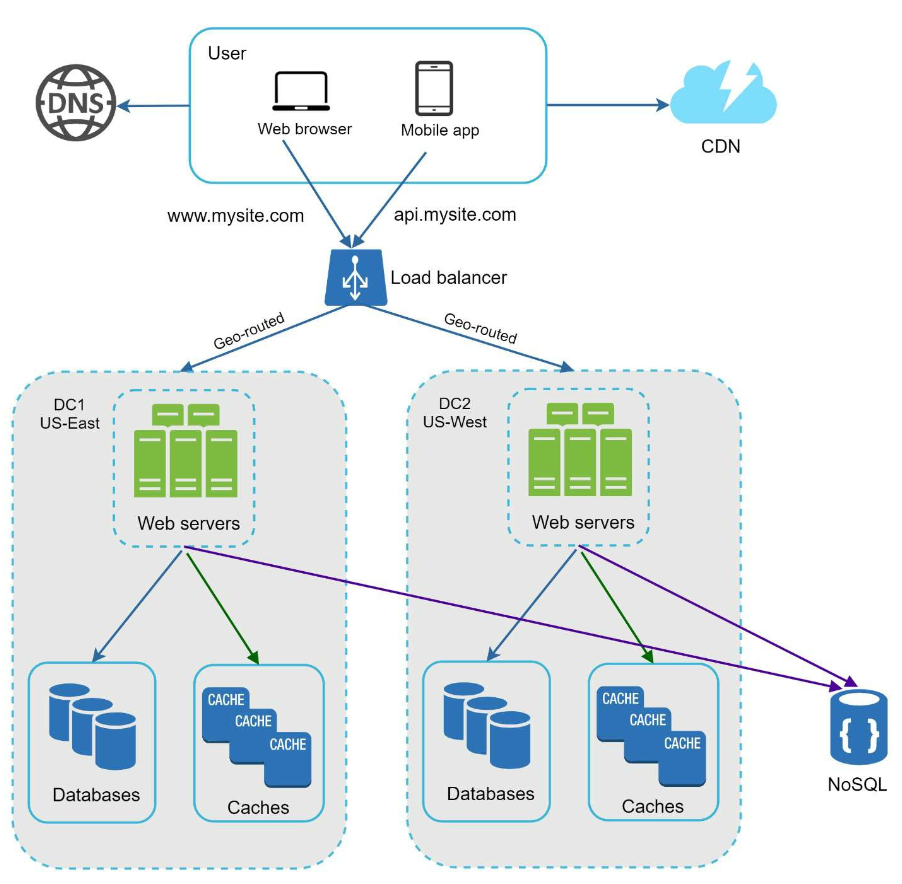
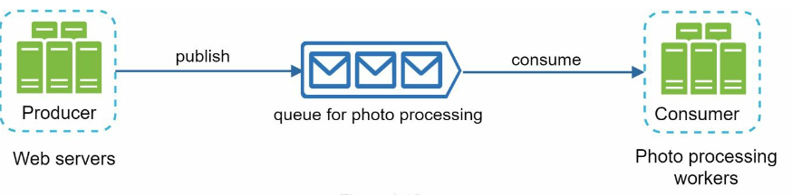

# Глава 1: Масштабирование от нуля до миллионов пользователей

## Введение
Масштабирование системы до миллионов пользователей — сложный итеративный путь, требующий постоянной доработки и оптимизации. В этой главе показано, как начать с одного сервера и шаг за шагом развивать архитектуру, пока она не сможет обслуживать миллионы пользователей.

---

## Раздел 1: Один сервер
На старте все компоненты (веб-приложение, база данных, кеш) работают на одном сервере. 

   

### Путь запроса
1. Пользователи обращаются к приложению по доменному имени (например, `api.mysite.com`), которое разрешается в IP-адрес через DNS.
2. IP-адрес веб-сервера возвращается браузеру или мобильному приложению.
3. HTTP-запросы отправляются на веб-сервер, который возвращает HTML или JSON.

### Источники трафика
1. **Веб-приложения:** серверные языки (например, Python, Java) для бизнес-логики и клиентские (например, JavaScript, HTML) для отображения.
2. **Мобильные приложения:** обмениваются данными с веб-сервером по HTTP, используя JSON как лёгкий формат передачи данных.

---

## Раздел 2: Вынос базы данных
По мере роста числа пользователей базу данных переносят на отдельный сервер, чтобы веб-уровень и уровень данных можно было масштабировать независимо.

   

### Выбор базы данных

1. **Реляционные базы данных (SQL):** структурированные данные, хранящиеся в таблицах. Примеры: MySQL, PostgreSQL.
2. **Нереляционные базы данных (NoSQL):** подходят для неструктурированных данных или когда требуется низкая задержка. Основные категории:
   - Хранилища «ключ — значение»
   - Графовые базы данных
   - Колоночные хранилища
   - Документные хранилища

- Нереляционная база может оказаться правильным выбором, если:
   - приложению нужна сверхнизкая задержка;
   - данные неструктурированы или между ними нет реляционных связей;
   - нужно лишь сериализовать и десериализовать данные (JSON, XML, YAML и т. д.);
   - требуется хранить огромные объёмы данных.

---

## Раздел 3: Вертикальное и горизонтальное масштабирование
### Вертикальное масштабирование
- Добавление ресурсов (CPU, RAM) существующим серверам.
- Ограничено возможностями железа и не даёт резервирования.

### Горизонтальное масштабирование
- Добавление новых серверов в пул — лучше подходит для крупных систем.
- Для маршрутизации запросов между серверами используется балансировщик нагрузки.
---

## Раздел 4: Балансировщик нагрузки

   

**Балансировщик нагрузки** (load balancer) распределяет трафик между несколькими серверами. Преимущества:
1. Резервирование: если сервер выходит из строя, трафик перенаправляется.
   -  Если сервер 1 недоступен, весь трафик пойдёт на сервер 2.
2. Масштабируемость: серверы легко добавлять при всплесках трафика.
   -  Если трафик сайта быстро растёт, для его обработки можно добавлять новые серверы.

---

## Раздел 5: Репликация базы данных

   

### Модель master-slave
- **Master-база (ведущая):** обрабатывает операции записи.
   - Все команды, изменяющие данные (insert, delete, update), должны направляться в master-базу.
- **Slave-базы (ведомые):** обрабатывают операции чтения, повышая производительность и надёжность.
   - Поскольку в большинстве приложений чтений гораздо больше, чем записей, число slave-баз
в системе обычно превышает число master-баз.

### Преимущества
1. Рост производительности за счёт параллельного чтения.
2. Высокая доступность и сохранность данных благодаря резервированию.

### Обработка отказов
- Если slave-база всего одна и она выходит из строя, операции чтения временно направляются
в master-базу.
- Если slave-баз несколько, чтение перенаправляется
на другие работающие slave-базы, а на место вышедшей из строя поднимается новый сервер. 
-  Если выходит из строя master-база, одна из slave-баз повышается до нового
master.
- В боевой системе выбранная slave-база может содержать не самые свежие данные, поэтому их приходится
восстанавливать скриптами (помочь могут схемы вроде multi-master или циклической репликации).

---

## Раздел 6: Кеширование
**Кеш** хранит часто запрашиваемые данные в памяти, снижая нагрузку на базу данных. Уровень кеша — это временное хранилище, работающее гораздо быстрее базы данных. 

   

### На что обратить внимание при кешировании
1. **Сценарий использования**: кеш имеет смысл, когда данные читаются часто, а изменяются редко.
2. **Политика устаревания:** по истечении срока жизни данные удаляются из кеша. Если политики устаревания нет,
данные останутся в памяти навсегда.
3. **Согласованность:** хранилище данных и кеш должны быть синхронизированы. Рассогласование
возможно потому, что изменение данных в хранилище и в кеше не выполняется в одной транзакции. 
4. **Устойчивость к отказам**: единственный сервер кеша — потенциальная единая точка отказа (SPOF), поэтому рекомендуется
разворачивать несколько серверов кеша в разных дата-центрах.
5. **Политика вытеснения:**: когда кеш заполнен, часть элементов приходится вытеснять, чтобы освободить память. Самая популярная политика вытеснения — LRU.

---

## Раздел 7: Сеть доставки контента (CDN)
**CDN** ускоряет загрузку, кешируя статический контент (изображения, CSS, JavaScript) на географически распределённых серверах.

   

### Как это работает
1. Пользователь запрашивает контент у ближайшего CDN-сервера.
2. Если контента там нет, он забирается с исходного сервера (origin) и кешируется.

### На что обратить внимание при использовании CDN
1. **Стоимость:** CDN обслуживаются сторонними провайдерами, которые берут плату за входящий и исходящий трафик.
2. **Срок жизни кеша:** он не должен быть ни слишком долгим, ни слишком коротким.
3. **Запасной вариант при сбое CDN:** при временной недоступности CDN клиенты должны уметь распознать проблему
и запрашивать ресурсы напрямую с исходного сервера.
4. **Инвалидация файлов:** при обновлении файлов кеш нужно инвалидировать, чтобы он указывал на новые версии.

---

## Раздел 8: Веб-уровень без состояния (stateless)
Если вынести данные сессий в общее хранилище, веб-серверы становятся stateless — не хранят состояние. Это даёт:
1. Более простое горизонтальное масштабирование.
2. Автомасштабирование в зависимости от трафика.

   

---

## Раздел 9: Несколько дата-центров
Развёртывание в нескольких дата-центрах повышает доступность и снижает задержки. Используемые подходы:

   

1. **Маршрутизация GeoDNS:** пользователи направляются в ближайший дата-центр.
2. **Репликация данных:** данные синхронизируются между дата-центрами, чтобы избежать рассогласований.

### Ключевые моменты
- **Перенаправление трафика:** нужны эффективные инструменты, чтобы направлять трафик в правильный дата-центр.
- **Синхронизация данных:** типичная стратегия — реплицировать данные между несколькими дата-центрами. 
- **Тестирование и развёртывание:**  инструменты автоматического развёртывания критически важны, чтобы сервисы во всех дата-центрах оставались одинаковыми.

---

## Раздел 10: Очередь сообщений
**Очередь сообщений** (message queue) — надёжный (durable) компонент, хранящийся в памяти, который обеспечивает асинхронное
взаимодействие. Она служит буфером и распределяет асинхронные запросы.

   

- Входные сервисы — производители/издатели (producers/publishers) — создают сообщения и публикуют их в очередь.
- Другие сервисы — потребители/подписчики (consumers/subscribers) — подключаются к очереди и выполняют действия, описанные в сообщениях.

---

## Раздел 11: Логирование, метрики и автоматизация

   

### Зачем это нужно
1. **Логирование:** отслеживание ошибок и состояния системы.
2. **Метрики:** понимание производительности и активности пользователей.
3. **Автоматизация:** упрощение тестирования, развёртывания и масштабирования.

---

## Раздел 12: Масштабирование базы данных
### Вертикальное масштабирование
- Добавляет аппаратные ресурсы, но упирается в физические и стоимостные ограничения.
- Имеет ряд недостатков:
   -  Повышенный риск единой точки отказа.
   -  Высокая общая стоимость вертикального масштабирования.

### Горизонтальное масштабирование (шардирование)

   

- Данные распределяются по нескольким шардам с помощью ключей (например, `user_id`).
   - Шардирование (sharding) разбивает большую базу данных на меньшие, более управляемые части — шарды.
   - Все шарды используют одну схему, но данные в каждом шарде уникальны.
-  Ключ шардирования критически важен для реализации стратегии шардирования. Выбирать нужно такой ключ, который равномерно распределяет данные.

#### Сложности 
1. **Решардирование данных:** требуется, когда:
   - отдельный шард больше не вмещает данные из-за быстрого роста; 
   - из-за неравномерного распределения данных некоторые шарды исчерпываются быстрее других.
   - Для решения этих проблем применяют согласованное хеширование (consistent hashing).

2. **Проблема знаменитости (celebrity problem):**  чрезмерное количество обращений к одному шарду может перегрузить сервер.
   - Чтобы решить эту проблему, может потребоваться выделить отдельный шард под каждую «знаменитость».

3. **Join и денормализация:** после шардирования базы по нескольким серверам сложно выполнять операции join между шардами.
   -  Обычный обходной путь — денормализовать базу так, чтобы запросы выполнялись в рамках одной таблицы.

---

## Заключение
### Главные выводы
1. Держите веб-уровень без состояния (stateless).
2. Закладывайте резервирование на каждом уровне.
3. Используйте кеширование и CDN для оптимизации производительности.
4. Масштабируйте уровень данных с помощью шардирования.
5. Разделяйте компоненты ради гибкости.

Эта глава закладывает прочный фундамент для построения масштабируемых систем, способных обслуживать миллионы пользователей.
