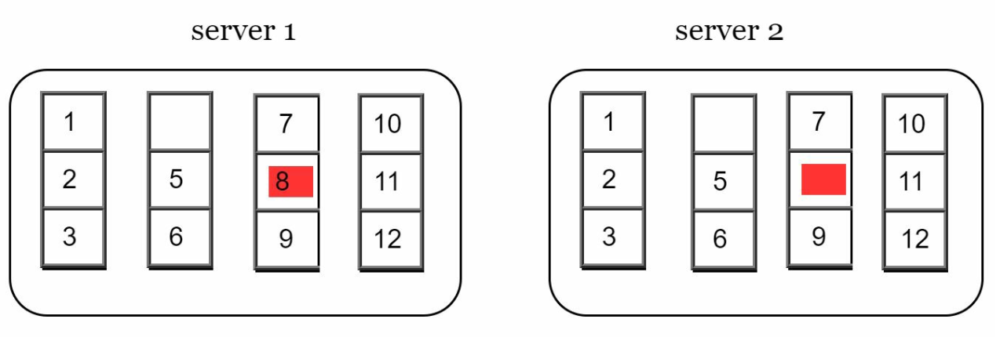
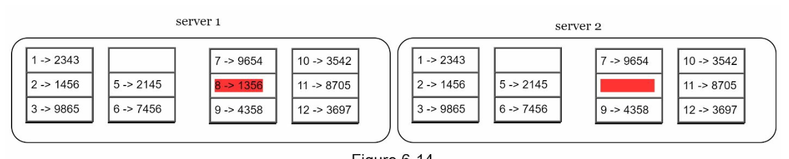
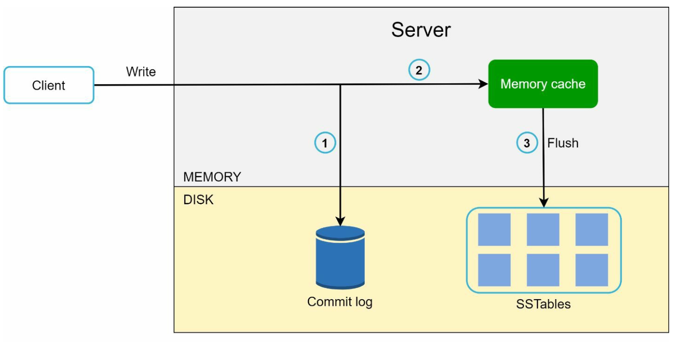

# Глава 6: Проектирование хранилища «ключ-значение» (Key-Value Store)

## Введение
**Хранилище «ключ-значение»** (key-value store) — это разновидность нереляционной базы данных, в которой данные хранятся в виде пар «ключ-значение». Каждый ключ уникален, а доступ к значениям осуществляется по этим ключам. В этой главе подробно разбирается, как спроектировать масштабируемое распределённое хранилище «ключ-значение» с высокой доступностью, поддерживающее такие операции, как:
- `put(key, value)` — для вставки данных;
- `get(key)` — для получения данных.

### Характеристики проектируемой системы
- Небольшие пары «ключ-значение» (<10 КБ).
- Поддержка больших данных при высокой доступности и масштабируемости.
- Автоматическое масштабирование и настраиваемая согласованность (tunable consistency).
- Низкая задержка.

---

## Хранилище «ключ-значение» на одном сервере
### Реализация
- Для хранения пар «ключ-значение» в памяти используется **хеш-таблица**.
- Оптимизации:
  - Сжатие данных.
  - Хранение редко используемых данных на диске.

### Ограничение
Объём памяти одного сервера ограничен, поэтому для масштабирования требуется **распределённый подход**.

---

## Распределённое хранилище «ключ-значение»
**Распределённое хранилище «ключ-значение»** разбивает данные на разделы (партиции) и размещает их на нескольких серверах; при этом приходится идти на компромиссы, описываемые **CAP-теоремой**.

### CAP-теорема
1. **Согласованность (Consistency):** все клиенты видят одни и те же данные в один и тот же момент времени.
2. **Доступность (Availability):** система отвечает на каждый запрос, даже если часть узлов не работает.
3. **Устойчивость к разделению (Partition Tolerance):** система продолжает работать, несмотря на разделение сети.

**Компромисс:** согласно CAP-теореме, одновременно можно обеспечить только две из трёх гарантий.

  

#### Типы систем:
- **CP-системы:** согласованность и устойчивость к разделению в ущерб доступности (например, банковские системы).
- **AP-системы:** доступность и устойчивость к разделению в ущерб согласованности (например, согласованность в конечном счёте).
- **CA-системы:** согласованность и доступность в ущерб устойчивости к разделению.

    **Поскольку сбои сети неизбежны, распределённая система обязана переживать разделение сети. Следовательно, CA-система в реальных приложениях существовать не может.**

    В распределённой системе разделения сети неизбежны. Когда происходит разделение, приходится выбирать между согласованностью и доступностью. Например, если узел n3 выходит из строя, 
    данные, записанные на узлы n1 или n2, не могут быть переданы на n3. И наоборот, если данные записаны на n3, но ещё не дошли до n1 и n2, то на узлах n1 и n2 окажутся устаревшие данные.

    

    
    

    
- Если мы выбираем CP-систему, то должны заблокировать все операции записи на n1 и n2, чтобы избежать рассогласования данных.
- Если мы выбираем AP-систему, система продолжает принимать запросы на чтение, даже если может вернуть устаревшие данные. 
Что касается записи, n1 и n2 продолжают принимать запросы на запись,
а данные синхронизируются с n3 после устранения разделения сети.

---

## Компоненты системы
### 1. Разбиение данных на разделы
- **Техника:** для равномерного распределения данных по нескольким серверам используется согласованное хеширование (consistent hashing).
- **Преимущества:**
  - Автоматическое масштабирование при добавлении и удалении серверов.
  - Учёт разнородности серверов за счёт виртуальных узлов. Число виртуальных узлов для сервера пропорционально его мощности.

### 2. Репликация данных
- Для высокой доступности данные реплицируются на `N` серверов.
- Эти N серверов выбираются так: двигаясь по кольцу по часовой стрелке от позиции сервера, берём первые N серверов, на которых будут храниться копии данных. Реплики следует размещать в разных дата-центрах, чтобы повысить надёжность при использовании виртуальных узлов.

    

    
    

### 3. Согласованность
Поскольку данные реплицируются на несколько узлов, их необходимо синхронизировать между репликами.
- **Кворумный консенсус (quorum consensus):**
  - `N`: общее число реплик.
  - `W`: размер кворума записи. Чтобы запись считалась успешной, она должна быть подтверждена W репликами.
  - `R`: размер кворума чтения. Чтобы чтение считалось успешным, нужно дождаться ответов как минимум от R реплик.
  - **Правило:** `W + R > N` обеспечивает строгую согласованность.
  - Выбор значений W, R и N — типичный компромисс между задержкой и согласованностью. 

    

    
    

    
    - Если R = 1 и W = N, система оптимизирована под быстрое чтение.
    - Если W = 1 и R = N, система оптимизирована под быструю запись.
    - Если W + R > N, гарантируется строгая согласованность (обычно N = 3, W = R = 2).
    - Если W + R <= N, строгая согласованность не гарантируется.

- **Модели**:
  - **Строгая согласованность (strong consistency):** операция чтения возвращает значение, соответствующее результату самой последней записи элемента данных.
  - **Слабая согласованность (weak consistency):** последующие операции чтения могут не увидеть самое актуальное значение.
  - **Согласованность в конечном счёте (eventual consistency):** по прошествии достаточного времени все обновления распространяются, и все реплики становятся согласованными.

### 4. Разрешение несогласованности
Репликация даёт высокую доступность, но приводит к рассогласованию между репликами. Для решения проблем несогласованности используются
версионирование и векторные часы.
- **Версионирование:** 
    - Для отслеживания версий данных и разрешения конфликтов используются **векторные часы** (vector clock).
    - Версионирование означает, что каждое изменение данных рассматривается как новая неизменяемая версия данных.
        

        
        
        

    
    - Сервер 1 меняет имя, и сервер 2 тоже меняет имя. Эти два изменения выполняются одновременно. Теперь у нас есть конфликтующие значения — версии v1 и v2.

- **Векторные часы**
    1. **Устройство**: векторные часы — это пара [сервер, версия], связанная с элементом данных. С их помощью можно проверить,
        предшествует ли одна версия другой, следует за ней или конфликтует с ней.
        - Пусть векторные часы представлены как D([S1, v1], [S2, v2], …, [Sn, vn]). Если элемент данных D записывается на сервер
        Si, система должна выполнить одно из следующих действий.
        - Здесь `D` — элемент данных, `Si` — идентификатор сервера, `vi` — счётчик версий для данных на сервере `Si`.

    2. **Обновление векторных часов:** когда элемент данных изменяется на сервере:
        - Если сервер уже присутствует в векторных часах, его счётчик версий увеличивается.
        - Иначе в векторные часы добавляется новая запись.

    3. **Обнаружение конфликтов:**
        - **Конфликта нет:** версия X является предком версии Y, если все счётчики в X меньше или равны соответствующим счётчикам в Y.
        - **Конфликт есть:** две версии являются «сиблингами» (siblings), если хотя бы один счётчик в Y меньше соответствующего счётчика в X.

    4. **Разрешение конфликтов:** при обнаружении конфликта (версии-сиблинги) система полагается на логику конкретного приложения или на вмешательство клиента, чтобы согласовать данные.

        

        
        

- **Сложности:**
  - Возрастает сложность на стороне клиентов.
  - При большом числе обновлений размер векторных часов может расти, поэтому нужны стратегии усечения, ограничивающие их размер.

### 5. Обработка сбоев

#### a. Обнаружение сбоев
Недостаточно считать сервер вышедшим из строя лишь потому, что так сообщил другой сервер. Обычно, чтобы пометить сервер как неработающий, требуются как минимум два независимых источника информации.
- **Gossip-протокол:**
    

        
    

    - Каждый узел хранит идентификаторы участников и счётчики heartbeat.
    - Каждый узел периодически увеличивает свой счётчик heartbeat.
    - Каждый узел периодически рассылает heartbeat-сообщения набору случайных узлов.
    - Если счётчик heartbeat не увеличивался дольше заранее заданного периода, участник
    считается отключённым.

#### b. Временные сбои
- **Нестрогий кворум (sloppy quorum):** для временного поддержания работы используются здоровые узлы.
        

        
        

    - После обнаружения сбоев системе нужны определённые механизмы для обеспечения доступности.
    - Вместо строгого соблюдения требования кворума система выбирает первые W здоровых серверов для записи и первые R
    здоровых серверов для чтения на хеш-кольце. 
    - Отключённые серверы игнорируются. Если сервер недоступен, запросы временно обрабатывает другой сервер.

- **Отложенная передача (hinted handoff):** после восстановления отключённые серверы «догоняют» пропущенные изменения.
    - Когда упавший сервер снова поднимается, изменения передаются обратно на него для достижения согласованности данных.

#### c. Постоянные сбои
- Для эффективной синхронизации между репликами используются **деревья Меркла (Merkle trees)**.
    **Дерево Меркла** (или хеш-дерево) — это структура данных для эффективного обнаружения и устранения расхождений между репликами при постоянных сбоях. 

- Принцип работы
    1. **Структура:**
        - **Листовые узлы** хранят хеши отдельных блоков данных.
        - **Нелистовые узлы** хранят хеш своих дочерних узлов.
        - **Корневой хеш** представляет совокупное состояние всех данных в дереве.

    2. **Построение дерева Меркла:**
        - **Шаг 1:** разделить пространство ключей на корзины (buckets).
            
            

        - **Шаг 2:** захешировать каждый ключ в корзине с помощью равномерного хеширования.

            

        - **Шаг 3:** вычислить единый хеш для каждой корзины.
        
            

        - **Шаг 4:** объединить хеши корзин для вычисления хешей более высокого уровня, вплоть до корневого хеша.

            

    3. **Синхронизация:**
        - Чтобы синхронизировать две реплики:
            - Сравнить их корневые хеши.
            - Если корневые хеши совпадают, реплики согласованы.
            - Если корневые хеши различаются, рекурсивно сравнить хеши дочерних узлов, чтобы найти несогласованные корзины.
        - Синхронизируются только несогласованные данные.

- Преимущества
    - **Эффективность:** синхронизируются только несогласованные данные, что сокращает объём передачи.
    - **Масштабируемость:** хорошо работает для больших наборов данных с минимальными накладными расходами на синхронизацию.
    - **Надёжность:** обеспечивает согласованность данных между репликами.

### 6. Обработка отказов дата-центров
- Реплицируйте данные в несколько дата-центров, чтобы обеспечить доступность при отказах.

---

## Пути записи и чтения
### 1. Путь записи (на основе архитектуры Cassandra)

    

- Запись сохраняется в **журнал фиксации (commit log)**.
- Данные сохраняются в **кеш в памяти**.
- Когда кеш заполняется, данные сбрасываются на диск в **SSTable** (Sorted String Table).

   

### 2. Путь чтения

    
    

- Проверить наличие данных в **кеше в памяти**.
- Если их там нет, с помощью **фильтра Блума (Bloom filter)** определить, в каких SSTable находятся данные.
- Извлечь и вернуть данные.

---

## Итоговая архитектура

-  Клиенты взаимодействуют с хранилищем «ключ-значение» через простые API: get(key) и put(key,
value).
- Координатор — это узел, выступающий прокси между клиентом и хранилищем «ключ-значение».
- Узлы распределены по кольцу с помощью согласованного хеширования.
- Система полностью децентрализована, поэтому добавление и перемещение узлов может происходить автоматически.
- Данные реплицируются на несколько узлов.
- Единой точки отказа нет, поскольку у каждого узла одинаковый набор обязанностей.
