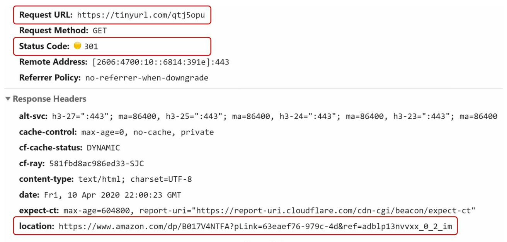

# Глава 8: Проектирование сервиса сокращения URL (URL Shortener)

## Введение
В этой главе обсуждается проектирование сервиса сокращения URL наподобие TinyURL. Основные задачи системы — **сокращение URL**, **перенаправление (redirect)** и **высокая масштабируемость**, позволяющая справляться с большими объёмами трафика.

### Требования
- Сокращённые URL должны быть **уникальными** и настолько **короткими**, насколько возможно.
- Обрабатывать **100 миллионов генераций URL в день** с расчётом на 10 лет работы.
- Поддерживать **эффективные операции чтения** при соотношении чтения к записи 10:1.
- Хранить 365 миллиардов записей, что за 10 лет потребует примерно **365 ТБ** хранилища.

---

## Шаг 1: Высокоуровневый дизайн

### Конечные точки API
1. **Сокращение URL:**  
   - Конечная точка: `POST api/v1/data/shorten`  
   - Параметры: `{longUrl: longURLString}`  
   - Возвращает: `shortURL`

2. **Перенаправление URL:**  
   - Конечная точка: `GET api/v1/shortUrl`  
   - Возвращает: `longURL` для перенаправления.

    

    
    

### Перенаправление URL
- **Редирект 301:** редирект 301 означает, что запрошенный URL «навсегда» перемещён на длинный URL. Браузер кеширует ответ, и
последующие запросы к тому же URL уже не будут отправляться сервису сокращения URL.
- **Редирект 302:** временный; полезен для аналитики, например для отслеживания кликов.

### Сокращение URL

    

- Для генерации короткого URL используется **хеш-функция**, отображающая длинные URL в уникальные сокращённые версии.
- Хеш-функция должна удовлетворять следующим требованиям:
    - Каждый longURL должен хешироваться ровно в одно значение hashValue.
    - Каждое значение hashValue должно однозначно отображаться обратно в longURL.
    

---

## Шаг 2: Детальная проработка дизайна

### Модель данных
Отображения `<shortURL, longURL>` хранятся в реляционной базе данных, чтобы оптимизировать использование памяти. Схема таблицы включает:
- `id` (первичный ключ),
- `shortURL`,
- `longURL`.

    

### Хеш-функция
#### 1. Преобразование в систему счисления с основанием 62 (Base 62):
- Кодирует числа символами `[0-9, a-z, A-Z]`, что даёт **62 возможных символа**.
- Преобразование системы счисления — ещё один подход, часто применяемый в сервисах сокращения URL. 
- Короткому URL можно присвоить уникальный идентификатор, а затем преобразовать этот ID в систему с основанием 62, получив короткий URL.
- Хеш из 7 символов покрывает до **3,5 триллиона уникальных URL** — этого достаточно для 365 миллиардов URL.

**Пример:**  
Преобразуем ID `2009215674938` в систему с основанием 62:
- `2009215674938` → `zn9edcu`.

#### 2. Хеш + разрешение коллизий:
- Используются хеш-функции вроде CRC32, MD5 или SHA-1.

    

- Один из подходов — брать первые 7 символов хеш-значения; однако этот метод может приводить к коллизиям хешей.
- Для разрешения коллизий можно рекурсивно дописывать заранее заданную строку, пока коллизии не исчезнут, но это может быть дорого.
- Для эффективного поиска при разрешении коллизий используются **фильтры Блума (Bloom filters)**.

    

    
    

### Сравнение

-  **Хеш + разрешение коллизий:**
    - Фиксированная длина короткого URL
    - Не требует генератора уникальных идентификаторов
    - Возможны коллизии, которые нужно разрешать
    - Невозможно вычислить следующий доступный короткий URL, так как он не зависит от ID

- **Преобразование Base 62**
    - Длина не фиксирована и растёт вместе с ID
    - Требуется генератор уникальных идентификаторов
    - Коллизии невозможны
    - Легко вычислить следующий короткий URL, если ID увеличивается на 1 (может быть проблемой с точки зрения безопасности)

---

### Процесс сокращения URL

    

1. Проверить, есть ли `longURL` в базе данных.
2. Если найден — вернуть существующий `shortURL`.
3. Иначе:
   - Сгенерировать уникальный ID с помощью **распределённого генератора идентификаторов**.
   - Преобразовать ID в `shortURL` с помощью Base 62.
   - Сохранить отображение `<id, shortURL, longURL>` в базе данных.

---

### Процесс перенаправления URL

    

1. Пользователь кликает по `shortURL`.
2. Запрашивается отображение `<shortURL, longURL>`:
   - Сначала проверяется **кеш** — для более быстрого доступа.
   - Если в кеше нет, выполняется запрос к базе данных.
3. Пользователь перенаправляется на `longURL`.

---

## Дополнительные соображения
### Ограничитель частоты запросов (rate limiter)
- Предотвращает злоупотребления за счёт ограничения числа запросов с одного IP.

### Масштабируемость
1. **Веб-уровень:** без состояния (stateless), масштабируется добавлением и удалением веб-серверов.
2. **Уровень базы данных:** используются репликация и шардирование.

### Аналитика
- Сбор данных о кликах, источниках и метках времени для бизнес-аналитики.

### Высокая доступность и надёжность
- Стабильность и надёжность сервиса обеспечиваются репликацией базы данных и отказоустойчивым дизайном.
