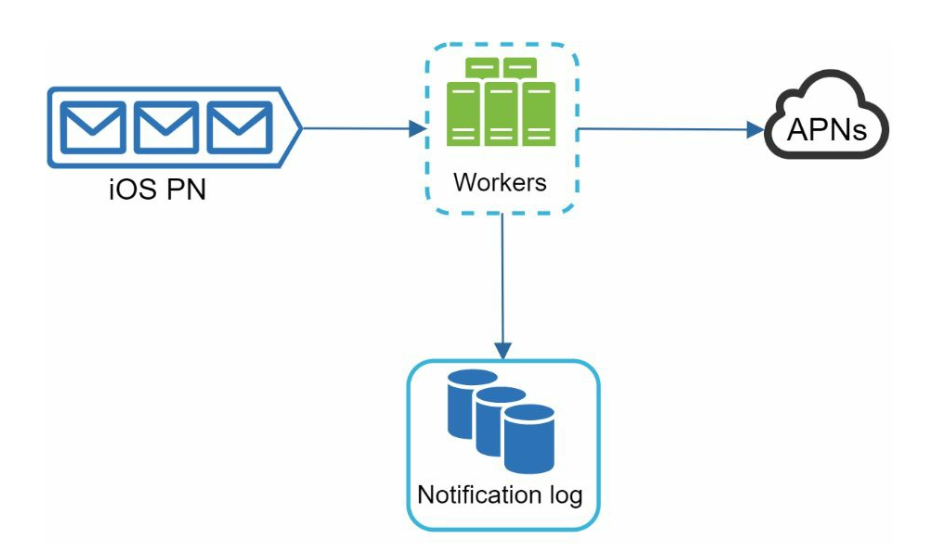
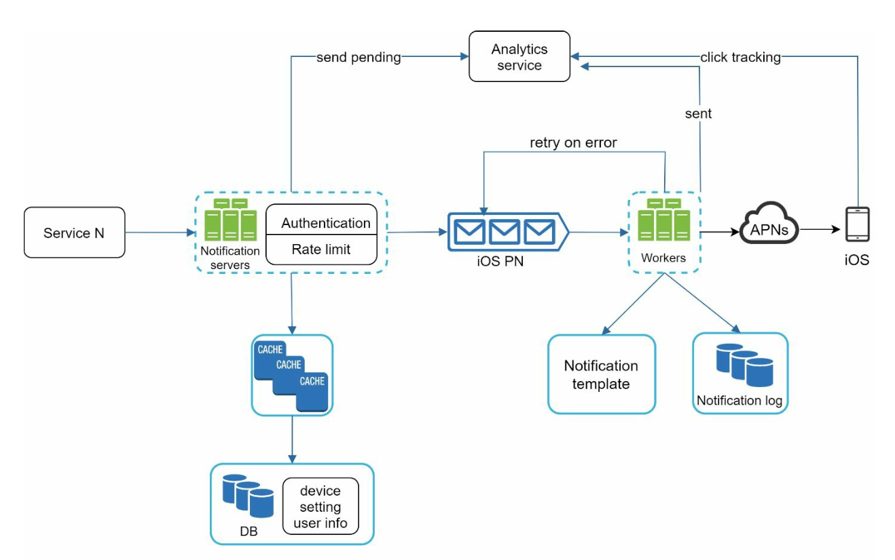

# Глава 10: Проектирование системы уведомлений (Notification System)

## Введение
**Система уведомлений (notification system)** — неотъемлемая часть современных приложений: она своевременно доставляет обновления о продукте, событиях, предложениях и оповещения. Уведомления можно отправлять через:
1. **Push-уведомления** (мобильные или настольные),
2. **SMS-сообщения** и
3. **Электронную почту**.

В этой главе мы проектируем масштабируемую систему, способную отправлять миллионы уведомлений в день.

---

## Шаг 1: Понимание задачи
### Требования
- **Типы уведомлений:** push-уведомления, SMS и электронная почта.
- **Доставка:** система «мягкого» реального времени с минимальными задержками.
- **Платформы:** iOS, Android и настольные компьютеры.
- **Триггеры:** уведомления могут инициироваться клиентскими приложениями или по расписанию на серверах.
- **Масштаб:**
  - **Push-уведомления:** 10 миллионов/день,
  - **SMS:** 1 миллион/день,
  - **Электронные письма:** 5 миллионов/день.
- **Возможность отписки:** пользователи могут отключать отдельные типы уведомлений.

---

## Шаг 2: Высокоуровневый дизайн

### Компоненты

1. **Типы уведомлений:**
   - **Push-уведомления iOS:** используем **Apple Push Notification Service (APNS)**.
   - **Push-уведомления Android:** используем **Firebase Cloud Messaging (FCM)**.
   - **SMS-сообщения:** сторонние сервисы вроде Twilio или Nexmo.
   - **Электронная почта:** коммерческие почтовые сервисы вроде SendGrid или Mailchimp.

2. **Сбор контактной информации:**
   

      
   

   - Собираем токены устройств, номера телефонов или адреса электронной почты при установке приложения или регистрации.
   - Храним контактную информацию в базе данных:
     - **Таблица токенов устройств:** для push-уведомлений.
     - **Таблица пользователей:** для адресов электронной почты и номеров телефонов.

3. **Процесс отправки уведомлений:**

   

      
   

   - **Сервисы-триггеры:**
      - Генерируют события, инициирующие уведомления (например, напоминания об оплате, обновления статуса доставки).
      - Сервисом может быть микросервис, cron-задача или распределённая система, порождающая события отправки уведомлений.
   - **Сервер уведомлений:** 
      - Предоставляет API, через который сервисы отправляют уведомления. 
      - Выполняет базовые проверки корректности адресов электронной почты и номеров телефонов.
      - Запрашивает базу данных или кеш, чтобы получить данные, необходимые для формирования уведомления.
   - **Сторонние сервисы:** доставляют уведомления пользователям.

     

### Проблемы первоначального дизайна
- **Единая точка отказа (SPOF):** сбой единственного сервера уведомлений выводит из строя всю систему.
- **Проблемы масштабирования:** сложно независимо масштабировать базы данных, кеши и обрабатывающие компоненты.
- **Узкие места производительности:** отправка уведомлений требует много ресурсов.

### Улучшенный дизайн

   

      
   

- Выносим базы данных и кеши за пределы сервера уведомлений.
- Вводим **горизонтальное масштабирование** с несколькими серверами уведомлений.
- Используем **очереди сообщений (message queues)** для развязки компонентов системы.
   -  Очереди сообщений служат буфером, когда нужно отправить большой объём уведомлений.
- Добавляем воркеры, которые забирают события уведомлений из очередей и передают их соответствующим сторонним сервисам.

   

---

## Шаг 3: Детальный разбор дизайна

### Надёжность
1. **Предотвращение потери данных:** 
   

   
   

   - Сохраняем данные уведомлений в базе данных и реализуем механизм повторных попыток. 
   - Для персистентности данных добавлена база данных журнала уведомлений (notification log).

2. **Дедупликация:** 
   - Проверяем идентификаторы событий, чтобы не отправлять дублирующиеся уведомления.
   - Когда событие уведомления поступает впервые, проверяем по его ID, встречалось ли оно раньше.
Если встречалось — отбрасываем, иначе отправляем уведомление. 

### Дополнительные компоненты
   

   
   

1. **Шаблоны уведомлений:** заранее отформатированные шаблоны для единообразных и быстро формируемых уведомлений.
2. **Настройки уведомлений:**
   - Пользователи могут подписаться или отписаться от отдельных каналов (push, SMS или email).
   - Хранятся в отдельной таблице настроек уведомлений.
3. **Ограничение частоты (rate limiting):** ограничиваем частоту уведомлений, отправляемых пользователям.
4. **Механизм повторных попыток:** повторяем отправку уведомлений при сбоях сторонних сервисов.
5. **Мониторинг очередей:** отслеживаем число уведомлений в очереди, чтобы динамически масштабировать воркеры.
6. **Отслеживание событий:** собираем метрики — процент открытий, процент кликов, вовлечённость.

### Безопасность
- Используем **AppKey** и **AppSecret** для аутентификации и защиты API push-уведомлений.

### Поток уведомлений

   

   
   

1. Сервисы-триггеры вызывают API для отправки уведомлений.
2. Серверы уведомлений валидируют запросы и получают метаданные из кешей или баз данных.
3. События уведомлений отправляются в очереди сообщений.
4. Воркеры обрабатывают события и взаимодействуют со сторонними сервисами.
5. Сторонние сервисы доставляют уведомления пользователям.

---

## Ключевые оптимизации
1. **Горизонтальное масштабирование:** добавляем серверы уведомлений для распределения нагрузки.
2. **Очереди сообщений:** развязываем обработку, чтобы справляться с большими объёмами.
3. **Кеширование:** снижаем задержку, кешируя часто запрашиваемые данные.
4. **Распределённая доставка:** оптимизируем доставку сообщений географически для лучшей производительности.
