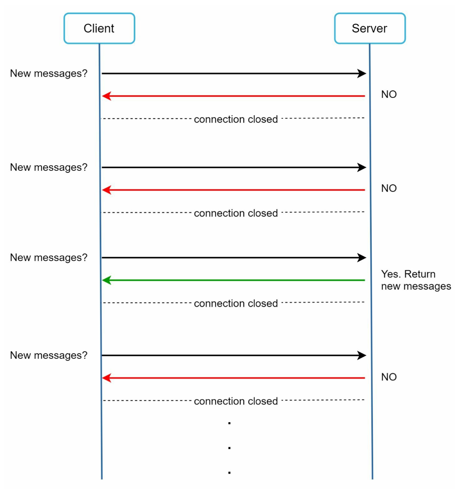

# Глава 12: Проектирование чат-системы (Chat System)

## Введение
**Чат-система** обеспечивает обмен сообщениями между пользователями в реальном времени. В этой главе мы проектируем чат-приложение, которое включает:
- **Личный чат (один на один)**
- **Групповой чат (до 100 пользователей)**
- **Индикаторы присутствия онлайн**
- **Поддержку нескольких устройств**
- **Push-уведомления**

Система рассчитана на **50 миллионов активных пользователей в день (DAU)** и хранит историю переписки бессрочно.

---

## Шаг 1: Понимание задачи

### Требования
1. **Функциональность:**
   - Личные и групповые чаты (до 100 участников).
   - Текстовые сообщения (до 100 000 символов).
   - Индикаторы онлайн/офлайн.
   - Поддержка нескольких устройств.
   - Push-уведомления.
2. **Масштаб:** проектируем на 50 миллионов DAU.
3. **Хранение:** история переписки хранится бессрочно.

---

## Шаг 2: Высокоуровневый дизайн

### Протоколы связи
1. **Сторона отправителя:** HTTP для отправки сообщений; для эффективности используются постоянные соединения (persistent connections).

      

          
      

2. **Сторона получателя:**
   - **Опрос (polling):**
      - Клиент периодически спрашивает сервер, есть ли новые сообщения.
      - Неэффективен из-за частых избыточных запросов.

             

   - **Длинный опрос (long polling):** 
      - Соединение держится открытым, пока не появятся сообщения. 
      - Неэффективен для неактивных пользователей.

         

   - **WebSocket:** 
      - Двунаправленное постоянное соединение для общения в реальном времени; выбираем его и для отправки, и для получения сообщений.
      - Использует протокол WebSocket (ws) для отправки и получения сообщений.

             
   
---

### Компоненты

       
   

1. **Сервисы без состояния (stateless):**
   - Отвечают за регистрацию, вход и управление профилем пользователя.
   - Интегрированы с обнаружением сервисов (service discovery), которое подбирает клиенту оптимальный чат-сервер.
2. **Сервисы с состоянием (stateful):**
   - Чат-серверы поддерживают постоянные WebSocket-соединения.
   - Отвечают за доставку и синхронизацию сообщений.
3. **Интеграция со сторонними сервисами:**
   - Сервисы push-уведомлений сообщают пользователям о новых сообщениях.
   - Реализация уведомлений описана в главе «Система уведомлений».

---
### Дизайн

Клиент поддерживает постоянное WebSocket-соединение с чат-сервером для обмена сообщениями в реальном времени.

       

- Чат-серверы обеспечивают отправку и получение сообщений.
- Серверы присутствия (presence servers) управляют статусами онлайн/офлайн.
- API-серверы отвечают за всё остальное: вход, регистрацию, изменение профиля и т.д.
- Серверы уведомлений отправляют push-уведомления.
- Наконец, для хранения истории переписки используется хранилище «ключ-значение» (key-value store). KV-хранилище выбрано для базы данных истории переписки по следующим причинам:
   - Оно легко масштабируется горизонтально.
   - KV-хранилища обеспечивают очень низкую задержку доступа к данным.
   - Реляционные базы данных плохо справляются с «длинным хвостом» данных: когда индексы
   разрастаются, случайный доступ становится дорогим.
   - KV-хранилища применяются в других проверенных и надёжных чат-приложениях — например,
   в Facebook Messenger и Discord.

Ниже приведены модели данных для личного и группового чата.
   - Первичный ключ — message_id, он определяет порядок сообщений.
   - Для группового чата используется составной первичный ключ (channel_id, message_id). 
      - Идентификаторы можно генерировать глобальным 64-битным генератором последовательных номеров вроде Snowflake.
      - Лучший подход — локальный генератор последовательных номеров. «Локальный» означает, что ID уникальны только внутри группы.
      - Локальные ID работают потому, что достаточно поддерживать порядок сообщений внутри одного личного или группового канала. 
      
         
         

## Шаг 3: Детальный разбор дизайна

### Обнаружение сервисов (Service Discovery)

      

- Основная задача обнаружения сервисов — подобрать клиенту оптимальный чат-сервер по таким
критериям, как географическое положение и ёмкость сервера. 
- Используется **Apache ZooKeeper**: он распределяет чат-серверы с учётом географии и ёмкости серверов.
- Обеспечивает эффективное распределение нагрузки и минимизирует задержку.

### Потоки сообщений
#### Личный чат

1. Пользователь A отправляет сообщение на чат-сервер 1.
2. Чат-сервер 1 присваивает сообщению уникальный ID и сохраняет его в KV-хранилище.
3. Если пользователь B онлайн, сообщение пересылается на чат-сервер 2, поддерживающий постоянное WebSocket-соединение.
4. Если пользователь B офлайн, отправляется push-уведомление.

#### Групповой чат

     

- Сообщения копируются в персональные «входящие» каждого получателя в группе.
- Это упрощает синхронизацию, но становится дорогим для больших групп.
- На стороне получателя сообщения могут приходить от нескольких пользователей. У каждого получателя
есть свой ящик входящих (очередь синхронизации сообщений), содержащий сообщения от разных отправителей.

---

#### Синхронизация сообщений

У многих пользователей несколько устройств, и сообщения нужно синхронизировать между ними.
Каждое устройство хранит переменную cur_max_message_id, которая отслеживает ID последнего
сообщения на устройстве. Новыми считаются сообщения, удовлетворяющие двум условиям:

     

- ID получателя совпадает с ID текущего вошедшего пользователя.
- ID сообщения в KV-хранилище больше, чем cur_max_message_id.

---

### Присутствие онлайн
1. **Механизм heartbeat:** 
   

       
   

   
   - Клиенты периодически посылают heartbeat-сигналы серверам присутствия, подтверждая, что они онлайн. 
   - Если heartbeat не получен в течение порогового времени (например, x = 30), пользователь помечается как офлайн.

     

2. **Модель рассылки (fanout):** 

   

       
   

   - Обновления статуса присутствия рассылаются друзьям по модели «издатель-подписчик» (publish-subscribe), где для каждой пары друзей поддерживается свой канал.
   - Когда онлайн-статус пользователя A меняется, событие публикуется в три канала: A-B, A-C и A-D. 
   - На эти три канала подписаны соответственно пользователи B, C и D — они и получают обновления статуса.
   - Такой дизайн эффективен для небольших групп пользователей.

---

## Дополнительные соображения
### Масштабируемость
- **Горизонтальное масштабирование:** добавляем серверы по мере роста числа пользователей.
- **Балансировка нагрузки:** равномерно распределяем трафик между серверами.
- **Кеширование:** снижаем нагрузку на базу данных и уменьшаем задержку.

### Обработка ошибок
- **Механизмы повторных попыток:** обрабатываем сбои доставки сообщений с помощью повторов и очередей.
- **Сбои серверов:** при отказах используем обнаружение сервисов для выделения новых серверов.

### Возможные расширения
1. **Поддержка медиа:** обработка фотографий и видео, включая сжатие и облачное хранение.
2. **Сквозное шифрование (end-to-end encryption):** обеспечение приватности сообщений.
3. **Кеширование на стороне клиента:** сокращение объёма передаваемых данных для лучшей производительности.
4. **Ускорение загрузки:** использование географически распределённых сетей кеширования.
