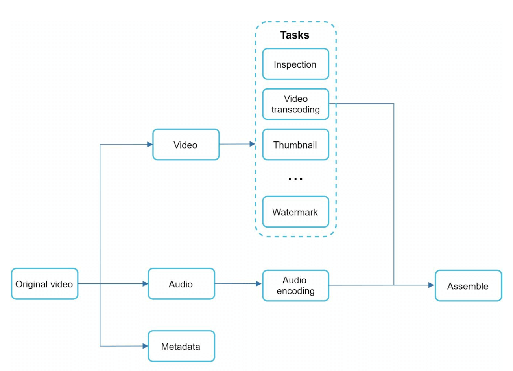

# Глава 14: Проектирование YouTube

## Введение
YouTube — гигантская платформа потокового видео, поддерживающая загрузку видео, воспроизведение и разнообразные взаимодействия. Эта глава посвящена проектированию масштабируемой системы видеостриминга со следующими ключевыми характеристиками:
- **Быстрая загрузка видео**
- **Плавное потоковое воспроизведение**
- **Возможность менять качество видео**
- **Низкая стоимость инфраструктуры**
- **Высокая доступность и надёжность**

### Ключевая статистика (2020)
- **2 миллиарда активных пользователей в месяц**
- **5 миллиардов просмотров видео в день**
- **37% мобильного интернет-трафика приходится на YouTube**
- Доступен на **80 языках**
- **$15,1 миллиарда рекламной выручки** в 2019 году

---

## Шаг 1: Понимание задачи и определение границ

### Основные функции
1. Загрузка видео
2. Просмотр видео

### Поддерживаемые платформы
- Мобильные приложения, веб-браузеры и умные телевизоры

### Допущения
- **Ежедневная аудитория (DAU):** 5 миллионов
- **Средний размер видео:** 300 MB
- **Ограничения загрузки:** максимум 1 GB на видео
- **Ежедневная потребность в хранилище:** 150 TB
- **Затраты на CDN:** 5 миллионов * 5 видео * 0.3GB * $0.02 = $150 000/день (при использовании Amazon CloudFront)

---

## Шаг 2: Высокоуровневый дизайн

### Компоненты

    

1. **Клиент:** устройства вроде смартфонов, компьютеров и телевизоров.
2. **CDN (сеть доставки контента):** хранит видео и раздаёт их в потоковом режиме.
3. **API-серверы:** обрабатывают все взаимодействия с пользователем, кроме стриминга видео (например, загрузку, обновление метаданных).
4. **База метаданных:** хранит метаданные видео (например, название, описание, размер).
5. **Хранилище оригиналов:** blob-хранилище для загруженных видео.
6. **Серверы транскодирования:** преобразуют видео в различные разрешения и форматы.
7. **Хранилище транскодированных видео:** blob-хранилище для перекодированных видео.

---

### Основные сценарии работы
#### 1. Процесс загрузки видео
- **Параллельные процессы:**
  1. Загрузка видео в хранилище оригиналов.
  2. Обновление метаданных видео в базе данных.

- **Загрузка видео (шаги):**

    

        
    

    - [1] Видео загружаются в blob-хранилище.
    - [2] Серверы транскодирования преобразуют видео в различные форматы.
    - [3] Как только транскодирование завершено, параллельно выполняются два следующих шага:
        - [3a] Перекодированные видео отправляются в хранилище транскодированных видео.
        - [3b] События о завершении транскодирования ставятся в очередь завершения (completion queue).
    - [3a.1] Видео распространяются по CDN.
    - [3b.1] Обработчики завершения обновляют метаданные и уведомляют пользователей.

- **Загрузка метаданных (шаги):**

    

        
    

    - Параллельно клиент отправляет запрос на обновление метаданных видео.
    - Запрос содержит метаданные видео: имя файла, размер, формат и т. д.
    
       

#### 2. Процесс потокового воспроизведения

  

- Видео стримятся напрямую из CDN с граничных серверов (edge servers), чтобы минимизировать задержку.
- Среди популярных протоколов стриминга — MPEG_DASH, Apple HLS, Adobe HDS.
-  *Разные протоколы стриминга поддерживают разные кодировки видео и плееры.*

---

## Шаг 3: Детальное проектирование

### Транскодирование видео
#### Зачем оно нужно
1. Сырое видео занимает огромный объём хранилища. Транскодирование сокращает занимаемое место.
2. Обеспечивает совместимость с разными устройствами и браузерами.
3. Подстраивает качество видео под состояние сети.

#### Составляющие
- **Контейнер:** инкапсулирует видео, аудио и метаданные (например, MP4, AVI).
- **Кодеки:** алгоритмы сжатия и распаковки (например, H.264, VP9).

#### Модель направленного ациклического графа (DAG)

    

- Транскодирование видео — вычислительно дорогая и длительная операция.
- Модель DAG описывает задачи вроде кодирования, генерации превью (thumbnail) и наложения водяных знаков.
- Позволяет обрабатывать видео с высокой степенью параллелизма.

- Исходное видео разбивается на видео, аудио и метаданные.
    - Кодирование видео: видео преобразуются для поддержки разных разрешений, кодеков и битрейтов.
    - Превью: может быть загружено пользователем или сгенерировано системой автоматически.
    - Водяной знак: изображение, накладываемое поверх видео и содержащее идентифицирующую его информацию.

---

### Архитектура транскодирования видео

1. **Препроцессор:** разбивает видео на более мелкие фрагменты (по границам GOP). У него 4 обязанности.

    

        
    

    - Разбиение видео: видеопоток разбивается (или дополнительно дробится) на более мелкие группы кадров — Group of Pictures (GOP).
    - Разбивает видео по границам GOP для старых клиентов.
    - Генерирует DAG на основе конфигурационных файлов, которые пишут программисты-клиенты.
    - Сохраняет GOP и метаданные во временное хранилище: если кодирование завершится неудачей, система сможет использовать сохранённые данные для повторных попыток.

2. **Планировщик DAG:** организует задачи в последовательные или параллельные стадии.
    

        
    

    - Разбивает граф DAG на стадии задач и помещает их в очередь задач менеджера ресурсов.
    - Стадия 1: видео, аудио и метаданные.
    - На стадии 2 видеофайл дополнительно разбивается на две задачи: кодирование видео и превью.

3. **Менеджер ресурсов:** отвечает за эффективность распределения ресурсов. Содержит 3 очереди и планировщик задач.
    

        
    

    - Очередь задач: приоритетная очередь с задачами на выполнение.
    - Очередь воркеров: приоритетная очередь с информацией о загруженности воркеров.
    - Очередь выполнения: содержит выполняемые в данный момент задачи и воркеры, которые их выполняют.
    - Планировщик задач: выбирает оптимальную пару задача/воркер и поручает выбранному воркеру выполнить работу.

4. **Воркеры задач:** выполняют транскодирование и другие операции.
    

        
   

    - Разные воркеры могут выполнять разные задачи.

5. **Временное хранилище:** хранит промежуточные данные для повторных попыток.
    - Выбор системы хранения зависит от таких факторов, как тип данных, их объём, частота доступа, время жизни данных и т. д.
6. **Результат:** перекодированные видео, готовые к распространению.

---

## Оптимизации системы

### Оптимизации скорости
1. **Параллельная загрузка видео:** разбивать видео на небольшие фрагменты для более быстрой и возобновляемой загрузки.

    

2. **Распределённые центры загрузки:** использовать CDN как узлы загрузки, расположенные ближе к пользователям.
3. **Параллельная обработка:** разделять модули с помощью очередей сообщений для высокого параллелизма.

    
    

### Оптимизации безопасности
1. **Предподписанные URL (pre-signed URLs):** разрешать загрузку видео только авторизованным пользователям.

    

2. **Защита видео:**
   - **DRM-системы** (например, Apple FairPlay, Google Widevine).
   - **Шифрование AES.**
   - **Водяные знаки.**

### Оптимизации затрат
1. Раздавать через CDN только популярные видео; менее популярные — с собственных серверов большой ёмкости.
2. Кодировать редко запрашиваемые видео по требованию.
3. Регионализировать распространение видео в зависимости от популярности.
4. Строить собственные CDN и сотрудничать с интернет-провайдерами, чтобы снизить расходы на трафик.

---

## Обработка ошибок
### Восстановимые ошибки
- Повторять неудавшиеся загрузки, транскодирование или задачи выделения ресурсов.

### Невосстановимые ошибки
- Останавливать обработку повреждённого видео и возвращать коды ошибок.
