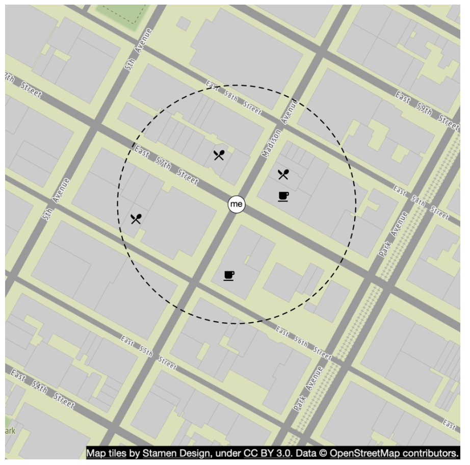
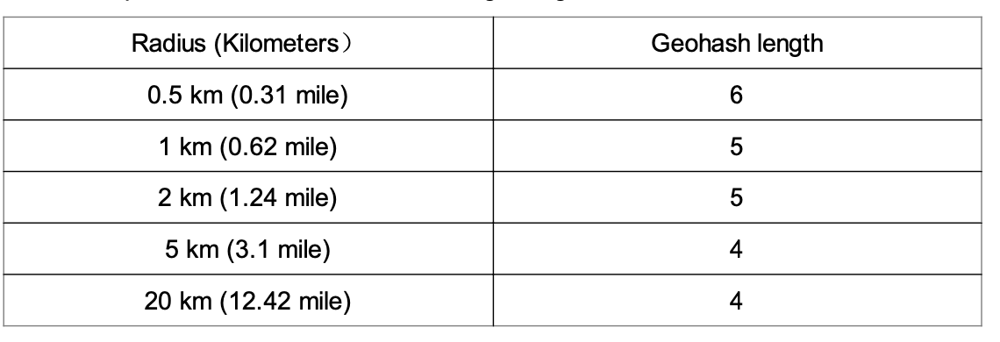
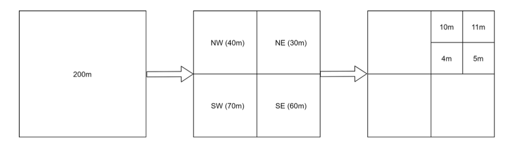

# Глава 16: Сервис поиска поблизости

## Введение
**Сервис поиска поблизости (proximity service)** предназначен для поиска расположенных рядом мест: ресторанов, отелей, заправок и других заведений. Эта функциональность используется в приложениях вроде **Google Maps** и **Yelp**, помогая пользователям находить места в пределах заданного радиуса.


## Шаг 1: Понимание задачи и определение границ

### **Функциональные требования**
1. **Поиск заведений** по местоположению пользователя (широта, долгота) и радиусу поиска.
2. **Возможность для владельцев** добавлять, обновлять и удалять заведения (не в реальном времени).
3. **Предоставление подробной информации о заведении** по запросу.

### **Нефункциональные требования**
- **Низкая задержка**: пользователи должны получать быстрые ответы.
- **Конфиденциальность данных**: соответствие требованиям GDPR и CCPA.
- **Высокая доступность**: выдерживать пиковые всплески нагрузки в оживлённых местах.

### **Приблизительная оценка (back-of-the-envelope)**
- **100 миллионов активных пользователей в день**.
- **200 миллионов заведений** в системе.
- **Расчёт поискового QPS**:
  - Пользователи делают **5 поисков в день**.
  - **Поисковый QPS** = (100M × 5) / 86 400 ≈ **5 000 QPS**.

---

## Шаг 2: Высокоуровневый дизайн

### **Проектирование API**
#### **Поиск заведений поблизости**
GET /v1/search/nearby

- **Параметры запроса**:
  - `latitude`: широта местоположения пользователя.
  - `longitude`: долгота местоположения пользователя.
  - `radius`: радиус поиска (по умолчанию: 5000 м).

#### **API заведений**
| Эндпоинт API                      | Описание                                         |
|-----------------------------------|--------------------------------------------------|
| `GET /v1/businesses/{id}`         | Получить подробную информацию о заведении       |
| `POST /v1/businesses`             | Добавить новое заведение                        |
| `PUT /v1/businesses/{id}`         | Обновить данные заведения                       |
| `DELETE /v1/businesses/{id}`      | Удалить заведение из системы                    |


### **Модель данных**
- Поскольку объём чтения велик — две функции используются очень часто, — хорошо подходит реляционная база данных, такая как MySQL:
  - Поиск заведений поблизости
  - Просмотр подробной информации о заведении

### **Схема данных**
- Ключевые таблицы базы данных — таблица заведений и таблица геопространственного индекса.
- Таблица заведений содержит подробную информацию о каждом заведении.

### **Высокоуровневая архитектура системы**
Система состоит из двух частей: сервиса на основе местоположения (location-based service, LBS) и сервиса работы с заведениями.

<div style="margin-left:3rem">
    
</div>

- **Сервис на основе местоположения (LBS)**:
  - Обрабатывает поисковые запросы, привязанные к местоположению.
  - Сервис с преобладанием чтения, без запросов на запись.
  - QPS высок, особенно в часы пик в густонаселённых районах; сервис не хранит состояние (stateless).
- **Сервис заведений**: обрабатывает два типа запросов.
  - Владельцы создают, обновляют и удаляют заведения.
  - Клиенты просматривают подробную информацию о заведении.
- **Балансировщик нагрузки**: направляет трафик в LBS и сервис заведений.
- **Кластер базы данных**:
  - Использует архитектуру **primary-replica**, подходящую для нагрузок с преобладанием чтения.
  - Возможны расхождения между данными, которые читает LBS, и данными, записанными в первичную базу.
  - Эта несогласованность не является проблемой, поскольку информация о заведениях не обновляется в реальном времени.


---

## Шаг 3: Алгоритмы поиска заведений поблизости

### **Вариант 1: Двумерный поиск (наивный подход)**

<div style="margin-left:3rem">
    
</div>

Самый интуитивный способ — нарисовать окружность заданного радиуса и найти все заведения внутри неё.

**SQL-запрос:**
```
SELECT business_id, latitude, longitude
FROM business
WHERE (latitude BETWEEN :lat - radius AND :lat + radius)
AND (longitude BETWEEN :long - radius AND :long + radius);
```
**Проблемы:**
- **Неэффективно**: требует сканирования всей базы данных.
- **Ограничен одномерными индексами** (широта/долгота).

Возможное улучшение — построить индексы по столбцам долготы и широты; это немного лучше, но всё равно очень медленно.

### Более удачный подход
- Проблема предыдущего подхода в том, что индекс базы данных ускоряет поиск только по одному измерению.
- Оптимальный подход — представить двумерные данные в одном измерении с помощью геопространственного индексирования (geospatial indexing).
  - Хеш: равномерная сетка, геохеш (geohash)
  - Дерево: квадродерево (quadtree), Google S2, R-дерево (RTree)

  <div style="margin-left:3rem">
    
  </div>


### **Вариант 2: Равномерная сетка**

  <div style="margin-left:3rem">
    
  </div>

- **Делит мир на ячейки фиксированного размера**.
- **Проблема**: неравномерное распределение заведений (высокая плотность в городах, редкая — в сельской местности).

### **Вариант 3: Геохеш**
- Разделить планету на четыре квадранта вдоль нулевого меридиана и экватора. Затем разделить каждую ячейку на четыре меньшие ячейки.
- Каждую ячейку можно представить, чередуя биты долготы и широты.
- Повторять это деление рекурсивно.

  <div style="margin-left:3rem">
    
    
  </div>


- **Кодирует широту и долготу в одну буквенно-цифровую строку**. Есть 12 уровней точности (precision).
- **Иерархическая структура сетки** обеспечивает эффективный поиск.
- Нужная точность выбирается по минимальной длине геохеша согласно таблице.
  <div style="margin-left:3rem">
    
  </div>
- Геохеш гарантирует: чем длиннее общий префикс двух геохешей, тем ближе точки друг к другу.

- **Сложности**:
  <div style="margin-left:3rem">
    
  </div>

  - **Проблемы на границах** (заведения у краёв ячеек могут не попасть в выдачу).
    - Две точки могут находиться очень близко, но вообще не иметь общего префикса (например, по разные стороны экватора).
    - Две точки могут иметь длинный общий префикс, но принадлежать разным геохешам.
  - Решение: искать и в соседних ячейках.


### **Вариант 4: Квадродерево**

  Квадродерево (quadtree) — древовидная структура данных, рекурсивно делящая двумерное пространство на четыре квадранта: каждый внутренний узел имеет ровно четыре потомка, соответствующих четырём подобластям пространства.
  - Квадродерево — структура данных в памяти: оно работает на каждом сервере LBS и строится при запуске сервера.

  <div style="margin-left:3rem">
    
  </div>

  - Корневой узел рекурсивно делится на 4 квадранта до тех пор, пока не останется узлов, содержащих больше x заведений (в данном случае 100).

  <div style="margin-left:3rem">
    
  </div>

- Индекс квадродерева занимает не слишком много памяти (обычно единицы GB) и легко помещается на один сервер.
- Поскольку временная сложность построения дерева — nlogn, его построение может занять несколько минут.
- **Эффективно для запросов k ближайших соседей** (например, найти ближайшую заправку).

  <div style="margin-left:3rem">
    
  </div>

#### Эксплуатационные соображения
 - Для примерно 200 миллионов заведений построение квадродерева при старте сервера может занять несколько минут.
 - Пока квадродерево строится, сервер не может обслуживать трафик, поэтому новый релиз следует выкатывать постепенно, на часть серверов.
 - При обновлении заведения или добавлении нового простейший подход — постепенно перестраивать квадродерево. (Это приводит к массовой инвалидации кеша.)
 - Можно обновлять квадродерево и на лету, но это сложнее в реализации. (Требуется механизм блокировок.)

### **Вариант 5: Google S2**
Он отображает сферу в одномерный индекс на основе кривой Гильберта (Hilbert curve). Две точки, близкие друг к другу на кривой Гильберта, близки и в одномерном пространстве.


  <div style="margin-left:3rem">
    
    
  </div>

- **Делит Землю на маленькие ячейки с помощью кривой Гильберта**.
- Отлично подходит для геозонирования (geofencing), поскольку может покрывать произвольные области с разными уровнями детализации.
- Геозонирование также позволяет задавать параметры, окружающие интересующую область.
- Ещё одно преимущество: вместо фиксированного уровня точности в S2 можно задать минимальный и максимальный уровень и максимальное число ячеек.


## Сравнение компромиссов

#### Геохеш
- Прост в использовании и реализации — не нужно строить и перестраивать дерево.
- Поддерживает выдачу результатов в фиксированном радиусе.
- Индекс легко обновлять.
- Не может динамически подстраивать размер ячейки под плотность населения.

#### Квадродерево
- Немного сложнее в реализации.
- Поддерживает выборку k ближайших заведений.
- Может динамически подстраивать размер ячейки под плотность населения.
- Обновлять индекс сложнее: может потребоваться перестроить всё дерево.

---

## Шаг 4: Масштабирование базы данных и стратегия кеширования

### **Масштабирование таблицы заведений**
- **Шардирование по ID заведения** обеспечивает равномерное распределение данных.
- В таблице для каждого заведения хранится отдельная строка.

| Геохеш  | ID заведения |
|---------|------------|
| 9q9hvu  | 343        |
| 9q9hvu  | 347        |
| 9q9hvu  | 112        |

### **Масштабирование геопространственного индекса**
- Шардирование может плохо подходить для таблицы геохешей. В нашем случае всё помещается на один сервер, поэтому технических причин для шардирования нет.
- Более удачный подход — использовать реплики для чтения (read replicas), чтобы разгрузить чтение.


---

### **Стратегия кеширования**
Самый очевидный кандидат на ключ кеша — координаты местоположения, но у них есть несколько проблем:
 - Координаты от GPS неточны.
 - Пользователь может перемещаться, из-за чего координаты меняются.
 - Более удачный ключ — геохеш.

| Ключ кеша  | Значение кеша |
|------------|------------|
| `geohash`  | Список ID заведений в этой ячейке |
| `business_id` | Данные заведения (название, адрес, отзывы и т. д.) |

---

## Шаг 5: Стратегия развёртывания и итоговая архитектура

### **Регионы и зоны доступности**
- Развернуть LBS и сервис заведений **в нескольких регионах**.

### **Обработка обновлений в реальном времени**
- **Обновления заведений обрабатываются пакетно раз в день**.

### **Итоговая архитектура системы**


  <div style="margin-left:3rem">
    
  </div>


Итоговый алгоритм выглядит так:

## Шаги получения заведений поблизости
1. **Запрос пользователя:**
   - Пользователь ищет рестораны в радиусе **500 метров**.
   - Клиент отправляет **широту (37.776720), долготу (-122.416730) и радиус (500 м)** на **балансировщик нагрузки**.

2. **Перенаправление запроса:**
   - **Балансировщик нагрузки (LB)** перенаправляет запрос в **сервис на основе местоположения (LBS)**.

3. **Вычисление геохеша:**
   - LBS определяет **длину геохеша**, соответствующую радиусу.
   - По справочной таблице **500 м соответствует длине геохеша = 6**.

4. **Получение соседних геохешей:**
   - LBS вычисляет **соседние геохеши**, чтобы охватить прилегающие области.
   - Результат — список:
     ```
     [my_geohash, neighbor1_geohash, neighbor2_geohash, ..., neighbor8_geohash]
     ```

5. **Получение ID заведений из Redis:**
   - Для каждого геохеша из списка LBS запрашивает у **Redis-сервера геохешей** **ID заведений**.
   - Запросы выполняются параллельно, чтобы минимизировать задержку.

6. **Получение и ранжирование заведений:**
   - LBS получает **полные данные заведений** из **Redis-сервера с информацией о заведениях**.
   - Заведения **сортируются по расстоянию** от местоположения пользователя.
   - **Ранжированные результаты** отправляются обратно клиенту.

## Ключевые оптимизации
- **Параллельные запросы к Redis**: сокращают время отклика.
- **Индексирование по геохешу**: обеспечивает эффективные пространственные запросы.
- **Кеширование**: ускоряет поиск и получение данных о заведениях.

Такой подход обеспечивает **низкую задержку и масштабируемость** при поиске заведений рядом с пользователем.

---

### **Выбор наилучшего метода индексирования**
| Метод индексирования | Плюсы | Минусы |
|----------------|------|------|
| **Геохеш** | Прост в реализации, эффективен для поиска поблизости | Проблемы на границах, фиксированный размер ячейки |
| **Квадродерево** | Динамически подстраивается под плотность, поддерживает запросы k ближайших | Сложнее, требует перебалансировки дерева |
| **Google S2** | Продвинутое геозонирование, используется в Google Maps | Сложнее в реализации |

---

## Ссылки
1. [Geohash Algorithm](https://www.movable-type.co.uk/scripts/geohash.html)
2. [Quadtree Indexing](https://en.wikipedia.org/wiki/Quadtree)
3. [Google S2 Geometry](https://s2geometry.io/)
