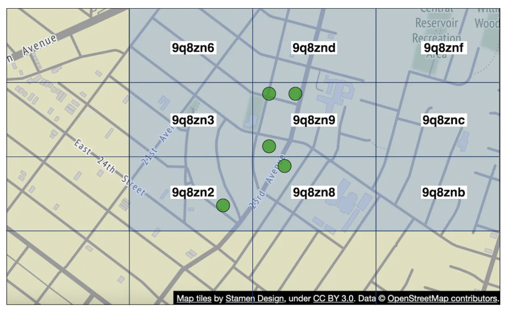

# Глава 17: Друзья поблизости (Nearby Friends)

## Введение

Эта глава посвящена проектированию масштабируемого бэкенда для приложения, которое позволяет пользователям делиться своим местоположением и находить друзей, которые находятся **поблизости**.

Главное отличие от главы про сервис поиска мест поблизости (proximity service) в том, что здесь **местоположения постоянно меняются**, тогда как там адреса заведений остаются более или менее неизменными.

---

## Шаг 1: Разберитесь в задаче и определите границы проектирования

Несколько вопросов, которые стоит задать на интервью:
 * К: Насколько близко географически считается «поблизости»?
 * И: 5 миль, и это число должно быть настраиваемым.
 * К: Расстояние считается по прямой или нужно учитывать, скажем, реку между друзьями?
 * И: Да, по прямой — это разумное допущение.
 * К: Сколько пользователей у приложения?
 * И: 1 млрд пользователей, и 10% из них пользуются функцией «друзья поблизости».
 * К: Нужно ли хранить историю местоположений?
 * И: Да, она может пригодиться, например, для машинного обучения.
 * К: Можем ли мы считать, что неактивные друзья исчезают из функции через 10 минут?
 * И: Да.
 * К: Нужно ли учитывать GDPR и тому подобное?
 * И: Нет, для простоты — нет.

### **Функциональные требования**

 * Пользователи должны видеть друзей поблизости в мобильном приложении. У каждого друга есть расстояние и временная метка, показывающая, когда местоположение было обновлено.
 * Список друзей поблизости должен обновляться каждые несколько секунд.

### **Нефункциональные требования**

- **Низкая задержка**: важно получать обновления местоположения без значительных задержек.
- **Надёжность**: эпизодическая потеря отдельных точек данных допустима, но система в целом должна быть доступна.
- **Согласованность в конечном счёте (eventual consistency)**: хранилищу данных о местоположении не нужна строгая согласованность. Задержка в несколько секунд при получении данных на разных репликах приемлема.

### **Прикидки на салфетке**

Несколько оценок, чтобы понять потенциальный масштаб:
 * Друзья поблизости — это друзья в радиусе 5 миль.
 * Интервал обновления местоположения — 30 с. Человек ходит медленно, поэтому обновлять местоположение чаще смысла нет.
 * В среднем 100 млн пользователей пользуются функцией ежедневно, из них 10% одновременно, то есть 10 млн.
 * В среднем у пользователя 400 друзей, и все они пользуются функцией «друзья поблизости».
 * Приложение показывает 20 друзей поблизости на страницу.
 * **QPS обновлений местоположения** = 10 млн / 30 == ~334k обновлений в секунду.

---

## Шаг 2: Предложите высокоуровневый дизайн и получите согласие

Прежде чем переходить к проектированию API и модели данных, разберёмся с протоколом взаимодействия, который мы будем использовать, — он менее привычен, чем традиционная модель «запрос-ответ».

### **Высокоуровневый дизайн**

На верхнем уровне нам нужно наладить эффективную передачу сообщений между узлами. Это можно сделать через одноранговый (peer-to-peer) протокол, но для мобильного приложения с нестабильным соединением и жёсткими ограничениями по энергопотреблению это непрактично.

Более практичный подход — использовать общий бэкенд как механизм веерной рассылки (fan-out) друзьям, до которых вы хотите достучаться:

    

Что делает бэкенд?
 * Принимает обновления местоположения от всех активных пользователей.
 * Для каждого обновления находит всех активных пользователей, которые должны его получить, и пересылает его им.
 * Не пересылает данные о местоположении, если расстояние между друзьями превышает заданный порог.

Звучит просто, но сложность в том, чтобы спроектировать систему под тот масштаб, с которым мы работаем.

Начнём с более простого дизайна, а более продвинутый подход обсудим в разделе с углублённым разбором:

    

- **Балансировщик нагрузки**: распределяет трафик между REST API-серверами, а также двунаправленными WebSocket-серверами.
- **REST API-серверы**: обрабатывают вспомогательные задачи — управление друзьями, обновление профилей и т. п.
- **WebSocket-серверы**: серверы с состоянием (stateful), которые пересылают запросы на обновление местоположения соответствующим клиентам. Они же отвечают за первоначальную «заливку» в мобильный клиент местоположений друзей поблизости при инициализации (подробнее об этом позже).
- **Кеш местоположений на Redis**: хранит самые свежие данные о местоположении каждого активного пользователя. Для каждой записи в кеше задан TTL. Когда TTL истекает, пользователь считается неактивным, и его данные удаляются из кеша.
- **База данных пользователей**: хранит данные о пользователях и дружеских связях. Подойдёт как реляционная, так и NoSQL-база.
- **База данных истории местоположений**: хранит историю местоположений пользователей — она не обязательно используется напрямую в функции «друзья поблизости», а служит для отслеживания исторических данных в аналитических целях.
- **Redis pub/sub**: используется как легковесная шина сообщений, которая позволяет завести отдельный топик-канал для обновлений местоположения каждого пользователя.

    

В примере выше WebSocket-серверы подписываются на каналы тех пользователей, которые к ним подключены, и пересылают обновления местоположения нужным пользователям по мере их поступления.

### **Периодическое обновление местоположения**

Вот как работает поток периодического обновления местоположения:

    

 * Мобильный клиент отправляет обновление местоположения на балансировщик нагрузки.
 * Балансировщик передаёт обновление в постоянное соединение этого клиента на WebSocket-сервере.
 * WebSocket-сервер сохраняет данные о местоположении в базу истории местоположений.
 * Данные о местоположении обновляются в кеше местоположений. WebSocket-сервер также сохраняет их в памяти для последующих расчётов расстояния для этого пользователя.
 * WebSocket-сервер публикует данные о местоположении в канал пользователя через Redis pub/sub.
 * Redis pub/sub рассылает обновление всем подписчикам канала этого пользователя, то есть серверам, отвечающим за его друзей.
 * Подписанные WebSocket-серверы получают обновление, вычисляют, каким пользователям его следует отправить, и отправляют.

Вот более детальная версия того же потока:

    

В среднем нужно будет переслать 40 обновлений местоположения, так как у пользователя в среднем 400 друзей и 10% из них в сети в каждый момент времени.

### **Проектирование API**

Процедуры (routines) по WebSocket, которые нам нужно поддержать:
 * периодическое обновление местоположения — пользователь отправляет данные о местоположении на WebSocket-сервер;
 * клиент получает обновление местоположения — сервер отправляет данные о местоположении друга и временную метку;
 * инициализация WebSocket-клиента — клиент отправляет своё местоположение, сервер возвращает местоположения друзей поблизости;
 * подписка на нового друга — WebSocket-сервер отправляет ID друга, за которым мобильный клиент должен следить, например когда друг впервые появляется в сети;
 * отписка от друга — WebSocket-сервер отправляет ID друга, от которого мобильный клиент должен отписаться, например из-за того, что друг ушёл в офлайн.

HTTP API — традиционные запросы/ответы для вспомогательных задач.

### **Модель данных**

 * Кеш местоположений хранит соответствие между `user_id` и `lat,long,timestamp`. Redis — отличный выбор для этого кеша, так как нас интересует только текущее местоположение, а Redis поддерживает вытеснение по TTL, которое нам как раз нужно.
 * Таблица истории местоположений хранит те же данные, но в реляционной таблице с четырьмя перечисленными выше колонками. Для этих данных подойдёт Cassandra, так как она оптимизирована под нагрузку с преобладанием записи.

---

## Шаг 3: Углублённый разбор дизайна

Обсудим, как масштабировать высокоуровневый дизайн, чтобы он работал на нужном нам масштабе.

### **Насколько хорошо масштабируется каждый компонент?**

- **API-серверы**: легко масштабируются через группы автомасштабирования и репликацию экземпляров серверов.
- **WebSocket-серверы**: их тоже легко масштабировать горизонтально, но нужно позаботиться о корректном (graceful) закрытии существующих соединений при выводе сервера из эксплуатации. Например, можно пометить сервер в балансировщике как «сливающий» (draining) и перестать направлять на него новые соединения, прежде чем окончательно убрать его из пула.
- **Инициализация клиента**: когда клиент впервые подключается к серверу, тот загружает список друзей пользователя, подписывается на их каналы в Redis pub/sub, забирает их местоположения из кеша и наконец пересылает всё клиенту.
- **База данных пользователей**: её можно шардировать по `user_id`. Также может быть разумно вынести данные о пользователях и друзьях в отдельный сервис с собственным API, за который отвечает выделенная команда.
- **Кеш местоположений**: легко шардируется — достаточно поднять несколько узлов Redis. К тому же TTL ограничивает максимальный объём памяти, который может быть занят одновременно. Но с большой нагрузкой на запись всё равно придётся справляться.
- **Сервер Redis pub/sub**: пользуемся тем, что инициализированные, но неиспользуемые каналы не потребляют память. Поэтому мы можем заранее выделить каналы для всех пользователей функции «друзья поблизости» и не разбираться с тем, как поднимать новый канал при появлении пользователя в сети и оповещать об этом активные WebSocket-серверы.

### **Углублённо о масштабировании компонента Redis pub/sub**

Чтобы поддерживать все pub/sub-каналы, нам понадобится около 200 GB памяти. Этого можно добиться двумя серверами Redis по 100 GB каждый.

Однако, учитывая, что нам нужно проталкивать ~14 млн обновлений местоположения в секунду, потребуется как минимум 140 серверов Redis, если считать, что один сервер выдерживает ~100k отправок в секунду.

Значит, для такой интенсивной нагрузки на CPU нужен распределённый кластер Redis.

Чтобы обеспечить работу распределённого кластера Redis, понадобится компонент обнаружения сервисов (service discovery) — например, ZooKeeper или etcd, — который отслеживает, какие серверы живы.

Вот какие данные нужно зафиксировать в компоненте обнаружения сервисов:

    

WebSocket-серверы используют эти данные, полученные из ZooKeeper, чтобы определить, где живёт тот или иной канал. Для эффективности данные хеш-кольца можно кешировать в памяти каждого WebSocket-сервера.

Что касается масштабирования кластера вверх или вниз, можно настроить ежедневную задачу, которая меняет размер кластера по историческим данным о трафике. Также можно держать запас мощности (overprovisioning), чтобы переживать всплески нагрузки.

Кластер Redis можно рассматривать как хранилище с состоянием, поскольку для каналов поддерживается некоторое состояние и требуется координация с подписчиками, чтобы они переключились на вновь поднятые узлы кластера.

Во время операций масштабирования нужно помнить о нескольких потенциальных проблемах:
 * Будет много запросов на переподписку от WebSocket-серверов из-за перемещения каналов.
 * Часть обновлений местоположения от клиентов может быть потеряна во время операции. Для нашей задачи это приемлемо, но всё же стоит минимизировать такие случаи. Имеет смысл проводить подобные операции в часы наименьшего трафика.
 * Можно применить консистентное хеширование (consistent hashing), чтобы минимизировать количество перемещаемых каналов при добавлении/удалении серверов.

    

### **Добавление и удаление друзей**

Всякий раз, когда друг добавляется или удаляется, WebSocket-сервер, отвечающий за затронутого пользователя, должен подписаться на канал друга или отписаться от него.

Поскольку функция «друзья поблизости» — часть более крупного приложения, можно считать, что на стороне мобильного клиента при возникновении любого из этих событий срабатывает зарегистрированный колбэк, и клиент отправляет WebSocket-серверу сообщение с нужным действием.

### **Пользователи с огромным числом друзей**

Можно ввести ограничение на общее количество друзей — например, в Facebook действует лимит в 5000 друзей.

WebSocket-сервер, обслуживающий такого «кита» (whale), получит повышенную нагрузку, но пока у нас достаточно WebSocket-серверов, всё будет нормально.

### **Случайный человек поблизости**

А что, если интервьюер захочет доработать дизайн и добавить функцию, при которой на карте друзей поблизости иногда всплывает случайный человек?

Один из способов — определить пул pub/sub-каналов на основе геохеша (geohash):

    

Каждый, кто находится внутри геохеша, подписывается на соответствующий канал и получает обновления местоположения случайных пользователей:

    

Можно также подписываться сразу на несколько геохешей, чтобы обработать случаи, когда человек рядом, но находится в соседнем геохеше:

    

### **Альтернатива Redis pub/sub**

Альтернатива использованию Redis для pub/sub — задействовать Erlang, язык общего назначения, оптимизированный под приложения для распределённых вычислений.

С его помощью можно порождать миллионы маленьких erlang-процессов, которые общаются друг с другом. Внутри распределённого erlang-приложения можно обрабатывать и WebSocket-соединения, и pub/sub-каналы.

Сложность с Erlang, однако, в том, что это нишевый язык программирования и найти сильных erlang-разработчиков может быть непросто.

---

## Шаг 4: Подведение итогов

Мы успешно спроектировали систему, поддерживающую функцию «друзья поблизости».

Ключевые компоненты:
- **WebSocket-серверы**: обмен данными в реальном времени между клиентом и сервером.
- **Redis**: быстрые чтение и запись данных о местоположении + pub/sub-каналы.

Мы также разобрали, как масштабировать REST API-серверы, WebSocket-серверы, слой данных и серверы Redis pub/sub, рассмотрели альтернативу Redis pub/sub, а заодно обсудили функцию «случайный человек поблизости».
