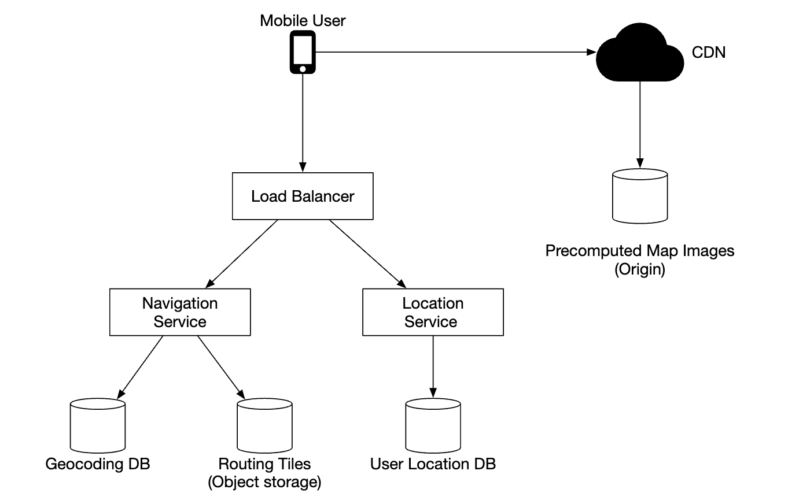
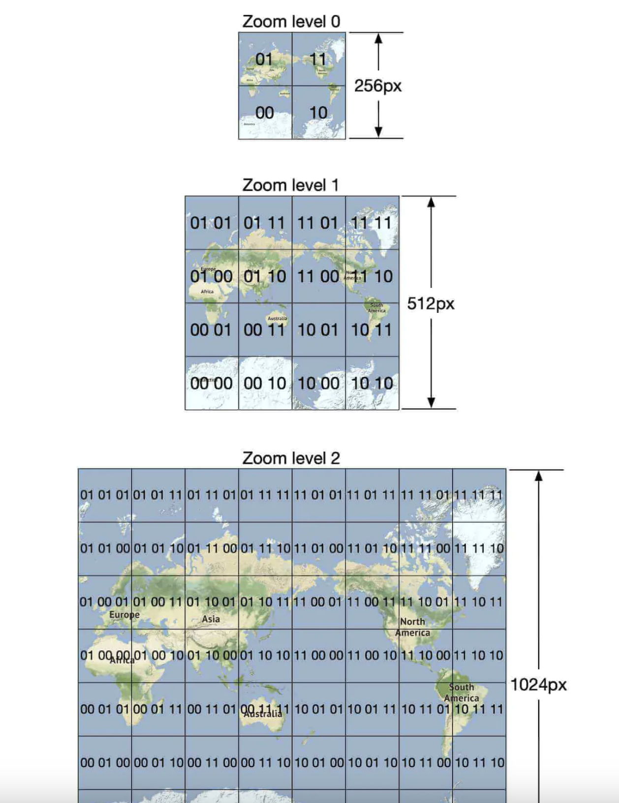
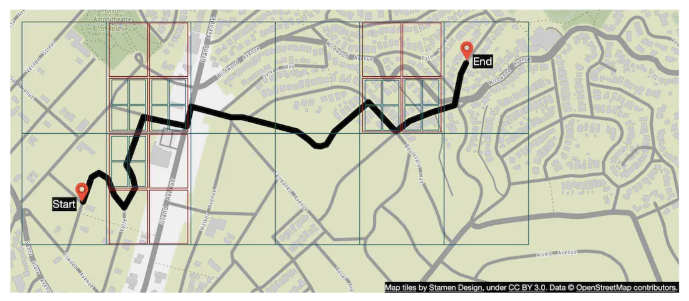

# Глава 18: Проектирование Google Maps

## Введение

Мы спроектируем упрощённую версию **Google Maps**.

Несколько фактов о Google Maps:
 * Запущен в 2005 году
 * Предоставляет разнообразные сервисы: спутниковые снимки, карты улиц, дорожную обстановку в реальном времени, планирование маршрутов
 * К 2021 году — 1 млрд активных пользователей в день, покрытие 99% мира, 25 млн ежедневных обновлений геолокации в реальном времени

---

## Шаг 1: Разобраться в задаче и определить границы проектирования

Пример диалога кандидата (К) и интервьюера (И):
 * К: Сколько активных пользователей в день у нас будет?
 * И: 1 млрд DAU
 * К: На каких функциях нужно сосредоточиться?
 * И: Обновление местоположения, навигация, расчётное время прибытия (ETA), отрисовка карты
 * К: Насколько велики данные о дорогах? У нас есть к ним доступ?
 * И: Мы получили дорожные данные из разных источников, это терабайты сырых данных
 * К: Нужно ли учитывать дорожную обстановку?
 * И: Да, это необходимо для точной оценки времени
 * К: А разные способы передвижения — пешком, на велосипеде, на автомобиле?
 * И: Их нужно поддерживать
 * К: Как насчёт маршрутов с несколькими остановками?
 * И: Давайте не будем на этом фокусироваться в рамках интервью
 * К: Заведения и фотографии?
 * И: Хороший вопрос, но их учитывать не нужно

Мы сосредоточимся на трёх ключевых функциях: обновление местоположения пользователя, сервис навигации (включая ETA), отрисовка карты.

### **Нефункциональные требования**

- **Точность**: пользователь не должен получать неверные указания
- **Плавная навигация**: карта должна отрисовываться плавно
- **Расход трафика и батареи**: клиент должен потреблять как можно меньше трафика и заряда. Это важно для мобильных устройств.
- Общие требования к доступности и масштабируемости

### **Карты для начинающих**

Прежде чем переходить к проектированию, стоит разобраться с несколькими понятиями из мира карт.

#### Система координат

Мир — это сфера, вращающаяся вокруг своей оси. Положение задаётся широтой (насколько далеко вы на север/юг) и долготой (насколько далеко на восток/запад):

<div style="margin-left:3rem">
    
</div>

#### Из 3D в 2D

Процесс переноса точек из трёхмерного пространства на двумерную плоскость называется «картографической проекцией» (map projection).

Существуют разные способы это сделать, у каждого свои плюсы и минусы. Почти все они искажают реальную геометрию.

<div style="margin-left:3rem">
    
</div>

Google Maps выбрал модифицированный вариант проекции Меркатора под названием «Web Mercator».

#### Геокодирование

Геокодирование (geocoding) — это процесс преобразования адресов в географические координаты.

Обратный процесс называется «обратным геокодированием» (reverse geocoding).

Один из способов реализации — интерполяция: используются данные из разных источников (например, ГИС), где уличная сеть отображена в пространство географических координат.

#### Геохеширование

Геохеширование (geohashing) — это система кодирования, которая представляет географическую область в виде строки из букв и цифр.

Мир рассматривается как плоская поверхность, которая рекурсивно делится на четыре квадранта:

<div style="margin-left:3rem">
    
</div>

#### Отрисовка карты

Отрисовка карты выполняется с помощью тайлов (tiling). Вместо того чтобы отрисовывать всю карту как одно огромное изображение, мир разбивается на небольшие тайлы карты (map tiles).

Клиент скачивает только нужные тайлы и отрисовывает их, складывая как мозаику.

Для разных уровней масштаба есть разные наборы тайлов. Клиент выбирает подходящие тайлы в зависимости от текущего уровня масштаба.

Например, при максимальном отдалении, когда виден весь мир, скачивается всего один тайл 256x256, представляющий весь земной шар.

#### Обработка дорожных данных для алгоритмов навигации

В большинстве алгоритмов маршрутизации (routing) перекрёстки представлены узлами графа, а дороги — рёбрами:

<div style="margin-left:3rem">
    
</div>

Большинство навигационных алгоритмов используют модифицированные версии алгоритма Дейкстры или A*.

Производительность поиска пути сильно зависит от размера графа. Чтобы работать в масштабе, мы не можем представить весь мир одним графом и запускать алгоритм на нём.

Вместо этого применяется приём, похожий на тайлинг: мы разбиваем мир на всё более и более мелкие графы.

Тайлы маршрутизации (routing tiles) хранят ссылки на соседние тайлы, и алгоритм может «сшивать» из них более крупный дорожный граф по мере обхода связанных тайлов:

<div style="margin-left:3rem">
    
</div>

Этот приём позволяет значительно сократить объём памяти и загружать только те тайлы, которые нужны для конкретной пары «откуда/куда».

Однако для длинных маршрутов сшивание мелких, детализированных тайлов маршрутизации всё равно потребует много времени и памяти. Поэтому существуют тайлы маршрутизации с разным уровнем детализации, и алгоритм использует тайлы подходящей детализации в зависимости от того, куда мы направляемся:

<div style="margin-left:3rem">
    
</div>

### **Приблизительные оценки**

Для хранения нам потребуются:
 * карта мира — оценочно ~70 ПБ, исходя из числа тайлов, которые нужно хранить, с учётом сжатия очень похожих тайлов (например, огромные пустыни)
 * метаданные — пренебрежимо малы по объёму, поэтому в расчётах их можно опустить
 * информация о дорогах — хранится в виде тайлов маршрутизации

Оценка QPS для навигационных запросов: 1 млрд DAU при 35 минутах использования в неделю → 5 млрд минут в день.
Если предположить, что запросы с GPS-обновлениями отправляются пакетами, получаем 200k QPS и 1 млн QPS при пиковой нагрузке.

---

## Шаг 2: Предложить высокоуровневый дизайн и согласовать его

<div style="margin-left:3rem">
    
</div>

### **Сервис местоположения**

<div style="margin-left:3rem">
    
</div>

Он отвечает за запись обновлений местоположения пользователя:
 * обновления местоположения отправляются каждые `t` секунд
 * потоки данных о местоположении можно со временем использовать для улучшения сервиса: более точный расчёт ETA, мониторинг трафика, обнаружение перекрытых дорог, анализ поведения пользователей и т.д.

Вместо того чтобы постоянно отправлять обновления местоположения на сервер, можно накапливать их на стороне клиента и отправлять пакетами:

<div style="margin-left:3rem">
    
</div>

Несмотря на эту оптимизацию, для системы масштаба Google Maps нагрузка всё равно будет значительной. Поэтому стоит использовать базу данных, оптимизированную под интенсивную запись, например Cassandra.

Также можно задействовать Kafka для эффективной потоковой обработки обновлений местоположения, предназначенных для дальнейшего анализа.

Пример тела запроса на обновление местоположения:

```
POST /v1/locations
Parameters
  locs: JSON-массив кортежей (latitude, longitude, timestamp).
```

### **Сервис навигации**

Этот компонент отвечает за поиск быстрых маршрутов между точками A и B за разумное время (небольшая задержка допустима). Маршрут не обязан быть самым быстрым, но точность важна.

Пример запроса:

```
GET /v1/nav?origin=1355+market+street,SF&destination=Disneyland
```

Пример ответа:

```json
{
  "distance": {"text":"0.2 mi", "value": 259},
  "duration": {"text": "1 min", "value": 83},
  "end_location": {"lat": 37.4038943, "Ing": -121.9410454},
  "html_instructions": "Head <b>northeast</b> on <b>Brandon St</b> toward <b>Lumin Way</b><div style=\"font-size:0.9em\">Restricted usage road</div>",
  "polyline": {"points": "_fhcFjbhgVuAwDsCal"},
  "start_location": {"lat": 37.4027165, "lng": -121.9435809},
  "geocoded_waypoints": [
    {
       "geocoder_status" : "OK",
       "partial_match" : true,
       "place_id" : "ChIJwZNMti1fawwRO2aVVVX2yKg",
       "types" : [ "locality", "political" ]
    },
    {
       "geocoder_status" : "OK",
       "partial_match" : true,
       "place_id" : "ChIJ3aPgQGtXawwRLYeiBMUi7bM",
       "types" : [ "locality", "political" ]
    }
  ],
  "travel_mode": "DRIVING"
}
```

Изменения дорожной обстановки и перестроение маршрута пока не учитываются — мы разберём их в разделе детального проектирования.

### **Отрисовка карты**

Хранить весь набор тайлов карты на стороне клиента невозможно — он занимает петабайты.

Их нужно запрашивать с сервера по требованию, исходя из местоположения клиента и уровня масштаба.

Когда следует загружать новые тайлы: когда пользователь приближает/отдаляет карту и во время навигации, когда он движется в сторону нового тайла.

Как отдавать тайлы карты клиенту?
 * Их можно строить динамически, но это создаёт огромную нагрузку на сервер и затрудняет кэширование
 * Тайлы карты отдаются статически, по их геохешу (geohash), который клиент может вычислить сам. Их можно статически хранить и раздавать через CDN

<div style="margin-left:3rem">
    
</div>

CDN позволяет пользователям получать тайлы карты с ближайших к ним точек присутствия (POP), что минимизирует задержку:

<div style="margin-left:3rem">
    
</div>

Варианты определения нужных тайлов:
 * геохеш тайла можно вычислять на стороне клиента. В этом случае нужно понимать, что мы надолго привязываемся к такому способу вычисления тайлов, поскольку заставить клиентов обновиться трудно
 * либо можно сделать простой API, который вычисляет URL тайлов от имени клиента ценой дополнительного вызова API

<div style="margin-left:3rem">
    
</div>

---

## Шаг 3: Детальное проектирование

### **Модель данных**

Обсудим, как хранить разные типы данных, с которыми мы имеем дело.

#### Тайлы маршрутизации

Исходный набор дорожных данных получен из разных источников. Со временем он улучшается на основе данных об обновлениях местоположения.

Дорожные данные неструктурированы. У нас есть периодический офлайн-пайплайн обработки, который преобразует эти сырые данные в тайлы маршрутизации на основе графов, необходимые нашему приложению.

Хранить эти тайлы в базе данных незачем — возможности БД нам не нужны. Вместо этого можно хранить их в объектном хранилище S3, агрессивно кэшируя.

Также можно воспользоваться библиотеками для эффективного сжатия списков смежности в бинарные файлы.

#### Данные о местоположении пользователей

Данные о местоположении пользователей очень полезны для обновления дорожной обстановки и всевозможного другого анализа.

Для хранения таких данных можно использовать Cassandra, поскольку по своей природе это данные с интенсивной записью.

Пример строки:

<div style="margin-left:3rem">
    
</div>

#### База данных геокодирования

Эта база хранит пары «ключ-значение»: координаты (широта/долгота) и места.

Можно использовать Redis из-за высокой скорости чтения, так как у нас частые чтения и редкие записи.

#### Предварительно вычисленные изображения карты мира

Как мы уже обсуждали, изображения тайлов карты будут вычислены заранее и сохранены в CDN.

<div style="margin-left:3rem">
    
</div>

### **Сервисы**

#### Сервис местоположения

Рассмотрим подробнее устройство базы данных и то, как хранится местоположение пользователя в этом сервисе.

<div style="margin-left:3rem">
    
</div>

Для обработки высокой нагрузки на запись при обновлениях местоположения можно использовать NoSQL-базу данных. Мы отдаём приоритет доступности, а не согласованности, поскольку данные о местоположении часто меняются и устаревают по мере поступления новых обновлений.

В качестве базы данных выберем Cassandra — она хорошо подходит под все наши требования.

Пример строки, которую мы будем хранить:

<div style="margin-left:3rem">
    
</div>

 * `user_id` — ключ партиционирования, чтобы быстро получать все обновления местоположения конкретного пользователя
 * `timestamp` — ключ кластеризации, чтобы данные хранились отсортированными по времени получения обновления

Мы также используем Kafka для потоковой передачи обновлений местоположения в другие сервисы, которым эти данные нужны для разных целей:

<div style="margin-left:3rem">
    
</div>

#### Отрисовка карты

Тайлы карты хранятся для разных уровней масштаба. На самом низком уровне масштаба весь мир представлен одним тайлом 256x256.

С каждым следующим уровнем масштаба число тайлов увеличивается вчетверо:

<div style="margin-left:3rem">
    
</div>

Одна из возможных оптимизаций — не передавать по сети всё изображение целиком, а представлять тайлы в векторном виде (контуры и полигоны) и позволять клиенту отрисовывать их динамически.

Это даст существенную экономию трафика.

#### Сервис навигации

Этот сервис отвечает за поиск самых быстрых маршрутов:

<div style="margin-left:3rem">
    
</div>

Пройдёмся по каждому компоненту этой подсистемы.

Во-первых, есть сервис геокодирования, который преобразует адрес в координаты — пару «широта/долгота».

Пример запроса:

```
https://maps.googleapis.com/maps/api/geocode/json?address=1600+Amphitheatre+Parkway,+Mountain+View,+CA
```

Пример ответа:

```json
{
   "results" : [
      {
         "formatted_address" : "1600 Amphitheatre Parkway, Mountain View, CA 94043, USA",
         "geometry" : {
            "location" : {
               "lat" : 37.4224764,
               "lng" : -122.0842499
            },
            "location_type" : "ROOFTOP",
            "viewport" : {
               "northeast" : {
                  "lat" : 37.4238253802915,
                  "lng" : -122.0829009197085
               },
               "southwest" : {
                  "lat" : 37.4211274197085,
                  "lng" : -122.0855988802915
               }
            }
         },
         "place_id" : "ChIJ2eUgeAK6j4ARbn5u_wAGqWA",
         "plus_code": {
            "compound_code": "CWC8+W5 Mountain View, California, United States",
            "global_code": "849VCWC8+W5"
         },
         "types" : [ "street_address" ]
      }
   ],
   "status" : "OK"
}
```

Сервис планирования маршрутов (route planner) вычисляет предлагаемый маршрут, оптимизированный по времени в пути с учётом текущей дорожной обстановки.

Сервис кратчайшего пути (shortest-path service) запускает вариацию алгоритма A* на тайлах маршрутизации из объектного хранилища и вычисляет оптимальный путь:
 * Он получает пары «откуда/куда», преобразует их в пары «широта/долгота» и вычисляет по ним геохеши, чтобы определить нужные тайлы маршрутизации
 * Алгоритм стартует с начального тайла маршрутизации и обходит граф, пока не найдёт достаточно хороший путь до тайла назначения

<div style="margin-left:3rem">
    
</div>

Сервис ETA вызывается планировщиком маршрутов для получения расчётного времени прибытия — на основе алгоритмов машинного обучения, предсказывающих ETA по данным о трафике.

Сервис ранжирования (ranker) отвечает за ранжирование возможных путей с учётом фильтров, заданных пользователем, например флагов «избегать платных дорог» или «избегать автомагистралей».

Сервис обновления (updater) асинхронно обновляет некоторые важные базы данных, поддерживая их в актуальном состоянии.

#### Улучшение — адаптивный ETA и перестроение маршрута

Одно из возможных улучшений — адаптивно корректировать активные маршруты по мере поступления новых данных о трафике.

Один из способов реализации: хранить в базе данных пользователей, которые сейчас едут по маршруту, записывая все тайлы, через которые они должны проехать.

Данные могут выглядеть так:

```
user_1: r_1, r_2, r_3, …, r_k
user_2: r_4, r_6, r_9, …, r_n
user_3: r_2, r_8, r_9, …, r_m
...
user_n: r_2, r_10, r21, ..., r_l
```

Если на каком-то тайле происходит ДТП, мы можем найти всех пользователей, чей путь проходит через этот тайл, и перестроить их маршруты.

Чтобы сократить число тайлов, хранимых в базе, можно вместо этого хранить исходный тайл маршрутизации и несколько тайлов разных уровней детализации — до тех пор, пока тайл назначения не окажется внутри одного из них:

```
user_1, r_1, super(r_1), super(super(r_1)), ...
```

<div style="margin-left:3rem">
    
</div>

При таком подходе достаточно проверить, содержит ли последний (самый крупный) тайл пользователя тайл с ДТП, чтобы понять, затронут ли пользователь.

Также можно отслеживать все возможные маршруты для пользователя в пути и уведомлять его, если доступен более быстрый вариант.

#### Протоколы доставки

У нас есть несколько вариантов, позволяющих проактивно отправлять данные клиентам с сервера:
 * Мобильные push-уведомления не подходят: размер полезной нагрузки ограничен, и они недоступны для веб-приложений
 * WebSocket в целом лучше, чем длинные опросы (long-polling), так как создаёт меньшую вычислительную нагрузку на серверы
 * Можно также использовать server-sent events (SSE), но мы склоняемся к WebSocket, поскольку он поддерживает двунаправленную связь, что может пригодиться, например, для функции доставки «последней мили»

---

## Шаг 4: Подведение итогов

Вот наш итоговый дизайн:

<div style="margin-left:3rem">
    
</div>

Ещё одна функция, которую можно предложить, — навигация с несколькими остановками. Её можно продавать корпоративным клиентам вроде Uber или Lyft, чтобы определять оптимальный путь для посещения набора точек.
