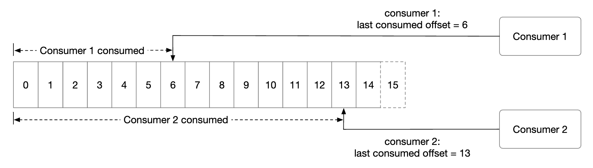
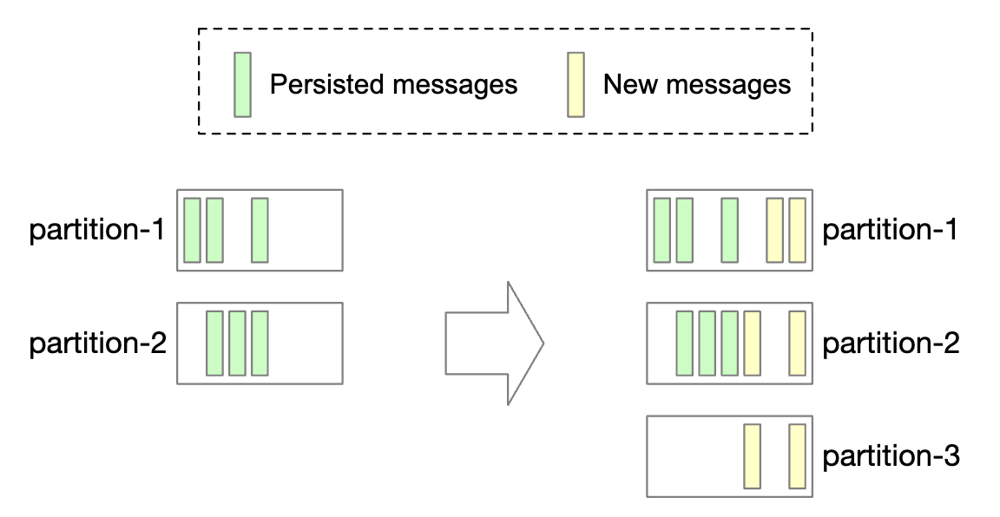

# Глава 19: Распределённая очередь сообщений

## Введение

В этой главе мы спроектируем **распределённую очередь сообщений** (distributed message queue).

Преимущества очередей сообщений:
- **Развязка компонентов (decoupling)**: устраняет жёсткую связанность между компонентами — их можно обновлять независимо друг от друга.
- **Лучшая масштабируемость**: производители и потребители масштабируются независимо, в зависимости от нагрузки.
- **Повышенная доступность**: если одна часть системы выходит из строя, остальные продолжают взаимодействовать с очередью.
- **Более высокая производительность**: производители могут отправлять сообщения, не дожидаясь подтверждения от потребителей.

Популярные реализации очередей сообщений — Kafka, RabbitMQ, RocketMQ, Apache Pulsar, ActiveMQ, ZeroMQ.

Строго говоря, Kafka и Pulsar — не очереди сообщений, а платформы потоковой обработки событий (event streaming platforms).
Однако наборы их возможностей постепенно сближаются, и граница между очередями сообщений и платформами потоковой обработки событий размывается.

В этой главе мы будем строить очередь сообщений с поддержкой более продвинутых возможностей: длительного хранения данных, повторного потребления сообщений и т. д.

---

## Шаг 1: Понять задачу и определить рамки проектирования

Очередь сообщений должна поддерживать несколько базовых функций: производители (producers) отправляют сообщения, а потребители (consumers) их потребляют.
Однако есть разные нюансы, связанные с производительностью, доставкой сообщений, хранением данных и т. д.

Вот примерный набор вопросов между кандидатом и интервьюером:
 * К: Каков формат и средний размер сообщения? Это только текст?
 * И: Сообщения только текстовые, обычно размером в несколько КБ.
 * К: Могут ли сообщения потребляться повторно?
 * И: Да, сообщения могут повторно потребляться разными потребителями. Это дополнительное требование, которого традиционные очереди сообщений не поддерживают.
 * К: Потребляются ли сообщения в том же порядке, в котором были отправлены?
 * И: Да, гарантия порядка должна сохраняться. Это дополнительное требование, традиционные очереди сообщений его не поддерживают.
 * К: Каковы требования к сроку хранения данных?
 * И: Сообщения должны храниться две недели. Это дополнительное требование.
 * К: Сколько производителей и потребителей мы хотим поддерживать?
 * И: Чем больше, тем лучше.
 * К: Какую семантику доставки данных мы хотим поддерживать? Не более одного раза, хотя бы один раз, ровно один раз?
 * И: Мы точно хотим поддерживать доставку хотя бы один раз. В идеале — поддерживать все варианты и сделать их настраиваемыми.
 * К: Каковы целевые показатели пропускной способности и сквозной задержки?
 * И: Система должна поддерживать высокую пропускную способность для сценариев вроде агрегации логов и низкую задержку для более традиционных сценариев.

### **Функциональные требования**

 * Производители отправляют сообщения в очередь
 * Потребители читают сообщения из очереди
 * Сообщения могут потребляться однократно или многократно
 * Исторические данные можно усекать
 * Размер сообщения — порядка килобайт
 * Порядок сообщений должен сохраняться
 * Семантика доставки настраивается: не более одного раза / хотя бы один раз / ровно один раз (at-most-once / at-least-once / exactly-once).

### **Нефункциональные требования**

- **Высокая пропускная способность или низкая задержка**: настраивается в зависимости от сценария использования
- **Масштабируемость**: система должна быть распределённой и выдерживать внезапные всплески объёма сообщений
- **Персистентность и надёжность хранения**: данные должны сохраняться на диск и реплицироваться между узлами

Традиционные очереди сообщений обычно не поддерживают длительное хранение данных и не дают гарантий порядка. Это сильно упрощает дизайн, и мы это обсудим.

---

## Шаг 2: Предложить высокоуровневый дизайн и согласовать его

Ключевые компоненты очереди сообщений:

    

 * Производитель отправляет сообщения в очередь
 * Потребитель подписывается на очередь и читает сообщения из подписки
 * Очередь сообщений — сервис посередине, который развязывает производителей и потребителей, позволяя им масштабироваться независимо.
 * Производитель и потребитель — клиенты, а очередь сообщений — сервер.

### **Модели обмена сообщениями**

Первый тип модели — «точка-точка» (point-to-point), она типична для традиционных очередей сообщений:

    

 * Сообщение отправляется в очередь и потребляется ровно одним потребителем.
 * Потребителей может быть несколько, но каждое сообщение потребляется только один раз.
 * Как только потребитель подтверждает обработку сообщения, оно удаляется из очереди.
 * В модели «точка-точка» нет хранения данных, а в нашем дизайне оно есть.

Модель «публикация-подписка» (publish-subscribe), напротив, более характерна для платформ потоковой обработки событий:

    

 * В этой модели сообщения привязаны к топику (topic).
 * Потребители подписываются на топик и получают все сообщения, отправленные в него.

### **Топики, партиции и брокеры**

Что делать, если объём данных в топике слишком велик? Один из способов масштабирования — разбить топик на партиции (partition), то есть применить шардирование:

    

 * Сообщения, отправляемые в топик, равномерно распределяются между партициями
 * Серверы, на которых размещаются партиции, называются брокерами (broker)
 * Каждый топик работает как очередь FIFO при обработке сообщений. Порядок сообщений сохраняется в пределах партиции.
 * Позиция сообщения внутри партиции называется **смещением** (offset).
 * Каждое произведённое сообщение попадает в конкретную партицию. Ключ партиционирования (partition key) определяет, в какую партицию попадёт сообщение.
   * Например, в качестве ключа партиционирования можно использовать `user_id`, чтобы гарантировать порядок сообщений одного пользователя.
 * Каждый потребитель подписывается на одну или несколько партиций. Когда одни и те же сообщения читают несколько потребителей, они образуют группу потребителей (consumer group).

### **Группы потребителей**

Группа потребителей — это набор потребителей, которые совместно читают сообщения из топика:

    

 * Сообщения реплицируются на каждую группу потребителей (а не на каждого потребителя).
 * Каждая группа потребителей хранит своё собственное смещение.
 * Параллельное чтение сообщений группой потребителей повышает пропускную способность, но мешает гарантии порядка.
 * Это можно смягчить, разрешив подписываться на партицию только одному потребителю из группы.
 * Значит, в группе не может быть больше потребителей, чем партиций.

### **Высокоуровневая архитектура**

    

- **Клиенты**: производитель и потребитель. Производитель отправляет сообщения в заданный топик. Группа потребителей подписывается на сообщения из топика.
- **Брокеры**: содержат множество партиций. Партиция хранит подмножество сообщений топика.
- **Хранилище данных**: хранит сообщения в партициях.
- **Хранилище состояния**: хранит состояние потребителей.
- **Хранилище метаданных**: хранит конфигурацию и свойства топиков.
- **Сервис координации**: отвечает за обнаружение сервисов (какие брокеры живы) и выбор лидера (какой брокер является лидером и отвечает за назначение партиций).

---

## Шаг 3: Детальное проектирование

Чтобы добиться высокой пропускной способности и выполнить требование длительного хранения данных, мы приняли несколько важных проектных решений:
 * Выбрали дисковую структуру данных, которая использует особенности современных HDD и стратегии кэширования диска в современных ОС.
 * Структура данных сообщения неизменяема (immutable), чтобы избежать лишнего копирования — в системе с большими объёмами и высокой нагрузкой это критично.
 * Спроектировали запись вокруг пакетирования (batching), поскольку мелкий ввод-вывод — враг высокой пропускной способности.

### **Хранилище данных**

Чтобы выбрать лучшее хранилище для сообщений, рассмотрим их свойства:
 * Интенсивная запись и интенсивное чтение
 * Нет операций обновления и удаления. В традиционных очередях сообщений есть операция «удалить», поскольку сообщения там не хранятся.
 * Преимущественно последовательный доступ на чтение и запись.

Какие у нас варианты:
- **База данных**: не идеально, так как типичные БД плохо справляются с системами, где одновременно интенсивны и запись, и чтение.
- **Журнал с упреждающей записью (write-ahead log, WAL)**: обычный файл, поддерживающий только дозапись в конец, очень дружелюбный к HDD.
  * Мы разбиваем партиции на сегменты, чтобы не держать один огромный файл.
  * Старые сегменты доступны только для чтения. Запись принимает только самый свежий сегмент.

    

WAL-файлы чрезвычайно эффективны при работе с традиционными HDD.

Существует заблуждение, что доступ к HDD медленный, но это сильно зависит от паттерна доступа.
При последовательном доступе (как в нашем случае) HDD достигают скорости чтения/записи в несколько МБ/с, чего для наших нужд достаточно.
Мы также пользуемся тем, что ОС агрессивно кэширует дисковые данные в памяти.

### **Структура данных сообщения**

Важно, чтобы схема сообщения была согласована между производителем, очередью и потребителем — это позволяет избежать лишнего копирования и обрабатывать данные гораздо эффективнее.

Пример структуры сообщения:

    

Ключ сообщения определяет, к какой партиции оно относится. Пример отображения — `hash(key) % numPartitions`.
Для большей гибкости производитель может переопределять ключи по умолчанию, чтобы управлять тем, по каким партициям распределяются сообщения.

Значение сообщения — это его полезная нагрузка. Это может быть обычный текст или сжатый бинарный блок.

**Примечание:** ключи сообщений, в отличие от традиционных KV-хранилищ, не обязаны быть уникальными. Допустимы дубликаты ключей и даже их отсутствие.

Прочие поля сообщения:
- **Topic**: топик, к которому относится сообщение
- **Partition**: идентификатор партиции, к которой относится сообщение
- **Offset**: позиция сообщения в партиции. Сообщение можно найти по тройке `topic`, `partition`, `offset`.
- **Timestamp**: время сохранения сообщения
- **Size**: размер сообщения
- **CRC**: контрольная сумма для проверки целостности сообщения

Дополнительные возможности, например фильтрацию, можно поддержать, добавив дополнительные поля.

### **Пакетирование**

Пакетирование (batching) критично для производительности нашей системы. Мы применяем его в производителе, потребителе и самой очереди сообщений.

Оно важно, потому что:
 * Позволяет операционной системе группировать сообщения, амортизируя стоимость дорогих сетевых круговых обходов
 * Сообщения записываются в WAL группами последовательно, что даёт много последовательных записей и хорошее дисковое кэширование.

Здесь есть компромисс между задержкой и пропускной способностью:
 * Крупные пакеты дают высокую пропускную способность, но и более высокую задержку.
 * Мелкие пакеты дают меньшую пропускную способность и меньшую задержку.

Если нужна низкая задержка, потому что система развёрнута как традиционная очередь сообщений, её можно настроить на меньший размер пакета.

Если же система настроена на пропускную способность, может понадобиться больше партиций на топик, чтобы компенсировать более медленную последовательную запись на диск.

### **Путь производителя**

Если производитель хочет отправить сообщение в партицию, к какому брокеру ему подключаться?

Один из вариантов — ввести слой маршрутизации, который направляет сообщения нужному брокеру. Если включена репликация, нужный брокер — это лидер-реплика:

    

 * Слой маршрутизации читает план репликации из хранилища метаданных и кэширует его локально.
 * Производитель отправляет сообщение в слой маршрутизации.
 * Сообщение пересылается брокеру 1, который является лидером данной партиции.
 * Реплики-подписчики (followers) забирают новое сообщение у лидера. Получив достаточно подтверждений, лидер фиксирует данные и отвечает производителю.

Реплики нужны для обеспечения отказоустойчивости.

Такой подход работает, но имеет недостатки:
 * Дополнительные сетевые переходы из-за лишнего компонента
 * Дизайн не позволяет пакетировать сообщения

Чтобы устранить эти проблемы, можно встроить слой маршрутизации прямо в производитель:

    

 * Меньше сетевых переходов — ниже задержка
 * Производители могут управлять тем, в какую партицию направляется сообщение
 * Буфер позволяет накапливать сообщения в памяти и отправлять крупные пакеты одним запросом, что повышает пропускную способность.

Выбор размера пакета — классический компромисс между пропускной способностью и задержкой.

    

 * Больший размер пакета означает более долгое ожидание перед отправкой пакета.
 * Меньший размер пакета означает, что запрос уходит раньше и задержка ниже, но ниже и пропускная способность.

### **Путь потребителя**

Потребитель указывает своё смещение в партиции и получает порцию сообщений, начиная с этого смещения:

    

Важный вопрос при проектировании потребителя — использовать модель push или pull:
- **Модель push**: даёт меньшую задержку, так как брокер проталкивает сообщения потребителю сразу по мере их поступления.
  * Однако если скорость потребления отстаёт от скорости производства, потребитель может захлебнуться.
  * Сложно работать с потребителями разной вычислительной мощности, поскольку темп потребления задаёт брокер.
- **Модель pull**: темп потребления контролирует сам потребитель.
  * Если потребление идёт медленно, потребитель не будет перегружен, а мы сможем отмасштабировать его, чтобы наверстать.
  * Модель pull лучше подходит для пакетной обработки, потому что в модели push брокер не знает, сколько сообщений потянет потребитель.
  * В модели pull, напротив, потребители могут агрессивно забирать крупные пакеты сообщений.
  * Минусы — более высокая задержка и лишние сетевые вызовы, когда новых сообщений нет. Последнюю проблему можно смягчить с помощью длинных опросов (long polling).

Поэтому большинство очередей сообщений (и мы тоже) выбирают модель pull.

    

 * Новый потребитель подписывается на топик A и вступает в группу 1.
 * Нужный узел-брокер находится хешированием имени группы. Так все потребители группы подключаются к одному и тому же брокеру.
 * Обратите внимание: этот координатор группы потребителей — не то же самое, что сервис координации (ZooKeeper).
 * Координатор подтверждает вступление потребителя в группу и назначает ему партицию 2.
 * Существуют разные стратегии назначения партиций — round-robin, по диапазонам (range) и т. д.
 * Потребитель забирает свежие сообщения, начиная с последнего смещения. Смещения потребителей хранятся в хранилище состояния.
 * Потребитель обрабатывает сообщения и фиксирует смещение у брокера. Порядок этих операций влияет на семантику доставки сообщений.

### **Ребалансировка потребителей**

Ребалансировка потребителей решает, какие потребители отвечают за какие партиции.

Этот процесс запускается, когда потребитель присоединяется к группе или покидает её, а также когда партиция добавляется или удаляется.

Брокер, выступающий в роли координатора, играет ключевую роль в оркестрации процесса ребалансировки.

    

 * Все потребители одной группы подключены к одному координатору. Координатор определяется хешированием имени группы.
 * Когда список потребителей меняется, координатор выбирает нового лидера группы.
 * Лидер группы рассчитывает новый план распределения партиций и сообщает его координатору, который рассылает его остальным потребителям.

Когда координатор перестаёт получать heartbeat-сигналы от потребителей группы, запускается ребалансировка:

    

Разберём, что происходит, когда потребитель вступает в группу:

    

 * Изначально в группе только потребитель A, и он потребляет все партиции.
 * Потребитель B отправляет запрос на вступление в группу.
 * Координатор пассивно уведомляет всех участников группы о необходимости ребалансировки — в ответе на heartbeat.
 * Когда все потребители заново вступили в группу, координатор выбирает лидера и сообщает остальным результат выборов.
 * Лидер формирует план распределения партиций и отправляет его координатору. Остальные ждут этот план.
 * Потребители начинают читать из вновь назначенных партиций.

Вот что происходит, когда потребитель покидает группу:

    

 * Потребители A и B состоят в одной группе.
 * Потребитель B просит исключить его из группы.
 * Когда координатор получает heartbeat от A, он сообщает ему, что пора выполнить ребалансировку.
 * Остальные шаги те же самые.

Аналогично протекает процесс, когда потребитель долго не присылает heartbeat:

    

### **Хранилище состояния**

Хранилище состояния хранит соответствие между партициями и потребителями, а также последние потреблённые смещения по каждой партиции.

    

Смещение группы 1 равно 6 — значит, все предыдущие сообщения потреблены. Если потребитель упадёт, новый потребитель продолжит с этого сообщения.

Паттерны доступа к данным о состоянии потребителей:
 * Частые операции чтения/записи, но небольшой объём
 * Данные часто обновляются, но редко удаляются
 * Случайный доступ на чтение и запись
 * Важна согласованность данных

С учётом этих требований идеально подходит быстрое KV-хранилище вроде ZooKeeper.

### **Хранилище метаданных**

Хранилище метаданных хранит конфигурацию и свойства топиков: число партиций, срок хранения, распределение реплик.

Метаданные меняются редко, их объём мал, но требования к согласованности высоки.
ZooKeeper — хороший выбор для такого хранилища.

### **ZooKeeper**

ZooKeeper незаменим при построении распределённых очередей сообщений.

Это иерархическое хранилище «ключ-значение», которое часто используют для распределённой конфигурации, сервиса синхронизации и реестра имён (то есть обнаружения сервисов).

    

С этим изменением брокеру остаётся хранить только данные сообщений. Метаданные и состояние хранятся в ZooKeeper.

ZooKeeper также помогает с выбором лидера среди реплик брокеров.

### **Репликация**

В распределённых системах отказы оборудования неизбежны. С этим можно бороться с помощью репликации, обеспечивающей высокую доступность.

    

 * Каждая партиция реплицируется на несколько брокеров, но лидер-реплика только одна.
 * Производители отправляют сообщения лидер-репликам.
 * Реплики-подписчики забирают реплицируемые сообщения у лидера.
 * Когда синхронизировано достаточно реплик, лидер возвращает подтверждение производителю.
 * Распределение реплик по каждой партиции называется планом распределения реплик (replica distribution plan).
 * Лидер конкретной партиции создаёт план распределения реплик и сохраняет его в ZooKeeper.

### **Синхронизированные реплики**

Одна из задач, которые надо решить, — поддержание сообщений в синхронизированном состоянии между лидером и подписчиками для конкретной партиции.

Синхронизированные реплики (in-sync replicas, ISR) — это реплики партиции, которые не отстают от лидера.

Параметр `replica.lag.max.messages` определяет, на сколько сообщений реплика может отставать от лидера, оставаясь при этом синхронизированной.

    

 * Зафиксированное смещение — 13.
 * В лидер записаны два новых сообщения, но они ещё не зафиксированы.
 * Сообщение считается зафиксированным, когда все реплики из ISR его синхронизировали.
 * Реплики 2 и 3 полностью догнали лидера, поэтому входят в ISR.
 * Реплика 4 отстала, поэтому пока исключена из ISR.

ISR отражает компромисс между производительностью и надёжностью хранения.
 * Чтобы производители не теряли сообщения, все реплики должны синхронизироваться до отправки подтверждения.
 * Но одна медленная реплика сделает недоступной всю партицию.

Обработка подтверждений настраивается.

`ACK=all` означает, что сообщение должны синхронизировать все реплики из ISR. Отправка сообщений медленная, зато надёжность хранения максимальная.

    

`ACK=1` означает, что производитель получает подтверждение, как только сообщение принял лидер. Отправка быстрая, но надёжность хранения низкая.

    

`ACK=0` означает, что производитель шлёт сообщения, вообще не дожидаясь подтверждений от лидера. Отправка самая быстрая, надёжность хранения минимальная.

    

На стороне потребителя можно подключить всех потребителей к лидеру партиции и читать сообщения с него:
 * Это самый простой дизайн и самая лёгкая эксплуатация
 * Сообщения партиции отправляются только одному потребителю в группе, что ограничивает число подключений к лидер-реплике
 * Число подключений к лидер-реплике обычно невелико, если только топик не сверхгорячий
 * Горячий топик можно масштабировать, увеличив число партиций и потребителей
 * В отдельных случаях имеет смысл разрешить потребителю читать с реплики из ISR — например, если она находится в другом дата-центре

Список ISR ведёт лидер, отслеживая отставание каждой реплики от себя.

### **Масштабируемость**

Оценим, как масштабировать разные части системы.

#### Производитель

Производитель гораздо проще потребителя. Его масштабируемость легко достигается добавлением/удалением экземпляров производителей.

#### Потребитель

Группы потребителей изолированы друг от друга. Их можно свободно добавлять и удалять.

Ребалансировка помогает корректно обрабатывать добавление и удаление потребителей внутри группы.

Группы потребителей и ребалансировка вместе обеспечивают нам масштабируемость и отказоустойчивость.

#### Брокер

Как брокеры справляются с отказами?

    

 * После падения брокера остаётся достаточно реплик, чтобы избежать потери данных партиций
 * Избирается новый лидер, и координатор брокеров перераспределяет партиции упавшего брокера по существующим репликам
 * Существующие реплики принимают новые партиции и работают как подписчики, пока не догонят лидера и не войдут в ISR

Дополнительные соображения по отказоустойчивости брокера:
 * Минимальное число ISR — баланс между задержкой и сохранностью данных. Его можно тонко настроить под свои нужды.
 * Если все реплики партиции находятся на одном узле — это пустая трата ресурсов. Реплики должны располагаться на разных брокерах.
 * Если упадут все реплики партиции, данные будут потеряны навсегда. Помогает распределение реплик по дата-центрам, но оно добавляет значительную задержку. Один из вариантов обхода — использовать [зеркалирование данных (data mirroring)](https://cwiki.apache.org/confluence/pages/viewpage.action?pageId=27846330).

Как перераспределяются реплики при добавлении нового брокера?

    

 * Можно временно допустить больше реплик, чем задано конфигурацией, пока новый брокер не догонит остальных
 * Когда это произойдёт, лишнюю реплику партиции можно удалить

#### Партиция

При добавлении новой партиции производитель получает уведомление, и запускается ребалансировка потребителей.

С точки зрения хранения данных достаточно писать в новую партицию только новые сообщения, а не пытаться копировать все старые:

    

Уменьшение числа партиций устроено сложнее:

    

 * После вывода партиции из эксплуатации новые сообщения принимают только оставшиеся партиции
 * Выведенная партиция не удаляется сразу — из неё всё ещё можно читать сообщения
 * Только по истечении заранее настроенного срока хранения данные усекаются и место освобождается
 * В переходный период производители пишут только в активные партиции, а потребители читают из всех
 * По истечении срока хранения выполняется ребалансировка потребителей

### **Семантика доставки данных**

Обсудим разные варианты семантики доставки.

#### Не более одного раза (at-most-once)

При этой гарантии сообщения доставляются не более одного раза, а могут не доставиться вовсе.

    

 * Производитель асинхронно отправляет сообщение в топик. Если доставка не удалась, повторных попыток нет.
 * Потребитель забирает сообщение и сразу фиксирует смещение. Если потребитель упадёт до обработки сообщения, оно так и не будет обработано.

#### Хотя бы один раз (at-least-once)

Сообщение может быть доставлено более одного раза, но ни одно сообщение не останется необработанным.

    

 * Производитель отправляет сообщение с `ack=1` или `ack=all`. При любой проблеме он будет повторять отправку.
 * Потребитель забирает сообщение и фиксирует смещение только после завершения его обработки.
 * Сообщение может быть доставлено более одного раза — например, если потребитель упал после обработки, но до фиксации смещения.
 * Поэтому эта семантика хороша для сценариев, где дублирование данных допустимо или возможна дедупликация.

#### Ровно один раз (exactly-once)

Крайне дорогая в реализации для системы семантика, хотя для пользователей она самая удобная:

    

### **Продвинутые возможности**

Обсудим несколько продвинутых возможностей, которые могут всплыть на интервью.

#### Фильтрация сообщений

Некоторым потребителям может быть нужно потреблять только сообщения определённого типа внутри партиции.

Этого можно добиться, создав отдельные топики для каждого подмножества сообщений, но при большом количестве разнородных сценариев это выходит дорого:
 * Хранить одно и то же сообщение в разных топиках — расточительно
 * Производитель оказывается жёстко связан с потребителями: он меняется под каждое новое требование потребителя

Проблему решает фильтрация сообщений:
 * Наивный подход — фильтровать на стороне потребителя, но это создаёт лишний трафик к потребителям
 * Вместо этого к сообщениям можно прикреплять теги, а потребители указывают, на какие теги они подписаны
 * Фильтровать можно и по полезной нагрузке сообщений, но для зашифрованных/сериализованных сообщений это сложно и небезопасно
 * Для более сложных математических формул брокер мог бы реализовать парсер грамматики или исполнитель скриптов, но для очереди сообщений это может оказаться слишком тяжеловесным

    

#### Отложенные и запланированные сообщения

В некоторых сценариях доставку сообщения нужно отложить или запланировать.
Например, можно поставить проверку статуса платежа на 30 минут вперёд: она заставит потребителя проверить, прошёл ли платёж.

Это реализуется отправкой сообщений во временное хранилище на брокере с перемещением сообщения в партицию в нужный момент:

    

 * Временным хранилищем могут служить один или несколько специальных топиков
 * Функцию таймера можно реализовать через выделенные очереди отложенных сообщений или [иерархическое колесо времени (hierarchical time wheel)](http://www.cs.columbia.edu/~nahum/w6998/papers/sosp87-timing-wheels.pdf)

---

## Шаг 4: Подведение итогов

Дополнительные темы для обсуждения:
- **Протокол взаимодействия**: важные соображения — поддержка всех сценариев и больших объёмов данных, а также проверка целостности сообщений. Популярные протоколы — AMQP и протокол Kafka.
- **Повторная обработка (retry)**: если сообщение не удаётся обработать сразу, его можно отправить в специальный retry-топик, чтобы попытаться позже.
- **Архив исторических данных**: старые сообщения можно выгружать в ёмкие хранилища, такие как HDFS или объектные хранилища (например, S3).
