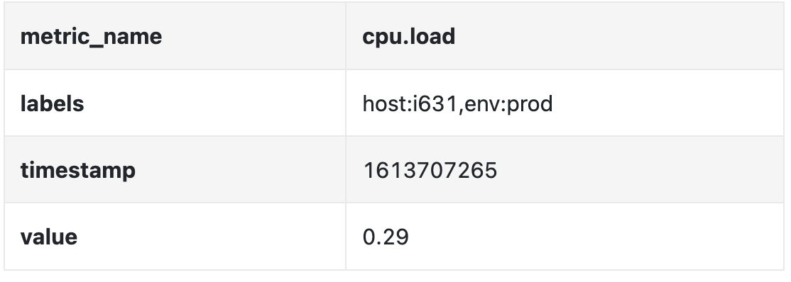
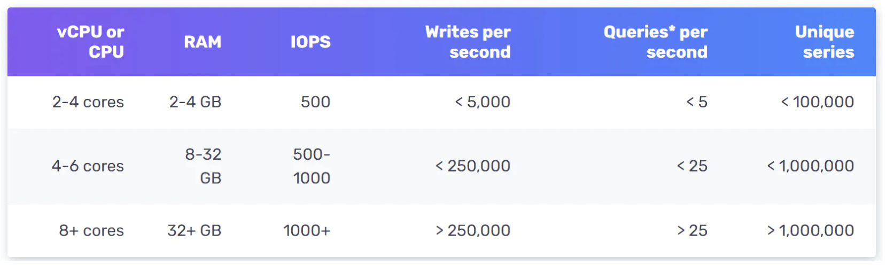
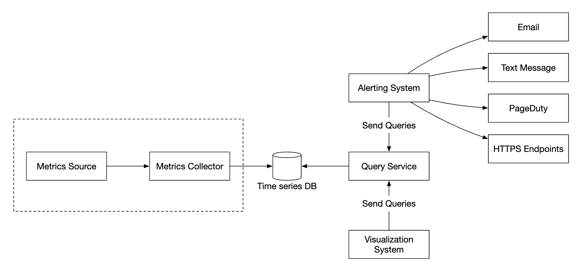
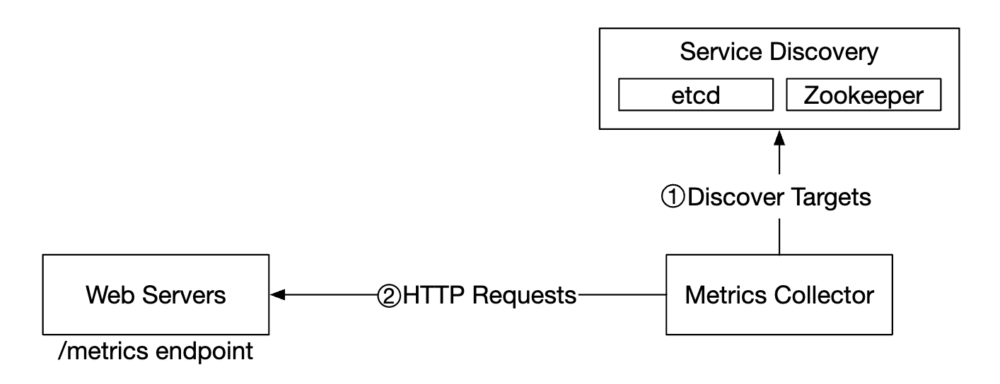
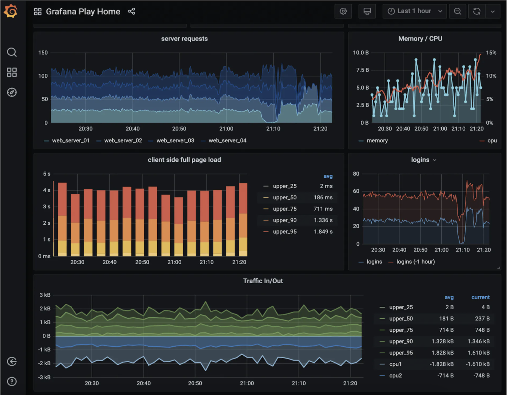

# Глава 20: Система мониторинга метрик и оповещений

## Введение
Эта глава посвящена проектированию высокомасштабируемой **системы мониторинга метрик и оповещений (metrics monitoring and alerting system)** — компонента, критически важного для обеспечения высокой доступности и надёжности.

---

## Шаг 1: Понять задачу и определить границы проектирования
Под системой мониторинга метрик можно понимать самые разные вещи — например, не стоит проектировать систему агрегации логов, если интервьюера интересуют только метрики инфраструктуры.

Сначала разберёмся в задаче:
 - К: Для кого мы строим систему? Это внутренняя система мониторинга для крупной технологической компании или SaaS-продукт вроде DataDog?
 - И: Строим только для внутреннего использования.
 - К: Какие метрики мы хотим собирать?
 - И: Операционные системные метрики — загрузка CPU, память, место на дисках с данными. А также высокоуровневые метрики, например число запросов в секунду. Бизнес-метрики вне рамок задачи.
 - К: Каков масштаб инфраструктуры, которую мы мониторим?
 - И: 100 млн активных пользователей в день, 1000 пулов серверов, по 100 машин в пуле.
 - К: Как долго нужно хранить данные?
 - И: Будем исходить из хранения данных в течение 1 года (retention).
 - К: Можно ли снижать разрешение данных метрик для долгосрочного хранения?
 - И: Свежеполученные метрики храните 7 дней. Затем сворачивайте их до разрешения 1 минута на следующие 30 дней. По прошествии 30 дней — до разрешения 1 час.
 - К: Какие каналы оповещения нужно поддерживать?
 - И: Email, телефон, PagerDuty или вебхуки.
 - К: Нужно ли собирать логи, например логи ошибок или логи доступа?
 - И: Нет.
 - К: Нужна ли поддержка трассировки распределённых систем?
 - И: Нет.

### **Высокоуровневые требования и допущения**
Мониторингу подлежит крупномасштабная инфраструктура:
 - 100 млн DAU
 - 1000 пулов серверов * 100 машин * ~100 метрик на машину -> ~10 млн метрик
 - хранение данных в течение 1 года
 - Политика хранения данных — сырые данные 7 дней, разрешение 1 минута — 30 дней, разрешение 1 час — 1 год

Мониторить можно самые разные метрики:
 - Загрузка CPU
 - Число запросов
 - Использование памяти
 - Число сообщений в очередях сообщений

### **Нефункциональные требования**
 - **Масштабируемость**: система должна масштабироваться, чтобы вмещать всё больше метрик и оповещений
 - **Низкая задержка**: системе нужна низкая задержка запросов для дашбордов и оповещений
 - **Надёжность**: система должна быть высоконадёжной, чтобы не пропускать критичные оповещения
 - **Гибкость**: система должна легко интегрироваться с новыми технологиями в будущем

Какие требования остаются вне рамок задачи?
 - **Мониторинг логов**: для этого сценария очень популярен стек ELK
 - **Трассировка распределённых систем (distributed tracing)**: речь о сборе данных о жизненном цикле запроса по мере его прохождения через множество сервисов системы

---

## Шаг 2: Предложить высокоуровневый дизайн и согласовать его

### **Основы**
Система мониторинга метрик и оповещений включает пять ключевых компонентов:

<div style="margin-left:3rem">
    
</div>

 - **Сбор данных**: собираем данные метрик из разных источников
 - **Передача данных**: переносим данные от источников в систему мониторинга метрик
 - **Хранение данных**: организуем и храним поступающие данные
 - **Оповещение**: анализируем поступающие данные, выявляем аномалии и генерируем оповещения
 - **Визуализация**: представляем данные в виде графиков, диаграмм и т. д.

### **Модель данных**
Данные метрик обычно записываются в виде временного ряда — набора значений с метками времени.
Ряд идентифицируется именем и необязательным набором тегов.

Пример 1 — какова загрузка CPU на продакшен-сервере i631 в 20:00?

<div style="margin-left:3rem">
    
</div>

Эти данные можно описать следующей таблицей:

<div style="margin-left:3rem">
    
</div>

Временной ряд идентифицируется именем метрики, лейблами и отдельной точкой в конкретный момент времени.

Пример 2 — какова средняя загрузка CPU по всем веб-серверам региона us-west за последние 10 минут?

```
CPU.load host=webserver01,region=us-west 1613707265 50

CPU.load host=webserver01,region=us-west 1613707265 62

CPU.load host=webserver02,region=us-west 1613707265 43

CPU.load host=webserver02,region=us-west 1613707265 53

...

CPU.load host=webserver01,region=us-west 1613707265 76

CPU.load host=webserver01,region=us-west 1613707265 83
```

Это пример данных, которые мы могли бы вытащить из хранилища, чтобы ответить на этот вопрос.
Среднюю загрузку CPU можно вычислить, усреднив значения в последнем столбце строк.

Показанный выше формат называется line protocol; его используют многие популярные системы мониторинга на рынке — например, Prometheus и OpenTSDB.

Из чего состоит каждый временной ряд:

<div style="margin-left:3rem">
    
</div>

Удобный способ представить, как выглядят данные:

<div style="margin-left:3rem">
    
</div>

 - Ось X — это время
 - Ось Y — измерение, по которому вы делаете запрос: имя метрики, тег и т. д.

Паттерн доступа к данным — интенсивная запись и всплесковое чтение: метрик мы собираем много, но обращаются к ним нечасто, хотя и пиками — например, во время текущих инцидентов.

Система хранения данных — сердце этого дизайна.
 - Использовать базу данных общего назначения для этой задачи не рекомендуется, хотя при экспертной настройке можно добиться неплохого масштаба.
 - NoSQL-база в теории может сработать, но сложно придумать масштабируемую схему для эффективного хранения и запросов данных временных рядов.

Существует много баз данных, специально заточенных под хранение временных рядов. Многие из них поддерживают собственные интерфейсы запросов, позволяющие эффективно запрашивать данные временных рядов.
 - OpenTSDB — распределённая база данных временных рядов (time-series database), но она построена на Hadoop и HBase. Если такая инфраструктура у вас не развёрнута, использовать эту технологию будет трудно.
 - Twitter использует MetricsDB, а Amazon предлагает Timestream.
 - Две самые популярные базы данных временных рядов — InfluxDB и Prometheus.
 - Они спроектированы для хранения больших объёмов данных временных рядов. Обе построены на связке кеша в памяти и хранилища на диске.

Пример масштаба InfluxDB — более 250 тыс. операций записи в секунду на машине с 8 ядрами и 32 ГБ RAM:

<div style="margin-left:3rem">
    
</div>

От вас не ждут понимания внутреннего устройства базы данных метрик — это нишевые знания. Об этом могут спросить, только если вы сами упомянули её в резюме.

Для целей интервью достаточно понимать, что метрики — это данные временных рядов, и знать популярные базы данных временных рядов, такие как InfluxDB.

Приятная особенность баз данных временных рядов — эффективная агрегация и анализ больших объёмов данных временных рядов по лейблам.
InfluxDB, например, строит индексы по каждому лейблу.

Однако критически важно держать кардинальность лейблов низкой — то есть не плодить слишком много уникальных лейблов.

### **Высокоуровневый дизайн**

<div style="margin-left:3rem">
    
</div>

 - **Источники метрик**: серверы приложений, базы данных SQL, очереди сообщений и т. д.
 - **Коллектор метрик**: собирает данные метрик и записывает их в базу данных временных рядов
 - **База данных временных рядов**: хранит метрики в виде временных рядов. Предоставляет специализированный интерфейс запросов для анализа больших объёмов метрик.
 - **Сервис запросов**: упрощает запросы и получение данных из базы временных рядов. Может быть целиком заменён интерфейсом самой БД, если тот достаточно мощный.
 - **Система оповещений**: отправляет уведомления в различные пункты назначения оповещений.
 - **Система визуализации**: показывает метрики в виде графиков и диаграмм.

---

## Шаг 3: Детальная проработка дизайна
Погрузимся в несколько наиболее интересных частей системы.

### **Сбор метрик**
При сборе метрик эпизодическая потеря данных не критична. Клиентам вполне допустимо работать по принципу «отправил и забыл» (fire and forget).

<div style="margin-left:3rem">
    
</div>

Реализовать сбор метрик можно двумя способами — по модели pull или push.

Вот как может выглядеть модель pull:

<div style="margin-left:3rem">
    
</div>

При таком решении коллектор метрик должен поддерживать актуальный список сервисов и эндпоинтов метрик.
Для этого можно использовать ZooKeeper или etcd — обнаружение сервисов (service discovery).

Обнаружение сервисов содержит правила конфигурации, определяющие, когда и откуда собирать метрики:

<div style="margin-left:3rem">
    
</div>

Подробное описание потока сбора метрик:

<div style="margin-left:3rem">
    
</div>

 - Коллектор метрик получает метаданные конфигурации из системы обнаружения сервисов. Сюда входят интервал опроса, IP-адреса, параметры таймаутов и повторных попыток.
 - Коллектор метрик забирает данные метрик через заранее определённый HTTP-эндпоинт (например, `/metrics`). Обычно этот эндпоинт реализуется клиентской библиотекой.
 - Как вариант, коллектор метрик может зарегистрировать в системе обнаружения сервисов подписку на события изменений, чтобы получать уведомления при смене эндпоинта сервиса.
 - Ещё один вариант — коллектор метрик периодически опрашивает конфигурацию эндпоинтов метрик на предмет изменений.

При нашем масштабе одного коллектора метрик недостаточно — нужно несколько экземпляров.
Однако между ними нужна и какая-то синхронизация, чтобы два коллектора не собирали одни и те же метрики дважды.

Одно из решений — разместить коллекторы и серверы на кольце консистентного хеширования (consistent hash ring) и закрепить каждый набор серверов ровно за одним коллектором:

<div style="margin-left:3rem">
    
</div>

В модели push, напротив, сервисы сами активно отправляют свои метрики коллектору метрик:

<div style="margin-left:3rem">
    
</div>

При этом подходе рядом с экземплярами сервиса обычно устанавливается агент сбора (collection agent).
Агент собирает метрики сервера и отправляет их коллектору метрик.

<div style="margin-left:3rem">
    
</div>

При этой модели мы можем агрегировать метрики ещё до отправки в коллектор, что снижает объём данных, которые коллектору приходится обрабатывать.

С другой стороны, коллектор метрик может отклонять push-запросы, если не справляется с нагрузкой.
Поэтому важно поместить коллектор в группу автомасштабирования за балансировщиком нагрузки.

Так какой же вариант лучше? У обоих подходов есть свои компромиссы, и разные системы устроены по-разному:
 - Prometheus использует pull-архитектуру
 - Amazon CloudWatch и Graphite используют push-архитектуру

Вот основные различия между push и pull:
|                                        | Pull                                                                                                                                                                                                    | Push                                                                                                                                                                                                                                    |
|----------------------------------------|---------------------------------------------------------------------------------------------------------------------------------------------------------------------------------------------------------|-----------------------------------------------------------------------------------------------------------------------------------------------------------------------------------------------------------------------------------------|
| Простота отладки                       | Эндпоинт /metrics на серверах приложений, из которого забираются метрики, позволяет посмотреть метрики в любой момент. Это можно сделать даже с собственного ноутбука. Побеждает pull.                  | Если коллектор метрик не получает метрики, причиной могут быть проблемы с сетью.                                                                                                                                                        |
| Проверка работоспособности             | Если сервер приложений не отвечает на pull-запрос, можно быстро понять, что сервер приложений упал. Побеждает pull.                                                                                     | Если коллектор метрик не получает метрики, причиной могут быть проблемы с сетью.                                                                                                                                                        |
| Короткоживущие задачи                  |                                                                                                                                                                                                         | Некоторые batch-задачи короткоживущие и не живут достаточно долго, чтобы их успели опросить. Побеждает push. В модели pull это лечится введением push-шлюзов (push gateway) [22].                                                       |
| Файрволы и сложные сетевые конфигурации | Чтобы серверы могли забирать метрики, все эндпоинты метрик должны быть доступны по сети. Это потенциально проблематично в конфигурациях с несколькими дата-центрами и может потребовать более изощрённой сетевой инфраструктуры. | Если коллектор метрик развёрнут за балансировщиком нагрузки в группе автомасштабирования, данные можно принимать откуда угодно. Побеждает push.                                                                                          |
| Производительность                     | Pull-методы обычно используют TCP.                                                                                                                                                                      | Push-методы обычно используют UDP. Это значит, что push обеспечивает передачу метрик с меньшей задержкой. Контраргумент: затраты на установление TCP-соединения малы по сравнению с отправкой самой полезной нагрузки с метриками.       |
| Достоверность данных                   | Серверы приложений, с которых собираются метрики, заранее определены в конфигурационных файлах. Метрики, собранные с этих серверов, гарантированно достоверны.                                          | Отправлять метрики коллектору может какой угодно клиент. Это лечится белым списком серверов, с которых принимаются метрики, либо обязательной аутентификацией.                                                                          |

Явного победителя нет. Крупной организации, скорее всего, придётся поддерживать оба подхода. Возможности установить push-агент может попросту не быть.

### **Масштабирование конвейера передачи метрик**

<div style="margin-left:3rem">
    
</div>

Коллектор метрик развёрнут в группе автомасштабирования — независимо от того, используем мы модель push или pull.

Однако если база временных рядов недоступна, есть риск потери данных. Чтобы его снизить, добавим механизм очередей:

<div style="margin-left:3rem">
    
</div>

 - Коллекторы метрик отправляют данные метрик в Kafka
 - Консьюмеры или сервисы потоковой обработки, такие как Apache Storm, Flink или Spark, обрабатывают данные и записывают их в базу временных рядов

У этого подхода несколько преимуществ:
 - Kafka выступает высоконадёжной и масштабируемой распределённой платформой сообщений
 - Она развязывает сбор данных и обработку данных друг от друга
 - Она предотвращает потерю данных за счёт их удержания в Kafka

Kafka можно настроить с отдельной партицией на каждое имя метрики, чтобы консьюмеры могли агрегировать данные по именам метрик.
Для дальнейшего масштабирования можно дополнительно партиционировать по тегам/лейблам и категоризировать/приоритизировать метрики, которые нужно собирать в первую очередь.

<div style="margin-left:3rem">
    
</div>

Главный минус применения Kafka в этой задаче — накладные расходы на сопровождение и эксплуатацию.
Альтернатива — использовать крупномасштабную систему приёма данных вроде [Gorilla](https://www.vldb.org/pvldb/vol8/p1816-teller.pdf).
Можно утверждать, что такое решение масштабируется не хуже, чем Kafka в роли очереди.

### **Где может происходить агрегация**
Агрегировать метрики можно в нескольких местах. У разных вариантов свои компромиссы:
 - **Агент сбора**: клиентский агент сбора поддерживает только простую логику агрегации. Например, накапливать счётчик в течение 1 минуты и отправлять его коллектору метрик.
 - **Конвейер приёма данных**: чтобы агрегировать данные до записи в БД, нужен движок потоковой обработки вроде Flink. Это снижает объём записи, но мы теряем точность данных, поскольку сырые данные не сохраняются.
 - **Сторона запросов**: можно агрегировать данные в момент выполнения запросов через систему визуализации. Потерь данных нет, но запросы могут работать медленно из-за большого объёма обработки.

### **Сервис запросов**
Сервис запросов, отделённый от базы временных рядов, развязывает системы визуализации и оповещений с базой данных, что позволяет отвязать БД от клиентов и менять её по своему усмотрению.

Здесь можно добавить слой кеша, чтобы снизить нагрузку на базу временных рядов:

<div style="margin-left:3rem">
    
</div>

Можно и вовсе обойтись без сервиса запросов — у большинства систем визуализации и оповещений есть мощные плагины для интеграции с большинством баз данных временных рядов.
А при удачно выбранной базе временных рядов собственный слой кеширования тоже может не понадобиться.

Большинство баз временных рядов не поддерживают SQL — просто потому, что он неэффективен для запросов к данным временных рядов. Вот пример SQL-запроса для вычисления экспоненциального скользящего среднего:

```
select id,
       temp,
       avg(temp) over (partition by group_nr order by time_read) as rolling_avg
from (
  select id,
         temp,
         time_read,
         interval_group,
         id - row_number() over (partition by interval_group order by time_read) as group_nr
  from (
    select id,
    time_read,
    "epoch"::timestamp + "900 seconds"::interval * (extract(epoch from time_read)::int4 / 900) as interval_group,
    temp
    from readings
  ) t1
) t2
order by time_read;
```

А вот тот же запрос на Flux — языке запросов, используемом в InfluxDB:

```
from(db:"telegraf")
  |> range(start:-1h)
  |> filter(fn: (r) => r._measurement == "foo")
  |> exponentialMovingAverage(size:-10s)
```

### **Слой хранения**
Базу данных временных рядов важно выбирать тщательно.

По данным исследования, опубликованного Facebook, около 85% запросов к операционному хранилищу приходились на данные за последние 26 часов.

Если выбрать базу данных, которая использует это свойство, эффект для производительности системы может быть значительным. InfluxDB — один из таких вариантов.

Какую бы базу мы ни выбрали, есть ряд оптимизаций, которые стоит применить.

Кодирование и сжатие данных позволяют существенно уменьшить их объём. Обычно эти возможности встроены в хорошую базу данных временных рядов.

<div style="margin-left:3rem">
    
</div>

В примере выше вместо полных меток времени можно хранить дельты меток времени.

Ещё один приём — даунсэмплинг (downsampling): преобразование данных высокого разрешения в данные низкого разрешения ради экономии места на диске.

Его можно применять к старым данным, а правила сделать настраиваемыми для дата-сайентистов, например:
 - 7 дней — без даунсэмплинга
 - 30 дней — даунсэмплинг до разрешения 1 минута
 - 1 год — даунсэмплинг до разрешения 1 час

Например, вот таблица метрик с разрешением 10 секунд:
| metric | timestamp            | hostname | Metric_value |
|--------|----------------------|----------|--------------|
| cpu    | 2021-10-24T19:00:00Z | host-a   | 10           |
| cpu    | 2021-10-24T19:00:10Z | host-a   | 16           |
| cpu    | 2021-10-24T19:00:20Z | host-a   | 20           |
| cpu    | 2021-10-24T19:00:30Z | host-a   | 30           |
| cpu    | 2021-10-24T19:00:40Z | host-a   | 20           |
| cpu    | 2021-10-24T19:00:50Z | host-a   | 30           |

и она же после даунсэмплинга до разрешения 30 секунд:
| metric | timestamp            | hostname | Metric_value (avg) |
|--------|----------------------|----------|--------------------|
| cpu    | 2021-10-24T19:00:00Z | host-a   | 19                 |
| cpu    | 2021-10-24T19:00:30Z | host-a   | 25                 |

Наконец, старые данные, которые больше не используются, можно вынести в холодное хранилище (cold storage). Оно обходится значительно дешевле.

### **Система оповещений**

<div style="margin-left:3rem">
    
</div>

Конфигурация загружается на кеш-серверы. Правила оповещения (alert rules) обычно описываются в формате YAML. Вот пример:

```
- name: instance_down
  rules:

  # Оповещение для любого инстанса, недоступного дольше 5 минут.
  - alert: instance_down
    expr: up == 0
    for: 5m
    labels:
      severity: page
```

Менеджер оповещений (alert manager) получает конфигурации оповещений из кеша. На основе правил конфигурации он также с заданным интервалом обращается к сервису запросов.
Если условие правила выполнено, создаётся событие оповещения.

Другие обязанности менеджера оповещений:
 - Фильтрация, слияние и дедупликация оповещений. Например, если оповещение по одному и тому же инстансу сработало несколько раз, генерируется только одно событие оповещения.
 - Контроль доступа — важно, чтобы операции управления оповещениями были доступны лишь ограниченному кругу лиц.
 - Повторные попытки — менеджер гарантирует, что оповещение будет доставлено хотя бы один раз.

Хранилище оповещений — это key-value база данных вроде Cassandra, которая хранит состояние всех оповещений. Она гарантирует, что уведомление будет отправлено хотя бы один раз.
Сработавшее оповещение публикуется в Kafka.

Наконец, консьюмеры оповещений забирают данные оповещений из Kafka и рассылают уведомления по разным каналам — email, SMS, PagerDuty, вебхуки.

В реальном мире существует множество готовых решений для систем оповещений. Обосновать разработку собственной системы внутри компании непросто.

### **Система визуализации**
Система визуализации показывает метрики и оповещения за период времени. Вот дашборд, построенный в Grafana:

<div style="margin-left:3rem">
    
</div>

Качественную систему визуализации построить очень трудно. Отказ от готового решения вроде Grafana сложно чем-то оправдать.

---

## Шаг 4: Подведение итогов
Вот наш итоговый дизайн:

<div style="margin-left:3rem">
    
</div>
