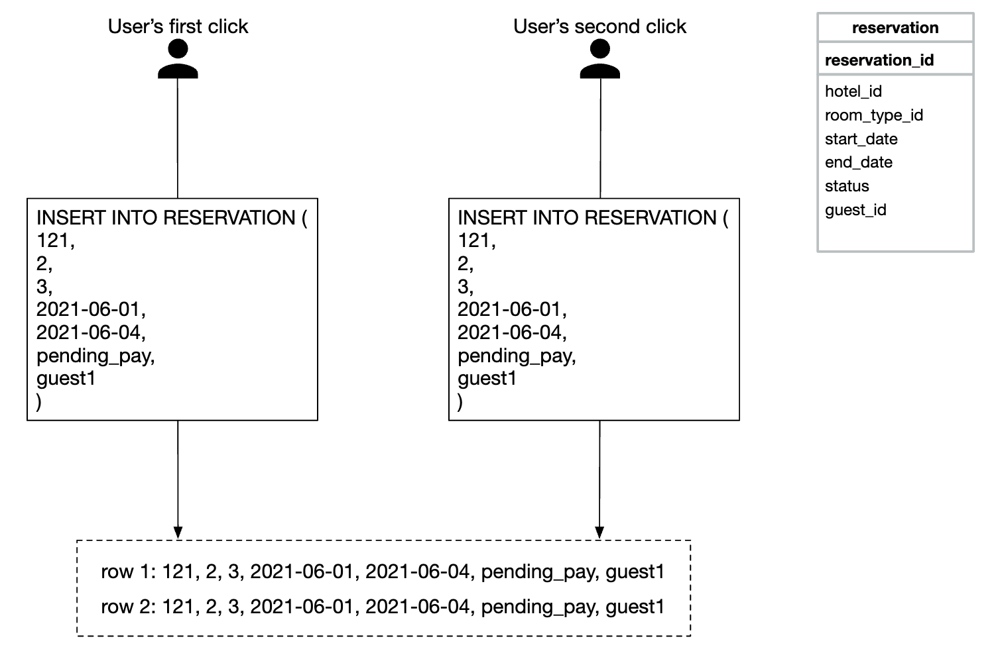
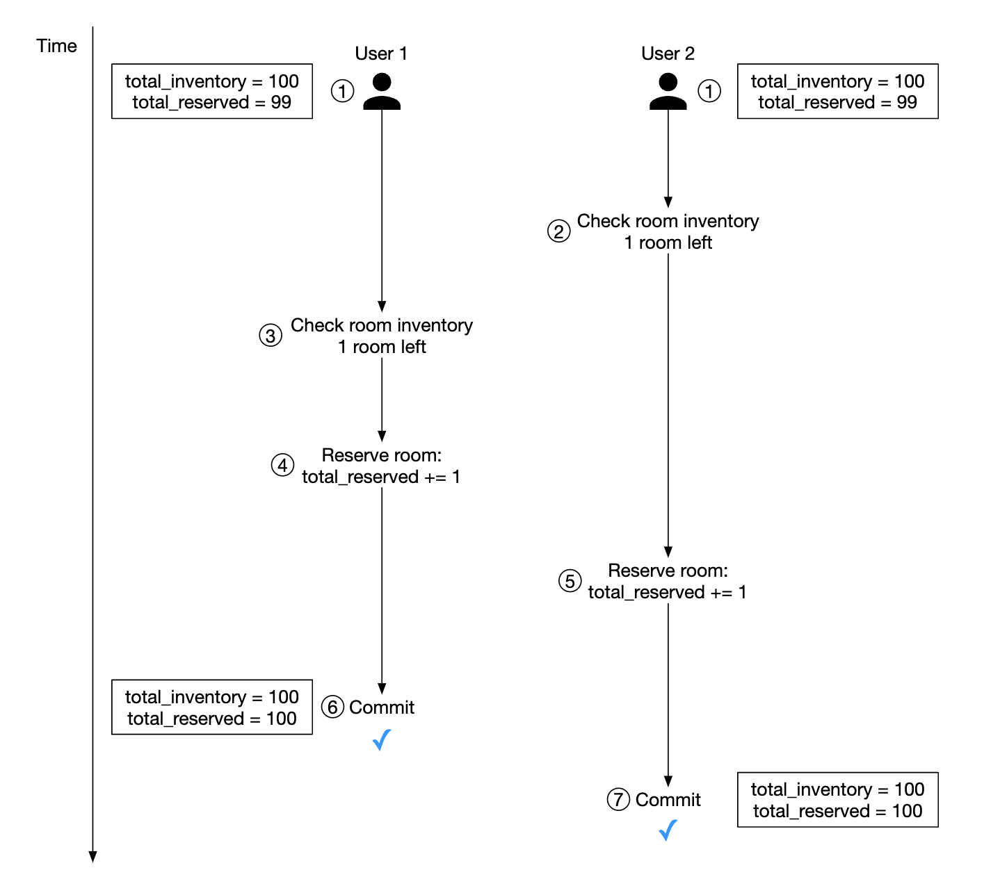
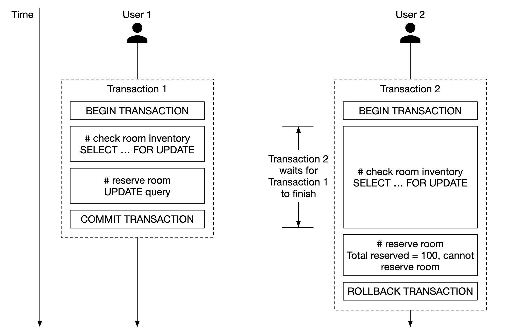
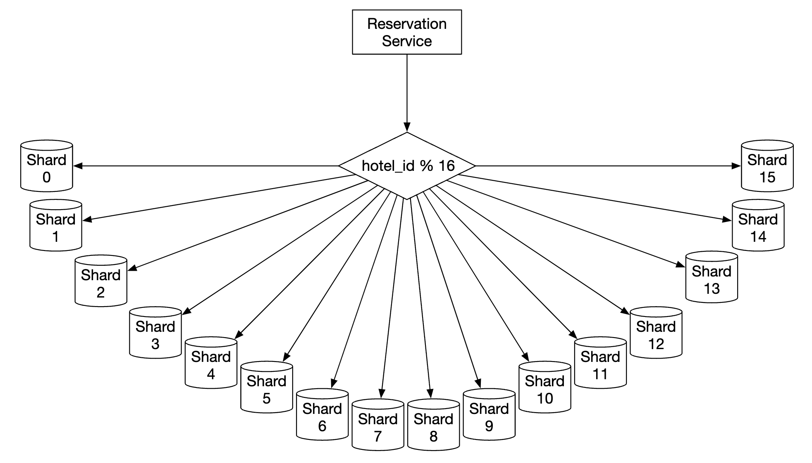
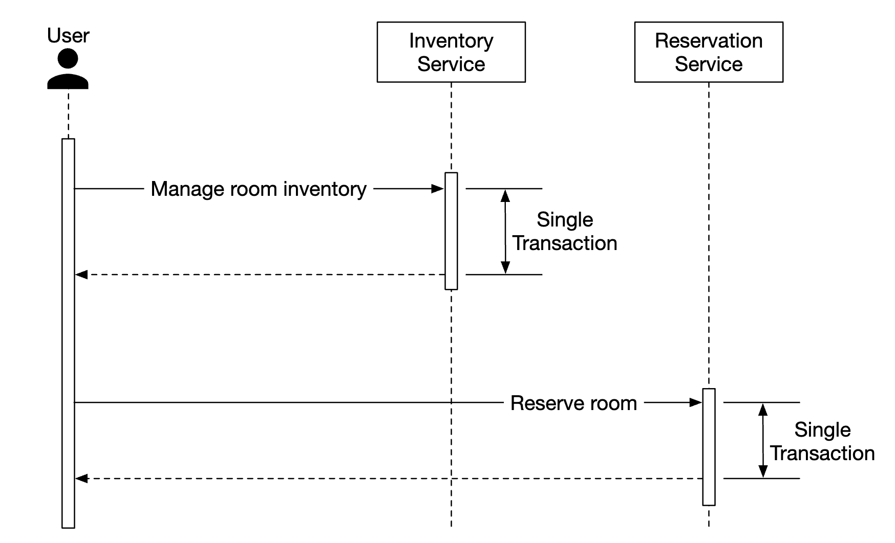

# Глава 22: Система бронирования отелей

## Введение
В этой главе мы проектируем **систему бронирования отелей (hotel reservation system)**, похожую на Marriott International.

Этот дизайн применим и к другим типам систем — Airbnb, бронирование авиабилетов, покупка билетов в кино.

---

## Шаг 1: Понять задачу и определить границы проектирования
Прежде чем погружаться в проектирование, стоит задать интервьюеру вопросы, чтобы уточнить рамки задачи:
 - К: Каков масштаб системы?
 - И: Мы строим сайт для сети из 5000 отелей и 1 млн номеров
 - К: Клиенты платят при бронировании или по прибытии в отель?
 - И: Они платят полностью в момент бронирования.
 - К: Клиенты бронируют номера только через сайт? Нужно ли поддерживать другие способы бронирования, например по телефону?
 - И: Бронирование только через сайт или приложение.
 - К: Могут ли клиенты отменять бронирования?
 - И: Да
 - К: Что-то ещё нужно учесть?
 - И: Да, мы допускаем овербукинг (overbooking) в 10%. Отель продаёт больше номеров, чем есть на самом деле. Отели делают это в расчёте на то, что часть клиентов отменит бронь.
 - К: Раз времени немного, сосредоточимся на следующем: страница отеля, страница с деталями номера, бронирование номера, админ-панель, поддержка овербукинга.
 - И: Звучит хорошо.
 - И: И ещё одно — цены на отели постоянно меняются. Считайте, что цена номера меняется каждый день.
 - К: OK.

### **Нефункциональные требования**
 - Поддержка высокой конкурентности — в высокий сезон множество клиентов могут одновременно пытаться забронировать один и тот же отель.
 - Умеренная задержка — в идеале бронирование должно проходить с низкой задержкой, но допустимо, если система обрабатывает его несколько секунд.

### **Прикидочные оценки**
 - 5000 отелей и 1 млн номеров в общей сложности
 - Предположим, что занято 70% номеров, а средняя длительность проживания — 3 дня
 - Оценка числа бронирований в день — 1 млн * 0,7 / 3 = ~240 тыс. бронирований в день
 - Бронирований в секунду — 240 тыс. / 10^5 секунд в сутках = ~3. Средний TPS бронирований невысок.

Оценим QPS. Если предположить, что до страницы бронирования ведут три шага с конверсией 10% на каждой странице,
то при 3 бронированиях должно быть 30 просмотров страницы бронирования и 300 просмотров страницы с деталями номера.

<div style="margin-left:3rem">
    
</div>

---

## Шаг 2: Предложить высокоуровневый дизайн и согласовать его
Мы рассмотрим дизайн API, модель данных и высокоуровневую архитектуру.

### **Дизайн API**
Этот дизайн API сосредоточен на ключевых эндпоинтах (в духе RESTful), необходимых для работы системы бронирования отелей.

Полноценной системе понадобился бы куда более обширный API с поиском номеров по множеству критериев, но в этом разделе мы на нём останавливаться не будем.
Причина в том, что технически это несложно, поэтому выносим за рамки.

**API отелей**
 - `GET /v1/hotels/{id}` — получить подробную информацию об отеле
 - `POST /v1/hotels` — добавить новый отель. Доступно только персоналу
 - `PUT /v1/hotels/{id}` — обновить информацию об отеле. Доступно только персоналу
 - `DELETE /v1/hotels/{id}` — удалить отель. API доступен только персоналу

**API номеров**
 - `GET /v1/hotels/{id}/rooms/{id}` — получить подробную информацию о номере
 - `POST /v1/hotels/{id}/rooms` — добавить номер. Доступно только персоналу
 - `PUT /v1/hotels/{id}/rooms/{id}` — обновить информацию о номере. Доступно только персоналу
 - `DELETE /v1/hotels/{id}/rooms/{id}` — удалить номер. Доступно только персоналу

**API бронирований**
 - `GET /v1/reservations` — получить историю бронирований текущего пользователя
 - `GET /v1/reservations/{id}` — получить подробную информацию о бронировании
 - `POST /v1/reservations` — создать новое бронирование
 - `DELETE /v1/reservations/{id}` — отменить бронирование

Пример запроса на создание бронирования:

```
{
  "startDate":"2021-04-28",
  "endDate":"2021-04-30",
  "hotelID":"245",
  "roomID":"U12354673389",
  "reservationID":"13422445"
}
```

Обратите внимание, что `reservationID` — это ключ идемпотентности, защищающий от двойного бронирования. Подробности — в [разделе о конкурентности](#concurrency-issues)

### **Модель данных**
Прежде чем выбирать базу данных, рассмотрим паттерны доступа к данным.

Нам нужно поддерживать следующие запросы:
 - Просмотр подробной информации об отеле
 - Поиск доступных типов номеров в заданном диапазоне дат
 - Запись бронирования
 - Поиск бронирования или истории прошлых бронирований

Из наших оценок мы знаем, что масштаб системы невелик, но нужно быть готовыми к всплескам трафика.

С учётом этого мы выберем реляционную базу данных, потому что:
 - Реляционные БД хорошо подходят для систем с преобладанием чтения над записью.
 - NoSQL-базы обычно оптимизированы под запись, но записей у нас будет немного — бронирование делает лишь малая доля посетителей сайта.
 - Реляционные БД дают гарантии ACID. Для такой системы они важны: без них мы не сможем предотвратить проблемы вроде отрицательного баланса, двойного списания и т.п.
 - Реляционные БД легко моделируют наши данные, поскольку их структура предельно ясна.

Вот наш дизайн схемы:

<div style="margin-left:3rem">
    
</div>

Большинство полей говорят сами за себя. Стоит упомянуть только поле `status`, которое отражает конечный автомат состояний номера:

<div style="margin-left:3rem">
    
</div>

Такая модель данных хорошо подходит для системы вроде Airbnb, но не для отелей, где пользователи бронируют не конкретный номер, а тип номера.
Они резервируют тип номера, а конкретный номер выбирается при заселении.

Этот недостаток мы устраним в разделе [Улучшенная модель данных](#improved-data-model).

### **Высокоуровневый дизайн**
Для этого дизайна мы выбрали микросервисную архитектуру. В последние годы она приобрела большую популярность:

<div style="margin-left:3rem">
    
</div>

 - **Пользователи**: бронируют номер с телефона или компьютера
 - **Администратор**: выполняет административные функции — возврат/отмена платежа и т.п.
 - **CDN**: кеширует статические ресурсы — JS-бандлы, изображения, видео и т.д.
 - **Публичный API-шлюз**: полностью управляемый сервис с поддержкой ограничения частоты запросов (rate limiting), аутентификации и т.д.
 - **Внутренние API**: видны только авторизованному персоналу. Обычно защищены VPN.
 - **Сервис отелей**: предоставляет подробную информацию об отелях и номерах. Данные об отелях и номерах статичны, поэтому их можно агрессивно кешировать.
 - **Сервис тарифов**: предоставляет цены на номера на будущие даты. Интересная особенность этой предметной области: цена зависит от заполненности отеля в конкретный день.
 - **Сервис бронирования**: принимает запросы на бронирование и резервирует номера. Также отслеживает инвентарь номеров по мере создания/отмены бронирований.
 - **Платёжный сервис**: обрабатывает платежи и при успехе обновляет статусы бронирований.
 - **Сервис управления отелями**: доступен только авторизованному персоналу. Даёт административные функции для управления бронированиями, отелями и т.п. и их просмотра.

Межсервисное взаимодействие можно организовать через RPC-фреймворк, например gRPC.

---

## Шаг 3: Детальное проектирование
Углубимся в следующие темы:
 - Улучшенная модель данных
 - Проблемы конкурентности
 - Масштабируемость
 - Устранение несогласованности данных в микросервисах

### **Улучшенная модель данных**
Как упоминалось выше, нам нужно скорректировать API и схему, чтобы бронировать тип номера, а не конкретный номер.

В API бронирования мы теперь резервируем не `roomID`, а `roomTypeID`:

```
POST /v1/reservations
{
  "startDate":"2021-04-28",
  "endDate":"2021-04-30",
  "hotelID":"245",
  "roomTypeID":"12354673389",
  "roomCount":"3",
  "reservationID":"13422445"
}
```

Вот обновлённая схема:

<div style="margin-left:3rem">
    
</div>

 - **room**: содержит информацию о номере
 - **room_type_rate**: содержит информацию о ценах для данного типа номера
 - **reservation**: хранит данные о бронированиях гостей
 - **room_type_inventory**: хранит данные об инвентаре номеров отеля.

Рассмотрим столбцы `room_type_inventory` подробнее — эта таблица самая интересная:
 - **hotel_id**: идентификатор отеля
 - **room_type_id**: идентификатор типа номера
 - **date**: конкретная дата
 - **total_inventory**: общее число номеров за вычетом временно выведенных из инвентаря.
 - **total_reserved**: общее число номеров, забронированных для данной комбинации (hotel_id, room_type_id, date)

Есть и другие способы спроектировать эту таблицу, но одна строка на (hotel_id, room_type_id, date) упрощает
управление бронированиями и сами запросы.

Строки таблицы заполняются заранее ежедневной CRON-задачей.

Пример данных:
| hotel_id | room_type_id | date       | total_inventory | total_reserved |
|----------|--------------|------------|-----------------|----------------|
| 211      | 1001         | 2021-06-01 | 100             | 80             |
| 211      | 1001         | 2021-06-02 | 100             | 82             |
| 211      | 1001         | 2021-06-03 | 100             | 86             |
| 211      | 1001         | ...        | ...             |                |
| 211      | 1001         | 2023-05-31 | 100             | 0              |
| 211      | 1002         | 2021-06-01 | 200             | 16             |
| 2210     | 101          | 2021-06-01 | 30              | 23             |
| 2210     | 101          | 2021-06-02 | 30              | 25             |

Пример SQL-запроса для проверки доступности типа номера:

```
SELECT date, total_inventory, total_reserved
FROM room_type_inventory
WHERE room_type_id = ${roomTypeId} AND hotel_id = ${hotelId}
AND date between ${startDate} and ${endDate}
```

Как по этим данным проверить доступность заданного числа номеров (напомним, мы поддерживаем овербукинг):

```
if (total_reserved + ${numberOfRoomsToReserve}) <= 110% * total_inventory
```

Теперь оценим объём хранилища.
 - У нас 5000 отелей.
 - В каждом отеле 20 типов номеров.
 - 5000 * 20 * 2 (года) * 365 (дней) = 73 млн строк

73 миллиона строк — это немного, с таким объёмом справится один сервер базы данных.
Тем не менее имеет смысл настроить реплики для чтения (возможно, в разных зонах), чтобы обеспечить высокую доступность.

Дополнительный вопрос: что делать, если данные о бронированиях перестанут помещаться в одну базу?
 - Хранить только текущие и будущие бронирования. Историю бронирований можно перенести в холодное хранилище.
 - Шардирование базы данных — можно шардировать данные по `hash(hotel_id) % servers_cnt`, поскольку во всех запросах мы фильтруем по `hotel_id`.

### **Проблемы конкурентности**
Ещё одна важная проблема, которую нужно решить, — двойное бронирование.

Здесь два вопроса:
 - Один и тот же пользователь дважды нажимает «забронировать»
 - Несколько пользователей пытаются забронировать один номер одновременно

Вот иллюстрация первой проблемы:

<div style="margin-left:3rem">
    
</div>

Есть два подхода к её решению:
 - Обработка на стороне клиента — фронтенд может отключать кнопку бронирования после нажатия. Но если пользователь отключил JavaScript, он не увидит, что кнопка стала неактивной.
 - Идемпотентный API — добавить в API ключ идемпотентности, благодаря которому действие выполняется один раз, сколько бы раз ни вызывался эндпоинт:

<div style="margin-left:3rem">
    
</div>

Вот как работает этот процесс:
 - Заказ на бронирование формируется, когда вы заполняете свои данные и оформляете бронь. Заказ получает глобально уникальный идентификатор.
 - Бронирование 1 отправляется с `reservation_id`, сгенерированным на предыдущем шаге.
 - Если «завершить бронирование» нажали второй раз, отправляется тот же `reservation_id`, и бэкенд распознаёт дубликат.
 - Дублирование предотвращается уникальным ограничением (unique constraint) на столбце `reservation_id`, которое не позволяет сохранить в БД несколько записей с одним id.

<div style="margin-left:3rem">
    
</div>

А что если одно и то же бронирование делают несколько пользователей?

<div style="margin-left:3rem">
    
</div>

 - Предположим, что уровень изоляции транзакций не serializable
 - Пользователи 1 и 2 пытаются забронировать один и тот же номер одновременно.
 - Транзакция 1 проверяет, достаточно ли номеров — достаточно
 - Транзакция 2 проверяет, достаточно ли номеров — достаточно
 - Транзакция 2 резервирует номер и обновляет инвентарь
 - Транзакция 1 тоже резервирует номер, поскольку всё ещё видит 99 `total_reserved` номеров из 100.
 - Обе транзакции успешно фиксируют изменения

Эту проблему можно решить с помощью того или иного механизма блокировок:
 - Пессимистичная блокировка
 - Оптимистичная блокировка
 - Ограничения базы данных

Вот SQL, которым мы резервируем номер:

```sql
# шаг 1: проверить инвентарь номеров
SELECT date, total_inventory, total_reserved
FROM room_type_inventory
WHERE room_type_id = ${roomTypeId} AND hotel_id = ${hotelId}
AND date between ${startDate} and ${endDate}

# Для каждой строки, полученной на шаге 1
if((total_reserved + ${numberOfRoomsToReserve}) > 110% * total_inventory) {
  Rollback
}

# шаг 2: зарезервировать номера
UPDATE room_type_inventory
SET total_reserved = total_reserved + ${numberOfRoomsToReserve}
WHERE room_type_id = ${roomTypeId}
AND date between ${startDate} and ${endDate}

Commit
```

#### Вариант 1: Пессимистичная блокировка
Пессимистичная блокировка предотвращает одновременные обновления, накладывая блокировку на запись на время её изменения.

В MySQL это делается запросом `SELECT... FOR UPDATE`, который блокирует выбранные строки до фиксации транзакции.

<div style="margin-left:3rem">
    
</div>

Плюсы:
 - Не даёт приложениям обновлять данные, которые уже изменяются
 - Проста в реализации и устраняет конфликты за счёт сериализации обновлений. Полезна при высокой конкуренции за данные.

Минусы:
 - При блокировке нескольких ресурсов возможны взаимоблокировки (deadlock).
 - Подход плохо масштабируется: если транзакция держит блокировку слишком долго, это бьёт по всем остальным транзакциям, обращающимся к тому же ресурсу.
 - Последствия особенно тяжелы, когда запрос выбирает много ресурсов, а транзакция долгоживущая.

Автор не рекомендует этот подход из-за проблем с масштабируемостью.

#### Вариант 2: Оптимистичная блокировка
Оптимистичная блокировка позволяет нескольким пользователям одновременно пытаться обновить запись.

Есть два распространённых способа её реализации — номера версий и временные метки. Рекомендуются номера версий, поскольку серверные часы могут быть неточными.

<div style="margin-left:3rem">
    
</div>

 - В таблицу базы данных добавляется новый столбец `version`
 - Перед изменением строки пользователь читает номер версии
 - При обновлении строки номер версии увеличивается на 1 и записывается обратно в базу
 - Проверка на стороне базы отклоняет запись, если новый номер версии не превышает предыдущий

Оптимистичная блокировка обычно быстрее пессимистичной, поскольку мы не блокируем базу данных.
Однако при высокой конкурентности её производительность падает — возникает много откатов.

Плюсы:
 - Не даёт приложениям редактировать устаревшие данные
 - Не нужно брать блокировку в базе данных
 - Предпочтительный вариант при низкой конкуренции за данные, то есть когда конфликты обновлений редки

Минусы:
 - Низкая производительность при высокой конкуренции за данные

Оптимистичная блокировка — хороший вариант для нашей системы, поскольку QPS бронирований не слишком высок.

#### Вариант 3: Ограничения базы данных
Этот подход очень похож на оптимистичную блокировку, но защита реализуется через ограничение (constraint) базы данных:

```
CONSTRAINT `check_room_count` CHECK((`total_inventory - total_reserved` >= 0))
```

<div style="margin-left:3rem">
    
</div>

Плюсы:
 - Простота реализации
 - Хорошо работает при небольшой конкуренции за данные

Минусы:
 - Как и оптимистичная блокировка, плохо работает при высокой конкуренции за данные
 - Ограничения базы данных сложно версионировать так же, как код приложения
 - Не все базы данных поддерживают ограничения

Ещё один хороший вариант для системы бронирования отелей — благодаря простоте реализации.

### **Масштабируемость**
Обычно нагрузка на систему бронирования отелей невысока.

Однако интервьюер может спросить, как вы поступите, если систему возьмёт на вооружение крупный популярный туристический сайт вроде booking.com.
В этом случае QPS может вырасти в 1000 раз.

В такой ситуации важно понимать, где находятся узкие места. Все сервисы у нас без состояния (stateless), поэтому их легко масштабировать репликацией.

База данных же хранит состояние, и как её масштабировать — не так очевидно.

Один из способов — шардирование базы данных: мы разбиваем данные на несколько баз, каждая из которых содержит свою часть.

Шардировать можно по `hotel_id`, поскольку все запросы фильтруют по нему.
Если предположить QPS 30 000, то после разбиения базы на 16 шардов каждый шард будет обрабатывать 1875 QPS, что укладывается в возможности одного кластера MySQL.

<div style="margin-left:3rem">
    
</div>

Также можно задействовать кеширование инвентаря и бронирований через Redis. Мы можем задать TTL, чтобы данные за прошедшие дни автоматически устаревали.

<div style="margin-left:3rem">
    
</div>

Инвентарь мы храним по ключу на основе `hotel_id`, `room_type_id` и `date`:

```
key: hotelID_roomTypeID_{date}
value: число доступных номеров для данного ID отеля, ID типа номера и даты.
```

Согласованность данных обеспечивается асинхронно с помощью механизма потоковой передачи CDC (change data capture) — изменения базы данных читаются и применяются к отдельной системе.
Debezium — популярный вариант для синхронизации изменений базы данных с Redis.

При таком механизме кеш и база данных могут какое-то время быть несогласованными.
В нашем случае это допустимо, поскольку база данных не позволит создать некорректное бронирование.

Это создаст некоторое неудобство в UI: пользователю придётся обновить страницу, чтобы увидеть, что «номеров больше не осталось», —
но такое может случиться и без этой проблемы, например если человек долго раздумывает перед бронированием.

Плюсы кеширования:
 - Сниженная нагрузка на базу данных
 - Высокая производительность, поскольку Redis держит данные в памяти

Минусы кеширования:
 - Поддерживать согласованность между кешем и БД сложно. Нужно продумать, как несогласованность влияет на пользовательский опыт.

### **Согласованность данных между сервисами**
Монолитное приложение позволяет использовать общую реляционную базу данных для обеспечения согласованности.

В нашем микросервисном дизайне мы выбрали гибридный подход: часть сервисов независимы,
но API бронирования и инвентаря обслуживаются одним и тем же сервисом.

Так сделано потому, что мы хотим опереться на ACID-гарантии реляционной базы для обеспечения согласованности.

Однако интервьюер может оспорить этот подход, поскольку это не чистая микросервисная архитектура, где у каждого сервиса своя база данных:

<div style="margin-left:3rem">
    
</div>

Чистый подход может привести к проблемам согласованности. В монолитном сервере мы можем использовать транзакционные возможности реляционной БД для реализации атомарных операций:

<div style="margin-left:3rem">
    
</div>

Гарантировать такую атомарность гораздо сложнее, когда операция охватывает несколько сервисов:

<div style="margin-left:3rem">
    
</div>

Есть несколько известных приёмов борьбы с такой несогласованностью данных:
 - **Двухфазная фиксация (two-phase commit)**: протокол баз данных, гарантирующий атомарную фиксацию транзакции на нескольких узлах.
   Однако он не отличается производительностью: задержка одного узла блокирует операцию на всех.
 - **Сага (saga)**: последовательность локальных транзакций, где при сбое любого шага запускаются компенсирующие транзакции. Это подход с итоговой согласованностью (eventual consistency).

Стоит отметить, что борьба с несогласованностью данных между микросервисами — сложная задача, повышающая сложность системы.
Полезно взвесить, оправданна ли эта цена, учитывая наш более прагматичный подход — инкапсулировать зависимые операции в одной реляционной базе данных.

---

## Шаг 4: Подведение итогов
Мы представили дизайн системы бронирования отелей.

Вот шаги, которые мы прошли:
 - Собрали требования и сделали прикидочные расчёты, чтобы понять масштаб системы
 - В высокоуровневом дизайне представили дизайн API, модель данных и архитектуру системы
 - В детальном разборе изучили альтернативные варианты схемы базы данных при изменении требований
 - Обсудили состояния гонки и предложили решения — пессимистичную/оптимистичную блокировку, ограничения базы данных
 - Рассмотрели способы масштабирования системы через шардирование базы и кеширование
 - Наконец, разобрали, как справляться с проблемами согласованности данных между микросервисами
