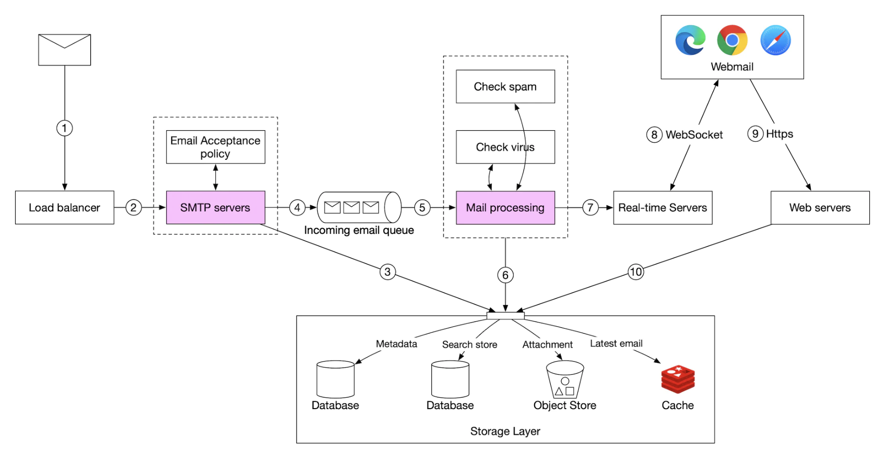
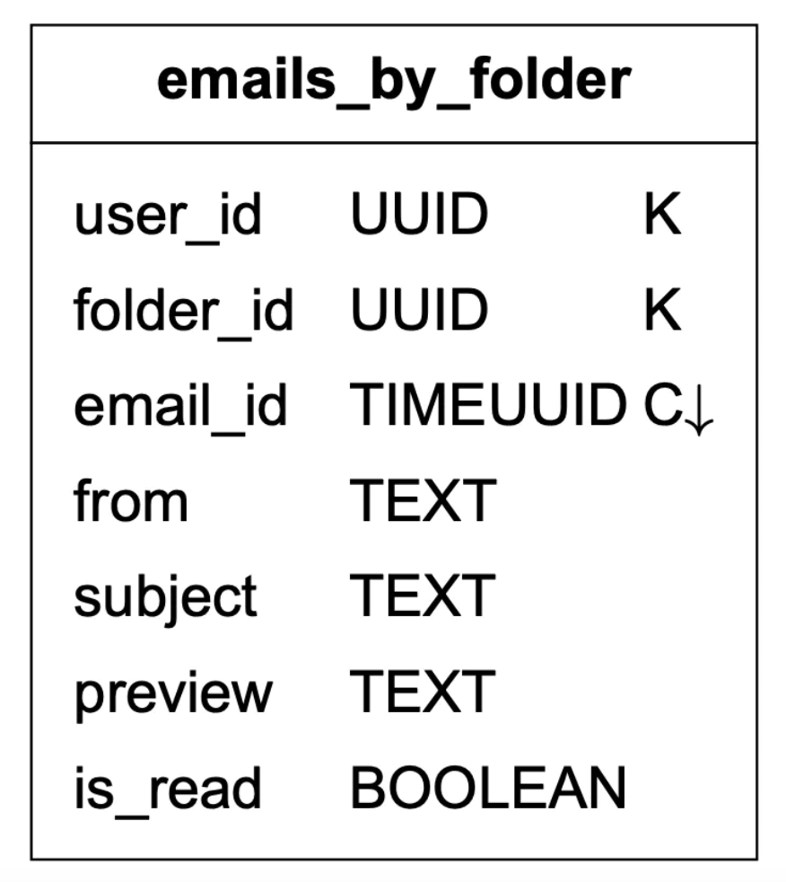
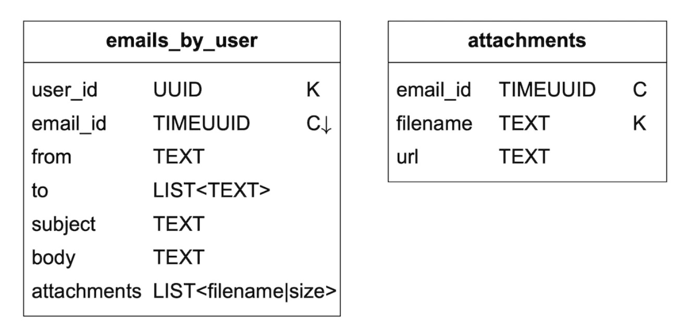

# Глава 23: Распределённый почтовый сервис

## Введение

В этой главе мы спроектируем **распределённый почтовый сервис (distributed email service)**, похожий на **Gmail**.

В 2020 году у **Gmail** было 1,8 млрд активных пользователей, а у **Outlook** — 400 млн пользователей по всему миру.

---

## Шаг 1: Понять задачу и определить границы проектирования

- К: Сколько пользователей у системы?
- И: 1 млрд пользователей
- К: На мой взгляд, важны следующие функции — аутентификация, отправка/получение писем, загрузка писем, фильтрация, поиск, защита от спама.
- И: Хороший список. Аутентификацией пока не занимайтесь.
- К: Как пользователи подключаются к почтовым серверам?
- И: Обычно почтовые клиенты подключаются по SMTP, POP, IMAP, но в этой задаче мы будем использовать HTTP.
- К: Могут ли письма содержать вложения?
- И: Да

### **Нефункциональные требования**

- **Надёжность** — мы не должны терять данные
- **Доступность** — нужно использовать репликацию, чтобы избежать единых точек отказа. Также система должна переживать частичные сбои.
- **Масштабируемость** — по мере роста аудитории система должна справляться с нагрузкой.
- **Гибкость и расширяемость** — система должна быть гибкой и легко расширяться новыми функциями. Это одна из причин, почему мы выбрали HTTP вместо SMTP и других почтовых протоколов.

### **Прикидочные оценки**

- **1 млрд пользователей**
- Если каждый человек отправляет 10 писем в день -> **100 тыс. писем в секунду**.
- Если каждый человек получает 40 писем в день, а каждое письмо в среднем содержит 50 KB метаданных -> **730 PB хранилища в год**.
- Если 20% писем содержат вложения со средним размером 500 KB -> **1 460 PB в год**.

---

## Шаг 2: Предложить высокоуровневый дизайн и согласовать его

### **Основы электронной почты**

Для отправки и получения писем используются разные протоколы:
- **SMTP** — стандартный протокол для пересылки писем с одного сервера на другой.
- **POP** — стандартный протокол для получения и скачивания писем с удалённого почтового сервера на локальный клиент. После получения письма удаляются с удалённого сервера.
- **IMAP** — как и POP, используется для получения и скачивания писем с удалённого сервера, но письма при этом остаются на сервере.
- **HTTPS** — формально не почтовый протокол, но применяется в веб-клиентах электронной почты.

Помимо почтового протокола, для нашего почтового сервера нужно настроить некоторые DNS-записи — MX-записи:

<div style="margin-left:3rem">
    
</div>

Вложения передаются в кодировке base64, и у большинства почтовых сервисов действует лимит размера, обычно 25 MB.
Он настраивается и отличается для личных и корпоративных аккаунтов.

### **Традиционные почтовые серверы**

Традиционные почтовые серверы хорошо работают, когда пользователей немного и все они подключены к одному серверу.

<div style="margin-left:3rem">
    
</div>

- Алиса заходит в свою почту Outlook и нажимает «отправить». Письмо уходит на почтовый сервер Outlook. Обмен идёт по SMTP.
- Сервер Outlook запрашивает у DNS MX-запись для gmail.com и передаёт письмо на их серверы. Обмен идёт по SMTP.
- Боб забирает письма со своего сервера Gmail по IMAP/POP.

В традиционных почтовых серверах письма хранились в локальной файловой системе. Каждое письмо было отдельным файлом.

<div style="margin-left:3rem">
    
</div>

С ростом масштаба узким местом стал дисковый ввод-вывод. К тому же такой подход не удовлетворяет нашим требованиям высокой доступности и надёжности:
диски могут выходить из строя, а сервер — падать.

### **Распределённые почтовые серверы**

Распределённые почтовые серверы спроектированы под современные сценарии использования и решают современные проблемы масштабируемости.

Такие серверы по-прежнему могут поддерживать IMAP/POP для нативных почтовых клиентов и SMTP для обмена почтой между серверами.

Но для полнофункциональных веб-клиентов обычно используется RESTful API поверх HTTP.

Примеры API:
- `POST /v1/messages` — отправляет сообщение получателям из заголовков To, Cc, Bcc.
- `GET /v1/folders` — возвращает все папки почтового аккаунта

Пример ответа:

```
[{id: string        Уникальный идентификатор папки.
  name: string      Имя папки.
                    Согласно RFC6154 [9], папками по умолчанию могут быть:
                    All, Archive, Drafts, Flagged, Junk, Sent
                    и Trash.
  user_id: string   Ссылка на владельца аккаунта
}]
```

- `GET /v1/folders/{:folder_id}/messages` — возвращает все сообщения в папке с пагинацией
- `GET /v1/messages/{:message_id}` — получить всю информацию о конкретном сообщении

Пример ответа:

```
{
  user_id: string                      // Ссылка на владельца аккаунта.
  from: {name: string, email: string}  // Пара <имя, email> отправителя.
  to: [{name: string, email: string}]  // Список пар <имя, email>
  subject: string                      // Тема письма
  body: string                         //  Тело сообщения
  is_read: boolean                     //  Признак, прочитано ли сообщение.
}
```

Вот высокоуровневый дизайн распределённого почтового сервера:

<div style="margin-left:3rem">
    
</div>

- **Веб-почта** — пользователи отправляют и получают письма через браузер
- **Веб-серверы** — публичные сервисы формата «запрос-ответ», обслуживающие вход, регистрацию, профиль пользователя и т.д.
- **Серверы реального времени** — доставляют клиентам обновления о новых письмах в реальном времени. Для этого мы используем веб-сокеты, а для старых браузеров без их поддержки откатываемся на long-polling.
- **База метаданных** — хранит метаданные писем: тему, тело, отправителя, получателя и т.д.
- **Хранилище вложений** — объектное хранилище (например, Amazon S3), подходящее для больших файлов.
- **Распределённый кеш** — недавние письма можно кешировать в Redis для улучшения UX.
- **Поисковое хранилище** — распределённое документное хранилище для полнотекстового поиска.

Вот как выглядит процесс отправки письма:

<div style="margin-left:3rem">
    
</div>

- Пользователь пишет письмо и нажимает «отправить». Письмо уходит на балансировщик нагрузки.
- Балансировщик ограничивает чрезмерную частоту отправки и направляет запрос на один из веб-серверов.
- Веб-серверы выполняют базовую валидацию письма (например, размер) и замыкают исходящий поток накоротко, если домен получателя совпадает с доменом отправителя. Но сначала выполняется проверка на спам.
- Если базовая валидация пройдена, письмо отправляется в очередь сообщений (вложение хранится в объектном хранилище и передаётся по ссылке)
- Если базовая валидация не пройдена, письмо попадает в очередь ошибок
- Исходящие SMTP-воркеры забирают сообщения из исходящей очереди, выполняют проверки на спам и вирусы и направляют письмо на целевой почтовый сервер.
- Письмо сохраняется в папке «Отправленные»

Также нужно следить за размером исходящей очереди сообщений. Её чрезмерный рост может указывать на проблему:
- Почтовый сервер получателя недоступен. Можно повторить отправку позже с экспоненциальной выдержкой (exponential backoff).
- Не хватает потребителей для обработки нагрузки — возможно, придётся их масштабировать.

Вот процесс получения письма:

<div style="margin-left:3rem">
    
</div>

- Входящие письма приходят на SMTP-балансировщик. Письма распределяются по SMTP-серверам, где применяется политика приёма почты (например, некорректные письма сразу отбрасываются).
- Если вложение слишком большое, его можно поместить в объектное хранилище (S3).
- Воркеры обработки почты выполняют предварительные проверки, после чего письма отправляются в хранилище, кеш, объектное хранилище и на серверы реального времени.
- Пользователи офлайн получают новые письма через HTTP API, когда снова выходят в сеть.

---

## Шаг 3: Детальное проектирование

Теперь углубимся в отдельные компоненты.

### **База метаданных**

Вот некоторые характеристики метаданных писем:
- заголовки обычно небольшие и часто запрашиваются
- Размер тела варьируется от маленького до большого, но читается оно, как правило, один раз
- Большинство почтовых операций ограничены одним пользователем — загрузка писем, отметка о прочтении, поиск.
- Свежесть данных влияет на характер их использования. Пользователи обычно читают только недавние письма
- К данным предъявляются высокие требования надёжности. Потеря данных недопустима.

В масштабах Gmail/Outlook база данных обычно разрабатывается на заказ, чтобы сократить количество операций ввода-вывода в секунду (IOPS).

Рассмотрим доступные варианты баз данных:
- **Реляционная база** — можно построить индексы по заголовкам и телу, но такие БД обычно оптимизированы под небольшие порции данных.
- **Распределённое объектное хранилище** — хороший вариант для резервных копий, но оно не может эффективно поддерживать поиск, отметки о прочтении и т.п.
- **NoSQL** — Gmail использует Google BigTable, но её исходный код закрыт.

Судя по этому анализу, лишь немногие из существующих решений идеально подходят под наши нужды.
На собеседовании спроектировать новую распределённую базу данных нереально, но важно назвать её характеристики:
- Один столбец может занимать единицы мегабайт
- Строгая согласованность данных
- Спроектирована так, чтобы сокращать дисковый ввод-вывод
- Высокая доступность и отказоустойчивость
- Должно быть легко создавать инкрементальные резервные копии

Для партиционирования данных можно использовать `user_id` как ключ партиционирования, чтобы данные одного пользователя хранились на одном шарде.
Это лишает нас возможности расшарить письмо между несколькими пользователями, но для данного собеседования это не требуется.

Определим таблицы:
- Первичный ключ состоит из ключа партиционирования (распределение данных) и ключа кластеризации (сортировка данных)
- Запросы, которые нужно поддерживать: получить все папки пользователя, показать все письма в папке, создать/получить/удалить письмо, выбрать прочитанные/непрочитанные письма, получить цепочки переписки (бонус)

Легенда к таблицам ниже:

<div style="margin-left:3rem">
    
</div>

Вот таблица папок:

<div style="margin-left:3rem">
    
</div>

таблица писем:

<div style="margin-left:3rem">
    
</div>

- email_id — это timeuuid, что позволяет сортировать письма по времени создания

Вложения хранятся в отдельной таблице и идентифицируются именем файла:

<div style="margin-left:3rem">
    
</div>

Выборку прочитанных/непрочитанных писем легко реализовать в традиционной реляционной базе, но не в Cassandra: фильтрация по полям, не входящим в ключ партиционирования/кластеризации, запрещена.
Один из обходных путей — загрузить все письма папки и отфильтровать в памяти, но для достаточно крупного приложения это работает плохо.

Вместо этого можно денормализовать таблицу писем на таблицы прочитанных и непрочитанных писем:

<div style="margin-left:3rem">
    
</div>

Чтобы поддержать цепочки переписки, можно включать в письма специальные заголовки, которые почтовые клиенты интерпретируют и используют для восстановления цепочки:

```
{
  "headers" {
     "Message-Id": "<7BA04B2A-430C-4D12-8B57-862103C34501@gmail.com>",
     "In-Reply-To": "<CAEWTXuPfN=LzECjDJtgY9Vu03kgFvJnJUSHTt6TW@gmail.com>",
     "References": ["<7BA04B2A-430C-4D12-8B57-862103C34501@gmail.com>"]
  }
}
```

Наконец, для нашей распределённой базы мы пожертвуем доступностью ради согласованности, поскольку для этой задачи она является жёстким требованием.

Соответственно, при переключении на резервный узел (failover) или сетевом разделении операции синхронизации/обновления будут кратковременно недоступны затронутым пользователям.

### **Доставляемость писем**

Настроить сервер для отправки писем легко, а вот добиться попадания письма во входящие получателя сложно — из-за алгоритмов защиты от спама.

Если мы просто поднимем новый почтовый сервер и начнём слать через него письма, они, скорее всего, окажутся в папке «Спам».

Вот что можно сделать, чтобы этого избежать:
- **Выделенные IP-адреса** — используйте выделенные IP для отправки писем, иначе серверы получателей не будут вам доверять.
- **Разделяйте типы писем** — не отправляйте маркетинговые рассылки с тех же серверов, чтобы более важные письма не классифицировались как спам
- **Прогревайте IP-адрес** постепенно, чтобы заработать хорошую репутацию у крупных почтовых провайдеров. Прогрев нового IP занимает от 2 до 6 недель
- **Быстро банить спамеров**, чтобы не портить свою репутацию
- **Обработка обратной связи** — настройте обратную связь (feedback loop) с интернет-провайдерами, чтобы отслеживать уровень жалоб и оперативно блокировать спам-аккаунты.
- **Аутентификация почты** — используйте общепринятые техники борьбы с фишингом, такие как Sender Policy Framework, DomainKeys Identified Mail и т.д.

Запоминать всё это не обязательно. Просто знайте: построение хорошего почтового сервера требует глубоких знаний предметной области.

### **Поиск**

Поиск включает полнотекстовый поиск по содержимому писем и более сложные запросы с фильтрами по отправителю, получателю, теме, признаку непрочитанности и т.д.

Особенность почтового поиска в том, что он локален для пользователя и в нём больше записей, чем чтений: переиндексация нужна при каждой операции, а вкладкой поиска пользователи пользуются редко.

Сравним поиск Google с почтовым поиском:

|               | Область поиска         | Сортировка                                  | Точность                                                   |
|---------------|------------------------|---------------------------------------------|-------------------------------------------------------------|
| Поиск Google  | Весь интернет          | Сортировка по релевантности                 | Индексация занимает время, поэтому результаты не мгновенны. |
| Почтовый поиск| Собственный ящик пользователя | Сортировка по атрибутам: время, дата и т.д. | Индексация должна быть быстрой, а результаты — точными.     |

Один из вариантов реализации такого поиска — кластер Elasticsearch. В качестве ключа партиционирования можно использовать `user_id`, чтобы данные группировались на одном узле:

<div style="margin-left:3rem">
    
</div>

Операции изменения выполняются асинхронно через Kafka, чтобы развязать сервисы и процесс переиндексации.
Сам поиск данных происходит синхронно.

Elasticsearch — одна из самых популярных поисковых баз данных, и она отлично поддерживает полнотекстовый поиск по письмам.

Как альтернатива, можно попробовать разработать собственное поисковое решение под наши специфические требования.

Проектирование такой системы выходит за рамки главы. Одна из ключевых сложностей при её построении — оптимизация под нагрузки с преобладанием записи.

Для этого можно использовать LSM-деревья (Log-Structured Merge-Trees) для организации индексных данных на диске. Путь записи оптимизирован исключительно под последовательную запись.
Эта техника применяется в Cassandra, BigTable и RocksDB.

Её основная идея — хранить данные в памяти до достижения заданного порога, после чего они сливаются на следующий уровень (диск):

<div style="margin-left:3rem">
    
</div>

Основные компромиссы между двумя подходами:
- Elasticsearch масштабируется до определённого предела, тогда как собственный поисковый движок можно тонко настроить под почтовый сценарий и масштабировать дальше.
- Elasticsearch — отдельный сервис, который придётся поддерживать вдобавок к хранилищу метаданных. Собственное решение может само быть этим хранилищем.
- Elasticsearch — готовое решение, тогда как собственный поисковый движок потребует значительных инженерных усилий.

### **Масштабируемость и доступность**

Поскольку операции отдельных пользователей не пересекаются с операциями других, большинство компонентов можно масштабировать независимо.

Для высокой доступности можно также развернуть систему в нескольких дата-центрах с переключением «лидер-последователь» (leader-follower) на случай сбоев:

<div style="margin-left:3rem">
    
</div>

---

## Шаг 4: Подведение итогов

Дополнительные темы для обсуждения:
- **Отказоустойчивость** — многие части системы могут отказать. Стоит обсудить, как мы будем справляться с отказами узлов.
- **Соответствие требованиям (compliance)** — персональные данные (PII) нужно хранить надлежащим образом с учётом европейского GDPR.
- **Безопасность** — шифрование писем, защита от фишинга, безопасный просмотр и т.д.
- **Оптимизации** — например, устранение дублирования одинаковых вложений, отправленных несколько раз разными пользователями.
