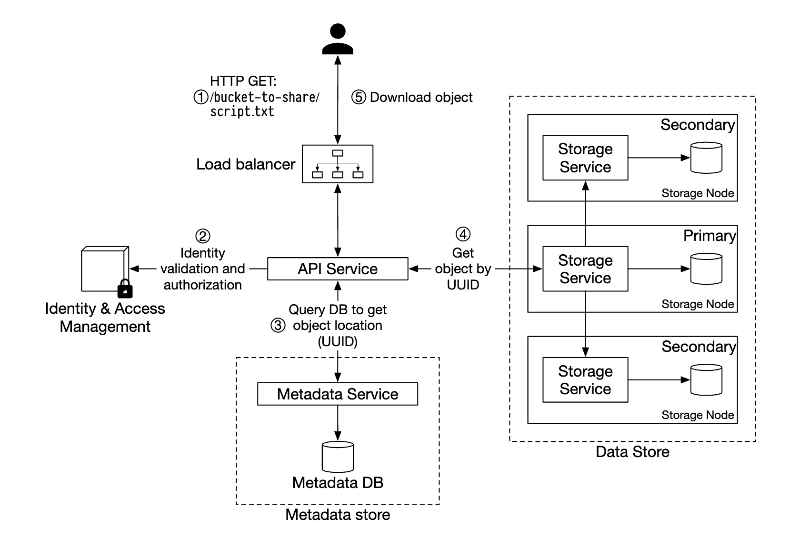
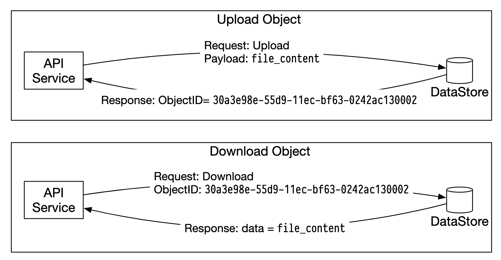
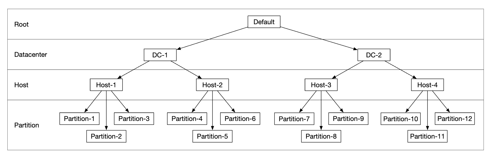
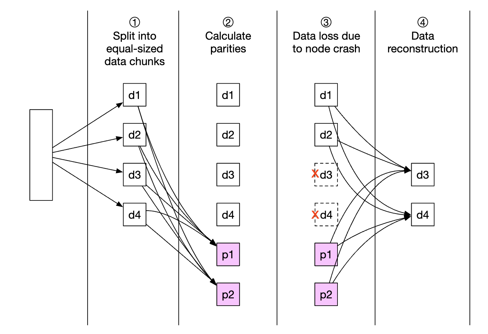
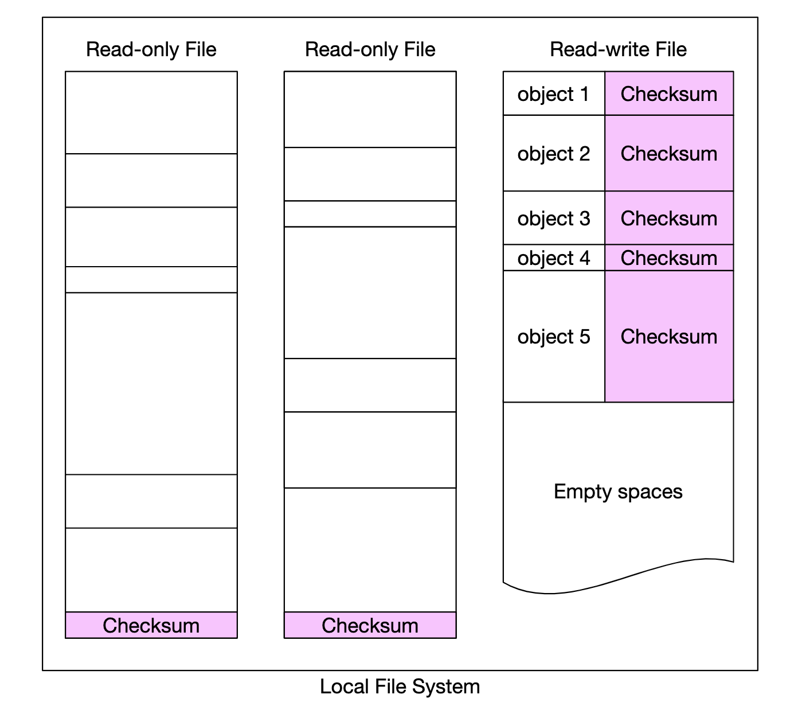

# Глава 24: Объектное хранилище в стиле S3

## Введение

В этой главе мы спроектируем сервис **объектного хранилища (object storage)**, похожий на **Amazon S3**.

Системы хранения делятся на три большие категории:
- **Блочное хранилище (block storage)**
- **Файловое хранилище (file storage)**
- **Объектное хранилище (object storage)**

**Блочные хранилища** — это устройства, появившиеся в 1960-х годах. Примеры — HDD и SSD.
Обычно такие устройства физически подключены к серверу, хотя могут подключаться и по сети через высокоскоростные сетевые протоколы.
Сервер может отформатировать сырые блоки и использовать их как файловую систему либо передать управление ими напрямую приложениям.

**Файловое хранилище** строится поверх блочного. Оно даёт более высокий уровень абстракции, упрощая работу с папками и файлами.

**Объектное хранилище** жертвует производительностью ради высокой сохранности данных (durability), огромного масштаба и низкой стоимости.
Оно ориентировано на «холодные» данные и используется в основном для архивов и резервных копий.
Иерархической структуры каталогов нет — все данные хранятся как объекты в плоской структуре.
По сравнению с другими типами хранилищ оно относительно медленное. У большинства облачных провайдеров есть объектное хранилище — Amazon S3, Google GCS и т.д.

<div style="margin-left:3rem">
    
</div>

|                      | Блочное хранилище                 | Файловое хранилище                        | Объектное хранилище                  |
|----------------------|-----------------------------------|-------------------------------------------|--------------------------------------|
| Изменяемое содержимое| Да                                | Да                                        | Нет (есть версионирование объектов）  |
| Стоимость            | Высокая                           | Средняя или высокая                       | Низкая                               |
| Производительность   | Средняя, высокая, очень высокая   | Средняя или высокая                       | Низкая или средняя                   |
| Согласованность      | Строгая согласованность           | Строгая согласованность                   | Строгая согласованность [5]          |
| Доступ к данным      | SAS/iSCSI/FC                      | Стандартный файловый доступ, CIFS/SMB и NFS | RESTful API                        |
| Масштабируемость     | Средняя масштабируемость          | Высокая масштабируемость                  | Огромная масштабируемость            |
| Подходит для         | Виртуальные машины (VM), базы данных | Файловый доступ общего назначения       | Бинарные данные, неструктурированные данные |

Немного терминологии, связанной с объектными хранилищами:
- **Бакет (bucket)** — логический контейнер для объектов. Имя глобально уникально.
- **Объект** — отдельная порция данных, хранящаяся в бакете. Содержит данные объекта и метаданные.
- **Версионирование** — функция, позволяющая хранить несколько вариантов объекта в одном бакете.
- **Единый идентификатор ресурса (URI)** — каждый ресурс уникально идентифицируется своим URI.
- **Соглашение об уровне сервиса (SLA)** — договор между поставщиком сервиса и клиентом.

SLA класса хранения Amazon S3 Standard-Infrequent Access:
- Сохранность данных 99,999999999% на нескольких зонах доступности
- Данные переживают уничтожение целой зоны доступности
- Расчётная доступность — 99,9%

---

## Шаг 1: Понять задачу и определить границы проектирования

- К: Какие функции нужно включить?
- И: Создание бакетов, загрузка/скачивание объектов, версионирование, листинг объектов в бакете
- К: Каков типичный размер данных?
- И: Нужно эффективно хранить и очень большие, и маленькие объекты
- К: Сколько данных мы будем хранить в год?
- И: 100 петабайт
- К: Можем ли мы исходить из шести девяток сохранности данных (99,9999%) и доступности сервиса в четыре девятки (99,99%)?
- И: Да, звучит разумно

### **Нефункциональные требования**

- **100 PB данных**
- **Шесть девяток сохранности данных**
- **Четыре девятки доступности сервиса**
- Эффективность хранения. Снижать стоимость хранения, сохраняя высокую надёжность и производительность

### **Прикидочные оценки**

Узкими местами объектного хранилища, скорее всего, окажутся ёмкость дисков или количество операций ввода-вывода в секунду (IOPS).

Допущения:
- у нас 20% маленьких объектов (меньше 1 MB), 60% средних (1–64 MB) и 20% больших (больше 64 MB),
- Один жёсткий диск (SATA, 7200 rpm) способен выполнять 100–150 случайных позиционирований в секунду (100–150 IOPS)

Исходя из этих допущений, можно оценить общее число объектов, которое система сможет хранить.
- Для простоты расчёта возьмём медианный размер каждого типа объектов — 0,5 MB для маленьких, 32 MB для средних, 200 MB для больших.
- При 100 PB хранилища (10^11 MB) и 40% заполненности получаем 0,68 млрд объектов
- Если считать, что метаданные занимают 1 KB, для их хранения понадобится 0,68 TB

---

## Шаг 2: Предложить высокоуровневый дизайн и согласовать его

Прежде чем погружаться в дизайн, рассмотрим несколько интересных свойств объектного хранилища:
- **Неизменяемость объектов** — объекты в объектном хранилище неизменяемы (в отличие от других систем хранения). Их можно удалить или заменить, но не обновить.
- **Хранилище «ключ-значение»** — URI объекта является его ключом, а содержимое можно получить HTTP-запросом
- **Одна запись, много чтений** — паттерн доступа к данным: записали один раз, читаем много раз. По данным одного исследования LinkedIn, 95% операций — чтения
- Поддержка и маленьких, и больших объектов

Философия дизайна объектного хранилища похожа на UNIX: при сохранении файла его имя попадает в структуру данных под названием inode, а сами данные файла хранятся в разных местах на диске.
Inode содержит список указателей на блоки файла, указывающих на разные позиции на диске.

При обращении к файлу мы сначала получаем его метаданные из inode и только потом — содержимое файла.

Объектное хранилище устроено аналогично: хранилище метаданных содержит информацию о файле, а содержимое лежит на диске:

<div style="margin-left:3rem">
    
</div>

Отделив метаданные от содержимого файлов, мы можем масштабировать эти хранилища независимо:

<div style="margin-left:3rem">
    
</div>

### **Высокоуровневый дизайн**

<div style="margin-left:3rem">
    
</div>

- **Балансировщик нагрузки** — распределяет API-запросы между репликами сервиса
- **API-сервис** — сервер без состояния, оркестрирующий вызовы к хранилищу метаданных, хранилищу данных и сервису IAM.
- **Управление идентификацией и доступом (IAM)** — единое место для аутентификации, авторизации и контроля доступа.
- **Хранилище данных** — сохраняет и отдаёт сами данные. Операции выполняются по ID объекта (UUID).
- **Хранилище метаданных** — хранит метаданные объектов

### **Загрузка объекта**

<div style="margin-left:3rem">
    
</div>

- Создаём бакет с именем «bucket-to-share» HTTP-запросом PUT
- API-сервис обращается к IAM, чтобы убедиться, что пользователь авторизован и имеет права на запись
- API-сервис обращается к хранилищу метаданных, чтобы создать запись о бакете. После создания возвращается успешный ответ.
- После создания бакета отправляется HTTP PUT для создания объекта с именем «script.txt»
- API-сервис проверяет личность пользователя и наличие у него прав на запись
- После успешной проверки содержимое объекта отправляется HTTP-запросом PUT в хранилище данных. Оно сохраняет данные и возвращает UUID.
- API-сервис обращается к хранилищу метаданных, чтобы создать новую запись с object_id, bucket_id, bucket_name и прочими метаданными.

Пример запроса на загрузку объекта:

```
PUT /bucket-to-share/script.txt HTTP/1.1
Host: foo.s3example.org
Date: Sun, 12 Sept 2021 17:51:00 GMT
Authorization: authorization string
Content-Type: text/plain
Content-Length: 4567
x-amz-meta-author: Alex

[4567 байт данных объекта]
```

### **Скачивание объекта**

В бакетах нет иерархии каталогов, но мы можем создать логическую иерархию, склеивая имя бакета и имя объекта, имитируя структуру папок.

Пример GET-запроса на получение объекта:

```
GET /bucket-to-share/script.txt HTTP/1.1
Host: foo.s3example.org
Date: Sun, 12 Sept 2021 18:30:01 GMT
Authorization: authorization string
```

<div style="margin-left:3rem">
    
</div>

- Клиент отправляет HTTP GET-запрос на балансировщик нагрузки, то есть `GET /bucket-to-share/script.txt`
- API-сервис запрашивает IAM, чтобы убедиться, что у пользователя есть права на чтение бакета
- После проверки из хранилища метаданных извлекается UUID объекта
- По UUID содержимое объекта извлекается из хранилища данных и возвращается клиенту

---

// sprint 1

## Шаг 3: Детальное проектирование

### **Хранилище данных**

Вот как API-сервис взаимодействует с хранилищем данных:

<div style="margin-left:3rem">
    
</div>

Основные компоненты хранилища данных:

<div style="margin-left:3rem">
    
</div>

Сервис маршрутизации данных предоставляет RESTful- или gRPC-API для доступа к кластеру узлов данных.
Это сервис без состояния, масштабируемый добавлением серверов.

Его основные обязанности:
- запрашивать у сервиса размещения (placement service) лучший узел данных для сохранения данных
- читать данные с узлов данных и возвращать их API-сервису
- записывать данные на узлы данных

Сервис размещения определяет, на каких узлах данных должен храниться объект.
Он поддерживает виртуальную карту кластера, описывающую его физическую топологию.

<div style="margin-left:3rem">
    
</div>

Также сервис обменивается heartbeat-сигналами со всеми узлами данных, чтобы решать, нужно ли исключить узел из виртуального кластера.

Поскольку это критически важный сервис, рекомендуется держать кластер из 5 или 7 реплик, синхронизируемых алгоритмами консенсуса Paxos или Raft.
Например, кластер из 7 узлов переживает отказ 3 узлов.

Узлы данных хранят собственно данные объектов.
Надёжность и сохранность обеспечиваются репликацией данных на несколько узлов.

На каждом узле данных работает демон, отправляющий heartbeat-сигналы сервису размещения.

Heartbeat включает:
- Сколько дисков (HDD или SSD) обслуживает узел данных?
- Сколько данных хранится на каждом диске?

#### Процесс сохранения данных

<div style="margin-left:3rem">
    
</div>

- API-сервис передаёт данные объекта в хранилище данных
- Сервис маршрутизации данных отправляет данные на первичный узел данных
- Первичный узел сохраняет данные локально и реплицирует их на два вторичных узла. Ответ отправляется после успешной репликации.
- UUID объекта возвращается API-сервису.

Нюансы:
- Группа репликации для данного UUID объекта выбирается детерминированно с помощью консистентного хеширования
- На шаге 4 первичный узел реплицирует данные объекта до отправки ответа. Это выбор в пользу строгой согласованности ценой большей задержки.

<div style="margin-left:3rem">
    
</div>

#### Как организованы данные

Простой подход к управлению данными — хранить каждый объект в отдельном файле.

Это работает, но плохо по производительности при множестве мелких файлов в файловой системе:
- Блоки данных на HDD расходуются впустую, поскольку каждый файл занимает блок целиком. Типичный размер блока — 4 KB.
- Много файлов — много inode. Операционные системы плохо справляются со слишком большим числом inode, к тому же есть верхний предел их количества.

Эти проблемы решаются слиянием множества мелких файлов в более крупные через журнал упреждающей записи (write-ahead log, WAL). Когда файл достигает предельного размера (обычно несколько GB), создаётся новый:

<div style="margin-left:3rem">
    
</div>

Недостаток подхода в том, что доступ на запись к файлу приходится сериализовать. Нескольким ядрам, работающим с одним файлом, приходится ждать друг друга.
Чтобы это исправить, можно закрепить файлы за конкретными ядрами и избежать конкуренции за блокировки.

#### Поиск объекта

Чтобы хранить несколько объектов в одном файле, нужно поддерживать таблицу, которая сообщает узлу данных:
- `object_id`
- `filename` — файл, где хранится объект
- `file_offset` — позиция начала объекта
- `object_size`

Эту таблицу можно разместить в файловой БД вроде RocksDB или в традиционной реляционной базе.
Поскольку паттерн доступа — мало записей и много чтений, реляционная база подходит лучше.

Как её развернуть?
Можно развернуть базу отдельным кластером, масштабируемым независимо и доступным всем узлам данных.

Недостатки:
- придётся агрессивно масштабировать кластер, чтобы обслужить все запросы
- появляется дополнительная сетевая задержка между узлом данных и кластером БД

Альтернатива — воспользоваться тем, что узлам данных нужны только их собственные данные,
и развернуть реляционную базу прямо внутри узла данных.

SQLite — хороший вариант: это легковесная файловая реляционная база данных.

#### Обновлённый процесс сохранения данных

<div style="margin-left:3rem">
    
</div>

- API-сервис отправляет запрос на сохранение нового объекта
- Сервис узла данных дописывает новый объект в конец файла с именем «/data/c»
- В таблицу соответствия объектов вставляется новая запись об объекте

#### Сохранность данных

Сохранность данных — важное требование нашего дизайна. Чтобы достичь шести девяток, нужно тщательно разобрать каждый сценарий отказа.

Первая проблема — отказы оборудования. С ней помогает репликация узлов данных, снижающая вероятность потери.
Но вдобавок стоит реплицировать данные между разными доменами отказа (failure domain) — между стойками, между дата-центрами, по раздельным сетям и т.д.
Критическое событие может вызвать несколько отказов оборудования в пределах одного домена:

<div style="margin-left:3rem">
    
</div>

Если принять годовую частоту отказов типичного HDD за 0,81%, три копии дают нам шесть девяток сохранности.

Такая репликация узлов данных обеспечивает нужную сохранность, но для снижения стоимости хранения можно также применить избыточное кодирование (erasure coding).

Избыточное кодирование опирается на биты чётности, которые позволяют восстановить потерянные биты в случае сбоя:

<div style="margin-left:3rem">
    
</div>

Представьте, что эти биты — узлы данных. Если два из них выйдут из строя, их можно восстановить по оставшимся четырём.

Существуют разные схемы избыточного кодирования. В нашем случае можно использовать схему 8+4, распределённую по разным доменам отказа для максимальной надёжности:

<div style="margin-left:3rem">
    
</div>

Избыточное кодирование позволяет добиться заметно меньшей стоимости хранения (выигрыш 50%) ценой скорости доступа: сервису маршрутизации данных приходится собирать данные из нескольких мест:

<div style="margin-left:3rem">
    
</div>

Прочие нюансы:
- Репликация требует 200% накладных расходов на хранение (при 3 репликах) против 50% при избыточном кодировании
- Избыточное кодирование [даёт 11 девяток сохранности](https://github.com/Backblaze/erasure-coding-durability) против 6 девяток при репликации
- Избыточное кодирование требует больше вычислений для расчёта и хранения битов чётности

Итого: репликация полезнее для приложений, чувствительных к задержке, а избыточное кодирование привлекательно экономией на хранении и сохранностью данных.
Кроме того, избыточное кодирование значительно сложнее в реализации.

#### Проверка корректности

Если диск отказывает целиком, обнаружить сбой легко. Сложнее, когда повреждается лишь часть данных на диске.

Для обнаружения таких повреждений можно использовать контрольные суммы — хеш содержимого файла, по которому проверяется его целостность.

В нашем случае мы будем хранить контрольные суммы для каждого файла и каждого объекта:

<div style="margin-left:3rem">
    
</div>

При избыточном кодировании (8+4) придётся получать каждый из 8 фрагментов данных по отдельности и проверять контрольную сумму каждого из них.

// sprint 2

### **Модель метаданных**

Схемы таблиц:

<div style="margin-left:3rem">
    
</div>

Запросы, которые нужно поддерживать:
- Найти ID объекта по имени
- Вставить/удалить объект по имени
- Вывести список объектов бакета с общим префиксом

Обычно число бакетов на пользователя ограничено, поэтому таблица бакетов невелика и помещается на один сервер БД.
Но сервер всё равно придётся масштабировать под пропускную способность чтения.

А вот таблица объектов, скорее всего, на один сервер не поместится. Поэтому масштабируем её шардированием:
- Шардирование по bucket_id приведёт к горячим точкам, ведь в бакете могут быть миллиарды объектов
- Шардирование по object_id распределяет нагрузку равномернее, но наши запросы будут медленными
- Мы выбираем шардирование по `hash(bucket_name, object_name)`, поскольку большинство запросов опираются на имя объекта/бакета.

Впрочем, даже при такой схеме шардирования листинг объектов в бакете будет медленным.

### **Листинг объектов в бакете**

В единственной базе данных листинг объектов по префиксу (похожему на каталог) выглядит так:

```
SELECT * FROM object WHERE bucket_id = "123" AND object_name LIKE `abc/%`
```

В шардированной базе выполнить такой запрос сложно. Можно запустить его на каждом шарде и агрегировать результаты в памяти.
Однако это осложняет пагинацию: разные шарды возвращают разное количество результатов, и для каждого приходится вести отдельные limit/offset.

Мы можем воспользоваться тем, что объектные хранилища обычно не оптимизируют под листинг объектов, и пожертвовать его производительностью.
Также можно создать денормализованную таблицу для листинга, шардированную по ID бакета.
Тогда запрос листинга будет достаточно быстрым, поскольку выполняется в пределах одного экземпляра базы.

### **Версионирование объектов**

Версионирование реализуется дополнительным столбцом `object_version` типа TIMEUUID, по которому можно сортировать записи.

Каждая новая версия порождает новый `object_id`:

<div style="margin-left:3rem">
    
</div>

Удаление объекта создаёт новую версию со специальным `object_id`, показывающим, что объект удалён. Запросы к нему возвращают 404:

<div style="margin-left:3rem">
    
</div>

### **Оптимизация загрузки больших файлов**

Загрузку больших файлов можно оптимизировать с помощью многочастной загрузки (multipart upload) — разбиения большого файла на несколько частей, загружаемых независимо:

<div style="margin-left:3rem">
    
</div>

- Клиент обращается к сервису, чтобы инициировать многочастную загрузку
- Хранилище данных возвращает ID загрузки, уникально её идентифицирующий
- Клиент разбивает большой файл на несколько частей и загружает их независимо, используя ID загрузки
- Когда часть загружена, хранилище данных возвращает etag — контрольную сумму md5, идентифицирующую эту часть
- После загрузки всех частей клиент отправляет запрос на завершение многочастной загрузки, включающий upload_id, номера частей и все etag
- Хранилище данных собирает объект из частей. Процесс может занять несколько минут. После этого клиенту возвращается успешный ответ.

Старые части, которые больше не нужны, на этом этапе можно удалить. Для этого можно завести сборщик мусора.

### **Сборка мусора**

Сборка мусора — процесс возврата дискового пространства, которое больше не используется. Данные становятся мусором несколькими путями:
- **ленивое удаление объектов** — объект помечается удалённым, но фактически не удаляется
- **осиротевшие данные** — например, загрузка оборвалась на середине, и старые части нужно удалить
- **повреждённые данные** — данные, не прошедшие проверку контрольных сумм

Сборщик мусора также отвечает за возврат неиспользуемого пространства в репликах.
При репликации данные удаляются и с первичных узлов, и с реплик. При избыточном кодировании (8+4) данные удаляются со всех 12 узлов.

Для выполнения удаления мы используем процесс под названием компакция (compaction):
- Сборщик мусора копирует неудалённые объекты из «data/b» в «data/d»
- После завершения копирования таблица `object_mapping` обновляется в рамках транзакции базы данных
- Чтобы не плодить слишком много мелких файлов, компакция выполняется для файлов, выросших сверх определённого порога

<div style="margin-left:3rem">
    
</div>

---

## Шаг 4: Подведение итогов

Что мы рассмотрели:
- Проектирование объектного хранилища в стиле S3
- Сравнение объектного, блочного и файлового хранилищ
- Загрузку, скачивание, листинг и версионирование объектов в бакете
- Детальный разбор дизайна — хранилище данных и хранилище метаданных, репликация и избыточное кодирование, многочастные загрузки, шардирование
