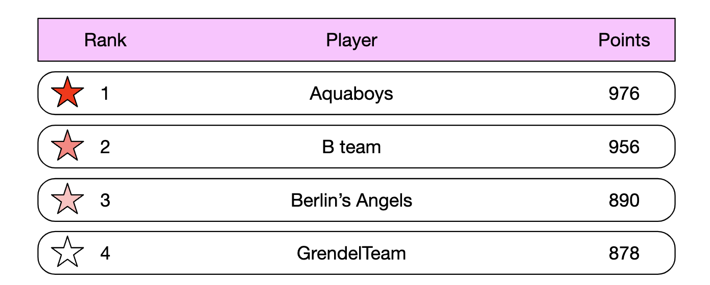
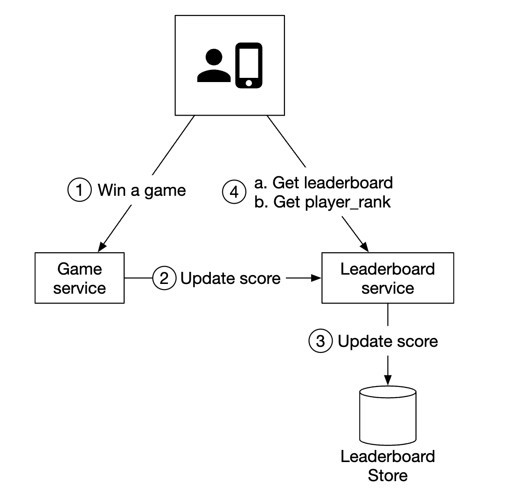
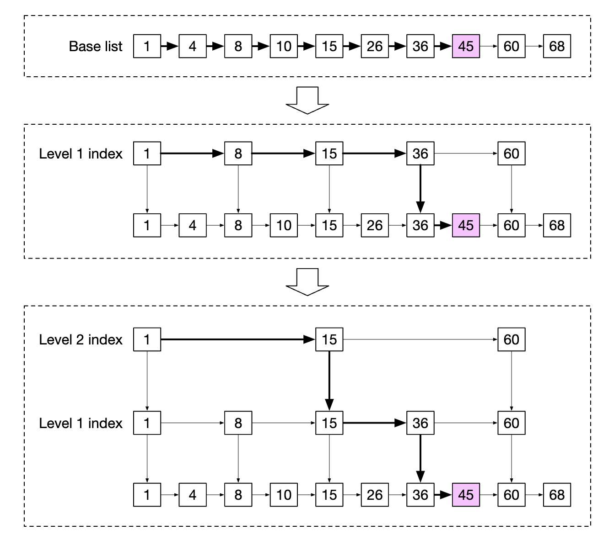
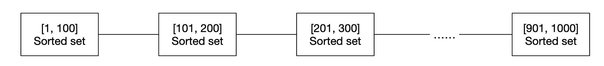

# Глава 25: Игровая таблица лидеров в реальном времени

## Введение

Мы будем проектировать **таблицу лидеров (leaderboard)** для онлайн-игры на мобильных устройствах:

<div style="margin-left:3rem">
    
</div>

---

## Шаг 1: Понять задачу и определить границы проектирования

- К: Как рассчитываются очки для таблицы лидеров?
- И: Пользователь получает очко каждый раз, когда выигрывает матч.
- К: В таблицу лидеров входят все игроки?
- И: Да.
- К: Привязана ли таблица лидеров к какому-то временному отрезку?
- И: Каждый месяц стартует новый турнир, а вместе с ним — новая таблица лидеров.
- К: Можно ли считать, что нас интересуют только 10 лучших игроков?
- И: Мы хотим показывать топ-10 пользователей, а также позицию конкретного пользователя. Если останется время, можно обсудить показ пользователей, находящихся рядом с данным пользователем в таблице лидеров.
- К: Сколько пользователей участвует в турнире?
- И: 5 млн DAU и 25 млн MAU.
- К: Сколько матчей в среднем играется за турнир?
- И: Каждый игрок в среднем играет 10 матчей в день.
- К: Как определяется ранг, если у двух игроков одинаковое количество очков?
- И: В этом случае их ранг совпадает. Если останется время, обсудим разрешение ничьих.
- К: Должна ли таблица лидеров обновляться в реальном времени?
- И: Да, мы хотим показывать результаты в реальном времени или максимально близко к нему. Показывать историю результатов, обработанных пакетно, недопустимо.

### **Функциональные требования**

- Показывать топ-10 игроков в таблице лидеров
- Показывать ранг конкретного пользователя
- Показывать пользователей, находящихся на четыре позиции выше и ниже данного пользователя (бонус)

### **Нефункциональные требования**

- Обновление очков в реальном времени
- Изменение очков отражается в таблице лидеров в реальном времени
- Общая масштабируемость, доступность, надёжность

### **Оценка «на салфетке»**

При 50 млн DAU, если игроки равномерно распределены в течение суток, в среднем получим 50 пользователей в секунду.
Однако распределение обычно неравномерное, поэтому можно оценить пиковое количество онлайн-пользователей как 250 в секунду.

QPS для начисления очков пользователям — при 10 играх в день в среднем: 50 пользователей/с * 10 = 500 QPS. Пиковый QPS = 2500.

QPS для получения топ-10 таблицы лидеров — предполагая, что пользователи открывают её в среднем раз в день, QPS равен 50.

---

## Шаг 2: Предложить высокоуровневый дизайн и согласовать его

### **Дизайн API**

Первый нужный нам API — обновление очков пользователя:

```
POST /v1/scores
```

Этот API принимает два параметра — `user_id` и `points`, начисленные за победу в игре.

Этот API должен быть доступен только игровым серверам, а не конечным клиентам.

Следующий — получение топ-10 игроков таблицы лидеров:

```
GET /v1/scores
```

Пример ответа:

```
{
  "data": [
    {
      "user_id": "user_id1",
      "user_name": "alice",
      "rank": 1,
      "score": 12543
    },
    {
      "user_id": "user_id2",
      "user_name": "bob",
      "rank": 2,
      "score": 11500
    }
  ],
  ...
  "total": 10
}
```

Также можно получить очки конкретного пользователя:

```
GET /v1/scores/{:user_id}
```

Пример ответа:

```
{
    "user_info": {
        "user_id": "user5",
        "score": 1000,
        "rank": 6,
    }
}
```

### **Высокоуровневая архитектура**

<div style="margin-left:3rem">
    
</div>

- Когда игрок выигрывает игру, клиент отправляет запрос игровому сервису
- Игровой сервис проверяет, что победа действительна, и вызывает сервис таблицы лидеров для обновления очков игрока
- Сервис таблицы лидеров обновляет очки пользователя в хранилище таблицы лидеров
- Игрок обращается к сервису таблицы лидеров, чтобы получить данные таблицы, например топ-10 игроков и ранг данного игрока

Рассматривался альтернативный дизайн, в котором клиент сам обновляет свои очки напрямую в сервисе таблицы лидеров:

<div style="margin-left:3rem">
    
</div>

Этот вариант небезопасен, поскольку уязвим к атакам «человек посередине» (man-in-the-middle). Игроки могут поставить прокси и менять свои очки как угодно.

Ещё одна оговорка: в играх, где игровая логика управляется сервером, клиентам не нужно явно вызывать сервер, чтобы зафиксировать победу.
Серверы делают это за них автоматически на основе игровой логики.

Ещё один момент — стоит ли ставить очередь сообщений между игровым сервером и сервисом таблицы лидеров. Это было бы полезно, если результаты игр интересуют и другие сервисы, но пока это не является явным требованием на собеседовании, поэтому в дизайн не включено:

<div style="margin-left:3rem">
    
</div>

### **Модели данных**

Обсудим варианты хранения данных таблицы лидеров — реляционные БД, Redis, NoSQL.

Решение на NoSQL рассматривается в разделе с углублённым разбором.

#### Решение на реляционной базе данных

Если масштаб не имеет значения и пользователей у нас не так много, реляционная БД вполне нам подходит.

Можно начать с простой таблицы leaderboard, по одной на каждый месяц (личное замечание автора конспекта — в этом нет смысла. Можно просто добавить столбец `month` и избежать головной боли с созданием новых таблиц каждый месяц):

<div style="margin-left:3rem">
    
</div>

Туда стоит добавить и другие данные, но для запросов, которые мы будем выполнять, они не важны, поэтому опущены.

Что происходит, когда пользователь зарабатывает очко?

<div style="margin-left:3rem">
    
</div>

Если пользователя ещё нет в таблице, сначала нужно его вставить:

```
INSERT INTO leaderboard (user_id, score) VALUES ('mary1934', 1);
```

При последующих вызовах мы просто обновляем его очки:

```
UPDATE leaderboard set score=score + 1 where user_id='mary1934';
```

Как найти лучших игроков таблицы лидеров?

<div style="margin-left:3rem">
    
</div>

Можно выполнить следующий запрос:

```
SELECT (@rownum := @rownum + 1) AS rank, user_id, score
FROM leaderboard
ORDER BY score DESC;
```

Однако это неэффективно, так как выполняется полное сканирование таблицы, чтобы отсортировать все записи в ней.

Можно оптимизировать запрос, добавив индекс по `score` и используя `LIMIT`, чтобы не сканировать всё:

```
SELECT (@rownum := @rownum + 1) AS rank, user_id, score
FROM leaderboard
ORDER BY score DESC
LIMIT 10;
```

Однако такой подход плохо масштабируется, если пользователь находится не в верхней части таблицы лидеров и нужно найти его ранг.

#### Решение на Redis

Нам нужно решение, которое хорошо работает даже для миллионов игроков, не прибегая к сложным запросам к базе данных.

Redis — это хранилище данных в оперативной памяти; оно быстрое, поскольку работает в памяти, и содержит подходящую для наших нужд структуру данных — отсортированное множество (sorted set).

Отсортированное множество — это структура данных, похожая на множества (sets) в языках программирования, которая позволяет держать данные отсортированными по заданному критерию.
Внутри оно реализовано с помощью хеш-таблицы, хранящей соответствие между ключом (user_id) и значением (score), и списка с пропусками (skip list), который отображает очки на пользователей в отсортированном порядке:

<div style="margin-left:3rem">
    
</div>

Как работает список с пропусками?
- Это связный список, позволяющий быстро искать
- Он состоит из отсортированного связного списка и многоуровневых индексов

<div style="margin-left:3rem">
    
</div>

Такая структура позволяет быстро искать конкретные значения, когда набор данных достаточно велик.
В примере ниже (64 узла) для поиска заданного значения нужно пройти 62 узла в обычном связном списке и всего 11 узлов в случае списка с пропусками:

<div style="margin-left:3rem">
    
</div>

Отсортированные множества производительнее реляционных баз данных, так как данные всегда хранятся отсортированными — ценой операций добавления и поиска за O(logN).

Для сравнения, вот пример вложенного запроса, который пришлось бы выполнять для поиска ранга заданного пользователя в реляционной БД:

```
SELECT *,(SELECT COUNT(*) FROM leaderboard lb2
WHERE lb2.score >= lb1.score) RANK
FROM leaderboard lb1
WHERE lb1.user_id = {:user_id};
```

Какие операции нужны для работы нашей таблицы лидеров в Redis?
- **ZADD** — вставить пользователя в множество, если его там нет. Иначе — обновить очки. Временная сложность O(logN).
- **ZINCRBY** — увеличить очки пользователя на заданную величину. Если пользователя нет, очки начинаются с нуля. Временная сложность O(logN).
- **ZRANGE/ZREVRANGE** — получить диапазон пользователей, отсортированных по очкам. Можно указать порядок (ASC/DESC), смещение и размер результата. Временная сложность O(logN+M), где M — размер результата.
- **ZRANK/ZREVRANK** — получить позицию (ранг) заданного пользователя в порядке ASC/DESC. Временная сложность O(logN).

Что происходит, когда пользователь зарабатывает очко?

```
ZINCRBY leaderboard_feb_2021 1 'mary1934'
```

Каждый месяц создаётся новая таблица лидеров, а старые перемещаются в историческое хранилище.

Что происходит, когда пользователь запрашивает топ-10 игроков?

```
ZREVRANGE leaderboard_feb_2021 0 9 WITHSCORES
```

Пример результата:

```
[(user2,score2),(user1,score1),(user5,score5)...]
```

А как насчёт получения пользователем своей позиции в таблице лидеров?

<div style="margin-left:3rem">
    
</div>

Это легко сделать следующим запросом, если мы знаем позицию пользователя в таблице лидеров:

```
ZREVRANGE leaderboard_feb_2021 357 365
```

Позицию пользователя можно получить с помощью `ZREVRANK <user-id>`.

Разберёмся, каковы наши требования к хранилищу:
- Предположим худший сценарий — все 25 млн MAU участвуют в игре в данном месяце
- ID — строка из 24 символов, а очки — 16-битное целое; нам нужно 26 байт * 25 млн = ~650 MB хранилища
- Даже если удвоить объём из-за накладных расходов списка с пропусками, это всё равно легко поместится в современный кластер Redis

Ещё одно нефункциональное требование — поддержка 2500 обновлений в секунду. Это вполне по силам одному серверу Redis.

Дополнительные оговорки:
- Можно поднять реплику Redis, чтобы не потерять данные при сбое сервера Redis
- Можно также использовать персистентность Redis, чтобы не терять данные в случае сбоя
- Нам понадобятся две вспомогательные таблицы в MySQL: для получения сведений о пользователе (имя пользователя, отображаемое имя и т.д.) и для хранения, например, информации о том, когда пользователь выиграл игру
- Вторую таблицу в MySQL можно использовать для восстановления таблицы лидеров при сбое инфраструктуры
- В качестве небольшой оптимизации производительности можно кешировать сведения о топ-10 игроках, поскольку к ним обращаются чаще всего

---

## Шаг 3: Углублённое проектирование

### **Использовать облачного провайдера или нет**

Мы можем либо развёртывать и обслуживать сервисы самостоятельно, либо доверить это облачному провайдеру.

Если мы решим управлять сервисами сами, то будем использовать Redis для данных таблицы лидеров, MySQL для профилей пользователей и, возможно, кеш для профилей пользователей, если захотим масштабировать базу данных:

<div style="margin-left:3rem">
    
</div>

В качестве альтернативы можно использовать облачные предложения, которые возьмут на себя управление многими сервисами. Например, можно использовать AWS API Gateway для маршрутизации вызовов API в функции AWS Lambda:

<div style="margin-left:3rem">
    
</div>

AWS Lambda позволяет выполнять код, не управляя серверами и не выделяя их самостоятельно. Она запускается только по необходимости и масштабируется автоматически.

Пример: пользователь зарабатывает очко:

<div style="margin-left:3rem">
    
</div>

Пример: пользователь получает таблицу лидеров:

<div style="margin-left:3rem">
    
</div>

Lambda-функции — это реализация бессерверной (serverless) архитектуры. Нам не нужно заниматься масштабированием и настройкой окружения.

Автор рекомендует этот подход, если мы строим игру с нуля.

### **Масштабирование Redis**

При 5 млн DAU можно обойтись одним экземпляром Redis — как с точки зрения хранилища, так и с точки зрения QPS.

Однако если представить, что аудитория вырастет в 10 раз до 500 млн DAU, то нам понадобится 65 GB хранилища, а QPS вырастет до 250 тыс.

Такой масштаб потребует шардирования.

Один из способов — партиционирование данных по диапазонам:

<div style="margin-left:3rem">
    
</div>

В этом примере мы шардируем по очкам пользователя. Соответствие между user_id и шардом будем поддерживать в коде приложения.
Само это соответствие можно хранить либо в MySQL, либо в отдельном кеше.

Чтобы получить топ-10 игроков, мы запрашиваем шард с самыми высокими очками (`[900-1000]`).

Чтобы получить ранг пользователя, нужно вычислить ранг внутри шарда пользователя и прибавить количество всех пользователей с более высокими очками в других шардах.
Последнее — операция за O(1), так как общее число записей в шарде можно быстро получить командой info keyspace.

В качестве альтернативы можно использовать хеш-партиционирование через Redis Cluster. Это прокси, который распределяет данные по узлам Redis на основе партиционирования, похожего на консистентное хеширование, но не полностью идентичного ему:

<div style="margin-left:3rem">
    
</div>

При такой конфигурации вычислить топ-10 игроков непросто. Нужно получить топ-10 игроков из каждого шарда и объединить результаты в приложении:

<div style="margin-left:3rem">
    
</div>

У хеш-партиционирования есть ряд ограничений:
- Если нужно получить топ-K пользователей при большом K, задержка может вырасти, так как придётся забирать много данных со всех шардов
- Задержка растёт с увеличением числа партиций
- Нет простого способа определить ранг пользователя

Из-за всего этого автор склоняется к использованию фиксированных партиций для этой задачи.

Другие оговорки:
- Хорошая практика — выделять узлам Redis с интенсивной записью вдвое больше памяти, чем требуется, чтобы при необходимости хватило места для снапшотов
- Можно использовать инструмент Redis-benchmark для отслеживания производительности конфигурации Redis и принятия решений на основе данных

### **Альтернативное решение: NoSQL**

Ещё одно решение, которое стоит рассмотреть, — использовать подходящую NoSQL-базу данных, оптимизированную для:
- интенсивной записи
- эффективной сортировки элементов внутри одной партиции по очкам

DynamoDB, Cassandra или MongoDB — все они хорошо подходят.

В этой главе автор решил использовать DynamoDB. Это полностью управляемая NoSQL-база данных, обеспечивающая стабильную производительность и отличную масштабируемость.
Она также позволяет использовать глобальные вторичные индексы, когда нужно делать запросы по полям, не входящим в первичный ключ.

<div style="margin-left:3rem">
    
</div>

Начнём с таблицы для хранения таблицы лидеров шахматной игры:

<div style="margin-left:3rem">
    
</div>

Это работает, но плохо масштабируется, если нужно делать запросы по очкам. Поэтому можно сделать очки ключом сортировки (sort key):

<div style="margin-left:3rem">
    
</div>

Ещё одна проблема этого дизайна — партиционирование по месяцу. Это приводит к «горячей» партиции, так как к последнему месяцу обращаются гораздо чаще, чем к остальным.

Можно применить технику под названием шардирование записи (write sharding), когда к каждому ключу добавляется номер партиции, вычисляемый как `user_id % num_partitions`:

<div style="margin-left:3rem">
    
</div>

Важный компромисс — сколько партиций использовать:
- Чем больше партиций, тем выше масштабируемость записи
- Однако масштабируемость чтения страдает, так как для сбора агрегированных результатов нужно опрашивать больше партиций

Такой подход требует применения техники «scatter-gather», которую мы видели ранее; её временная сложность растёт с добавлением партиций:

<div style="margin-left:3rem">
    
</div>

Чтобы обоснованно выбрать число партиций, потребуется провести бенчмарки.

У этого NoSQL-подхода остаётся один серьёзный недостаток — сложно вычислить конкретный ранг пользователя.

Если масштаб достаточно велик, чтобы потребовалось шардирование, можно вместо ранга сообщать пользователям, в каком «процентиле» очков они находятся.

Cron-задача может периодически анализировать распределение очков, на основе которого определяется процентиль пользователя, например:

```
10-й процентиль = score < 100
20-й процентиль = score < 500
...
90-й процентиль = score < 6500
```

---

## Шаг 4: Подведение итогов

Что ещё можно обсудить, если останется время:
- **Более быстрое получение данных** — можно кешировать объект пользователя в Redis-хеше с отображением `user_id -> объект пользователя`. Это быстрее, чем запрашивать базу данных.
- **Разрешение ничьих** — когда у двух игроков одинаковые очки, ничью можно разрешить, отсортировав их по времени последней сыгранной игры.
- **Восстановление после сбоя системы** — в случае масштабного отказа Redis можно воссоздать таблицу лидеров, пройдясь по записям WAL в MySQL и восстановив её ad-hoc-скриптом
