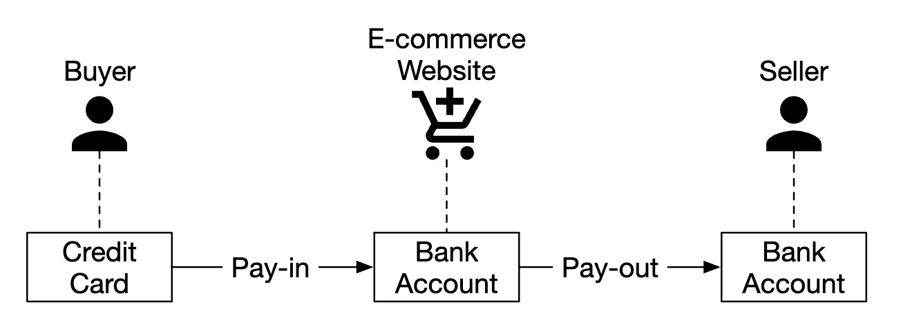

# Глава 26: Платёжная система

## Введение
В этой главе мы спроектируем **платёжную систему**, лежащую в основе всей современной **электронной коммерции**.

**Платёжная система** используется для проведения финансовых транзакций — перевода денежной стоимости.

---

## Шаг 1: Понять задачу и определить границы проектирования
 * К: Какую именно платёжную систему мы строим?
 * И: Платёжный бэкенд для системы электронной коммерции вроде Amazon.com. Он обрабатывает всё, что связано с движением денег.
 * К: Какие способы оплаты поддерживаются — кредитные карты, PayPal, банковские карты и т.д.?
 * И: В реальной жизни система должна поддерживать все эти варианты. Для целей собеседования ограничимся оплатой кредитными картами.
 * К: Обрабатываем ли мы кредитные карты самостоятельно?
 * И: Нет, мы используем стороннего провайдера, например Stripe, Braintree, Square и т.д.
 * К: Храним ли мы данные кредитных карт в нашей системе?
 * И: По соображениям соответствия требованиям регуляторов мы не храним данные кредитных карт напрямую в наших системах. Мы полагаемся на сторонних платёжных обработчиков.
 * К: Приложение глобальное? Нужно ли поддерживать разные валюты и международные платежи?
 * И: Приложение глобальное, но для целей собеседования считаем, что используется только одна валюта.
 * К: Сколько платёжных транзакций в день мы поддерживаем?
 * И: 1 млн транзакций в день.
 * К: Нужно ли поддерживать поток выплат, например ежемесячные выплаты продавцам?
 * И: Да, это нужно поддерживать.
 * К: Есть ли ещё что-то, на что стоит обратить внимание?
 * И: Нужно поддерживать сверку (reconciliation) для устранения любых несоответствий при взаимодействии с внутренними и внешними системами.

### **Функциональные требования**
 * Поток приёма платежей (pay-in flow) — платёжная система получает деньги от покупателей от имени продавцов
 * Поток выплат (pay-out flow) — платёжная система отправляет деньги продавцам по всему миру

### **Нефункциональные требования**
 * Надёжность и отказоустойчивость. Неудавшиеся платежи требуют аккуратной обработки
 * Необходимо настроить сверку между внутренними и внешними системами

### **Оценка «на салфетке»**
Система должна обрабатывать 1 млн транзакций в день, то есть 10 транзакций в секунду.

Это невысокая нагрузка для любой СУБД, поэтому она не является фокусом этого собеседования.

---

## Шаг 2: Предложить высокоуровневый дизайн и согласовать его
На верхнем уровне в движении денег участвуют три действующих лица:

<div style="margin-left:3rem">
    
</div>

### **Поток приёма платежей (pay-in)**
Вот высокоуровневый обзор потока приёма платежей:

<div style="margin-left:3rem">
    
</div>

 * Платёжный сервис — принимает платёжные события и координирует процесс оплаты. Обычно он также выполняет проверку рисков через стороннего провайдера на предмет нарушений AML или преступной деятельности.
 * Исполнитель платежей (payment executor) — исполняет отдельный платёжный ордер через платёжного провайдера (Payment Service Provider, PSP). Платёжные события могут содержать несколько платёжных ордеров.
 * Платёжный провайдер (PSP) — перемещает деньги с одного счёта на другой, например со счёта кредитной карты покупателя на банковский счёт интернет-магазина.
 * Карточные платёжные системы (card schemes) — организации, обрабатывающие операции по кредитным картам, например Visa, MasterCard и т.д.
 * Леджер (ledger) — ведёт финансовый учёт всех платёжных транзакций.
 * Кошелёк (wallet) — хранит баланс счёта всех продавцов.

Пример потока приёма платежа:
 * пользователь нажимает «оформить заказ», и платёжное событие отправляется в платёжный сервис
 * платёжный сервис сохраняет событие в своей базе данных
 * платёжный сервис вызывает исполнителя платежей для всех платёжных ордеров, входящих в это платёжное событие
 * исполнитель платежей сохраняет платёжный ордер в своей базе данных
 * исполнитель платежей вызывает внешний PSP для обработки платежа по кредитной карте
 * после того как исполнитель платежей обработал платёж, платёжный сервис обновляет кошелёк, чтобы зафиксировать, сколько денег у продавца
 * сервис кошелька сохраняет обновлённую информацию о балансе в своей базе данных
 * платёжный сервис вызывает леджер для записи всех перемещений денег

### **API платёжного сервиса**
```
POST /v1/payments
{
  "buyer_info": {...},
  "checkout_id": "some_id",
  "credit_card_info": {...},
  "payment_orders": [{...}, {...}, {...}]
}
```

Пример `payment_order`:
```
{
  "seller_account": "SELLER_IBAN",
  "amount": "3.15",
  "currency": "USD",
  "payment_order_id": "globally_unique_payment_id"
}
```

Оговорки:
 * `payment_order_id` передаётся в PSP для дедупликации платежей, то есть служит ключом идемпотентности.
 * Поле amount имеет тип `string`, так как `double` не подходит для представления денежных значений.

```
GET /v1/payments/{:id}
```

Этот эндпоинт возвращает статус исполнения отдельного платежа по `payment_order_id`.

### **Модель данных платёжного сервиса**
Нам нужно вести две таблицы — `payment_events` и `payment_orders`.

Для платежей производительность обычно не является важным фактором. А вот строгая согласованность (strong consistency) — является.

Другие соображения при выборе базы данных:
 * Большой рынок DBA, которых можно нанять для администрирования базы данных
 * Проверенная репутация — база данных уже используется другими крупными финансовыми организациями
 * Богатство вспомогательных инструментов
 * Традиционный SQL вместо NoSQL/NewSQL — ради гарантий ACID

Вот что содержит таблица `payment_events`:
 * `checkout_id` — строка, первичный ключ
 * `buyer_info` — строка (личное замечание автора конспекта — вероятно, уместнее внешний ключ на другую таблицу)
 * `seller_info` — строка (личное замечание — то же, что и выше)
 * `credit_card_info` — зависит от карточного провайдера
 * `is_payment_done` — булево значение

Вот что содержит таблица `payment_orders`:
 * `payment_order_id` — строка, первичный ключ
 * `buyer_account` — строка
 * `amount` — строка
 * `currency` — строка
 * `checkout_id` — строка, внешний ключ
 * `payment_order_status` — перечисление (`NOT_STARTED`, `EXECUTING`, `SUCCESS`, `FAILED`)
 * `ledger_updated` — булево значение
 * `wallet_updated` — булево значение

Оговорки:
 * с одним платёжным событием связано много платёжных ордеров
 * `seller_info` не нужен для потока приёма платежей. Он требуется только при выплатах
 * `ledger_updated` и `wallet_updated` обновляются, когда соответствующий сервис вызывается для записи результата платежа
 * переходами состояний платежей управляет фоновая задача, которая отслеживает обновления незавершённых платежей и поднимает алерт, если платёж не обработан за разумное время

### **Леджер с двойной записью**
Механизм двойной бухгалтерской записи — ключевой для любой платёжной системы. Это способ отслеживания движения денег, при котором каждая денежная операция всегда применяется к двум счетам: баланс одного счёта увеличивается (кредит), а другого — уменьшается (дебет):

| Счёт      | Дебет | Кредит |
|-----------|-------|--------|
| покупатель | $1    |        |
| продавец   |       | $1     |

Сумма всех записей транзакции всегда равна нулю. Этот механизм обеспечивает сквозную прослеживаемость всех перемещений денег внутри системы.

### **Хостируемая платёжная страница**
Чтобы не хранить данные кредитных карт и не соответствовать множеству тяжёлых регуляторных требований, большинство компаний предпочитают использовать виджет, предоставляемый PSP, который хранит данные карт и обрабатывает карточные платежи за вас:

<div style="margin-left:3rem">
    
</div>

### **Поток выплат (pay-out)**
Компоненты потока выплат очень похожи на компоненты потока приёма платежей.

Основные отличия:
 * деньги перемещаются с банковского счёта интернет-магазина на банковский счёт продавца
 * можно использовать стороннего провайдера по работе с кредиторской задолженностью, например Tipalti
 * в отношении выплат также нужно учитывать множество требований бухгалтерского учёта и регуляторов

---

## Шаг 3: Углублённое проектирование
Этот раздел посвящён тому, как сделать систему быстрее, устойчивее и безопаснее.

### **Интеграция с PSP**
Если наша система может напрямую подключаться к банкам или карточным платёжным системам, платёж можно провести без PSP.
Такие подключения очень редки и нетипичны — обычно их делают крупные компании, способные оправдать такие инвестиции.

Если мы идём традиционным путём, PSP можно интегрировать одним из двух способов:
 * Через API, если наша платёжная система может собирать платёжные данные
 * Через хостируемую платёжную страницу, чтобы не иметь дела с регуляторными требованиями к платёжным данным

Вот как работает сценарий с хостируемой платёжной страницей:

<div style="margin-left:3rem">
    
</div>

 * Пользователь нажимает кнопку «checkout» в браузере
 * Клиент вызывает платёжный сервис с информацией о платёжном ордере
 * Получив информацию о платёжном ордере, платёжный сервис отправляет запрос на регистрацию платежа в PSP
 * PSP получает данные платежа — валюту, сумму, срок действия и т.д., а также UUID для целей идемпотентности. Обычно это UUID платёжного ордера
 * PSP возвращает токен, уникально идентифицирующий регистрацию платежа. Токен сохраняется в базе данных платёжного сервиса
 * После сохранения токена пользователю показывается платёжная страница, размещённая у PSP. Она инициализируется токеном, а также URL для перенаправления при успехе/неудаче
 * Пользователь вводит платёжные данные на странице PSP, PSP обрабатывает платёж и возвращает его статус
 * Пользователь перенаправляется обратно на redirectURL. Пример URL перенаправления — `https://your-company.com/?tokenID=JIOUIQ123NSF&payResult=X324FSa`
 * Асинхронно PSP вызывает наш платёжный сервис через вебхук, чтобы сообщить нашему бэкенду результат платежа
 * Платёжный сервис записывает результат платежа на основе полученного вебхука

### **Сверка (reconciliation)**
Предыдущий раздел описывает «счастливый путь» платежа. Проблемные сценарии обнаруживаются и устраняются с помощью фонового процесса сверки.

Каждую ночь PSP присылает файл расчётов (settlement file), с помощью которого наша система сравнивает состояние внешней системы с состоянием нашей внутренней.

<div style="margin-left:3rem">
    
</div>

Этот процесс также можно использовать для обнаружения внутренних несоответствий, например между сервисами леджера и кошелька.

Расхождения обрабатываются финансовым отделом вручную. Расхождения делятся на:
 * классифицируемые — то есть известный тип расхождения, который можно устранить по стандартной процедуре
 * классифицируемые, но не поддающиеся автоматизации. Устраняются финансовым отделом вручную
 * неклассифицируемые. Расследуются и устраняются финансовым отделом вручную

### **Обработка задержек платежей**
Бывают случаи, когда платёж может выполняться часами, хотя обычно занимает секунды.

Это может произойти из-за того, что:
 * платёж помечен как высокорисковый, и кто-то должен проверить его вручную
 * кредитная карта требует дополнительной защиты, например 3D Secure Authentication, для завершения которой нужны дополнительные данные от держателя карты

Такие ситуации обрабатываются так:
 * ждём, пока PSP пришлёт нам вебхук о завершении платежа, или опрашиваем его API, если PSP не поддерживает вебхуки
 * показываем пользователю статус «в обработке» и даём страницу, где он может проверять обновления по платежу. Также можно отправить ему письмо, когда платёж завершится

### **Взаимодействие между внутренними сервисами**
Существует два типа паттернов взаимодействия сервисов друг с другом — синхронный и асинхронный.

Синхронное взаимодействие (то есть HTTP) хорошо работает в небольших системах, но с ростом масштаба начинает страдать:
 * низкая производительность — цикл «запрос-ответ» удлиняется по мере вовлечения новых сервисов в цепочку вызовов
 * плохая изоляция отказов — если PSP или любой другой сервис откажет, пользователь не получит ответ
 * тесная связанность — отправитель должен знать получателя
 * сложно масштабировать — без буфера непросто выдержать внезапный рост трафика

Асинхронное взаимодействие делится на две категории.

Один получатель — несколько получателей подписываются на один топик, и каждое сообщение обрабатывается только один раз:

<div style="margin-left:3rem">
    
</div>

Несколько получателей — несколько получателей подписываются на один топик, но сообщения доставляются всем:

<div style="margin-left:3rem">
    
</div>

Вторая модель хорошо подходит для нашей платёжной системы, поскольку платёж может порождать несколько побочных эффектов, обрабатываемых разными сервисами.

Вкратце: синхронное взаимодействие проще, но не даёт сервисам автономности.
Асинхронное взаимодействие жертвует простотой и согласованностью ради масштабируемости и устойчивости.

### **Обработка неудавшихся платежей**
Любая платёжная система должна уметь работать с неудавшимися платежами. Вот некоторые механизмы, которые мы для этого используем:
 * Отслеживание состояния платежа — когда платёж не удался, по его состоянию можно определить, повторять его или возвращать деньги.
 * Очередь повторов (retry queue) — платежи, которые мы будем повторять, публикуются в очередь повторов
 * Очередь недоставленных сообщений (dead-letter queue) — окончательно неудавшиеся платежи помещаются в dead-letter-очередь, где их можно отладить и изучить.

<div style="margin-left:3rem">
    
</div>

### **Доставка exactly-once**
Нам нужно гарантировать, что платёж обрабатывается ровно один раз (exactly-once), чтобы не списать деньги с покупателя дважды.

Операция выполняется ровно один раз, если она выполняется одновременно хотя бы один раз (at-least-once) и не более одного раза (at-most-once).

Для гарантии at-least-once мы используем механизм повторов:

<div style="margin-left:3rem">
    
</div>

Вот распространённые стратегии выбора интервалов между повторами:
 * немедленный повтор — клиент сразу отправляет новый запрос после сбоя
 * фиксированные интервалы — перед повтором платежа ждём фиксированное время
 * нарастающие интервалы — интервал между повторами постепенно увеличивается
 * экспоненциальная выдержка (exponential back-off) — интервал удваивается между последовательными повторами
 * отмена — клиент отменяет запрос. Это происходит, когда ошибка окончательная или достигнут лимит повторов

Как правило, по умолчанию стоит выбирать стратегию с экспоненциальной выдержкой. Хорошая практика — чтобы сервер указывал интервал повтора в заголовке `Retry-After`.

Проблема повторов в том, что сервер потенциально может обработать платёж дважды:
 * клиент дважды нажал кнопку «оплатить», и с него списали деньги дважды
 * платёж успешно обработан PSP, но не нижестоящими сервисами (леджер, кошелёк). Повтор приводит к тому, что PSP обрабатывает платёж ещё раз

Чтобы решить проблему двойного платежа, нужен механизм идемпотентности — свойство, при котором операция, применённая несколько раз, обрабатывается только один раз.

С точки зрения API клиенты могут делать несколько вызовов, дающих один и тот же результат.
Идемпотентность управляется специальным заголовком в запросе (например, `idempotency-key`), который обычно является UUID.

<div style="margin-left:3rem">
    
</div>

Идемпотентности можно достичь с помощью механизма уникальных ограничений (unique key constraints) в базе данных:
 * сервер пытается вставить новую строку в базу данных
 * вставка не удаётся из-за нарушения ограничения уникальности
 * сервер обнаруживает эту ошибку и вместо этого возвращает клиенту уже существующий объект

Идемпотентность применяется и на стороне PSP — с помощью nonce, о котором говорилось ранее. PSP позаботится о том, чтобы не обрабатывать платежи с одним и тем же nonce дважды.

### **Согласованность**
На протяжении жизненного цикла платежа вызывается несколько сервисов с состоянием — PSP, леджер, кошелёк, платёжный сервис.

Взаимодействие между любыми двумя сервисами может дать сбой.
Мы можем обеспечить итоговую (eventual) согласованность данных между всеми сервисами, реализовав обработку exactly-once и сверку.

Если мы используем репликацию, придётся иметь дело с лагом репликации, из-за которого пользователи могут видеть несогласованные данные между основной базой и репликами.

Чтобы смягчить это, можно обслуживать все чтения и записи из основной базы данных, а реплики использовать только для избыточности и аварийного переключения.
Как вариант, можно гарантировать, что реплики всегда синхронизированы, применяя алгоритм консенсуса, такой как Paxos или Raft.
Можно также использовать распределённую базу данных на основе консенсуса, например YugabyteDB или CockroachDB.

### **Безопасность платежей**
Вот некоторые механизмы обеспечения безопасности платежей:
 * Перехват запросов/ответов — используем HTTPS для защиты всего трафика
 * Подмена данных — принудительное шифрование и мониторинг целостности
 * Атаки «человек посередине» — используем SSL с привязкой сертификата (certificate pinning)
 * Потеря данных — реплицируем данные между несколькими регионами и делаем снапшоты
 * DDoS-атаки — внедряем ограничение частоты запросов (rate limiting) и файрвол
 * Кража карт — используем токены вместо хранения реальных данных карт в нашей системе
 * Соответствие PCI — стандарт безопасности для организаций, работающих с брендированными кредитными картами
 * Мошенничество — проверка адреса, код проверки карты (CVV), анализ поведения пользователя и т.д.

---

## Шаг 4: Подведение итогов
Другие темы для обсуждения:
 * Мониторинг и алертинг
 * Инструменты отладки — нужны инструменты, позволяющие легко понять, почему платёж не прошёл
 * Обмен валют — важен при проектировании платёжной системы для международного использования
 * География — в разных регионах могут быть разные способы оплаты
 * Оплата наличными — очень распространена в таких странах, как Индия и Бразилия
 * Интеграция с Google/Apple Pay
