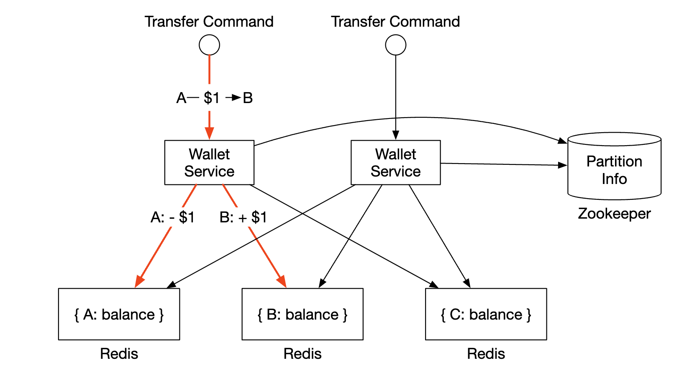
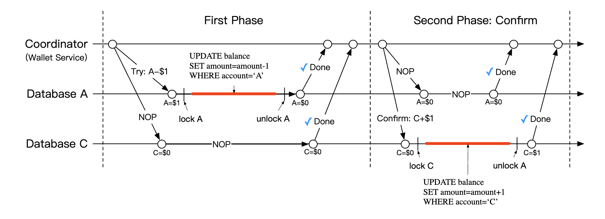
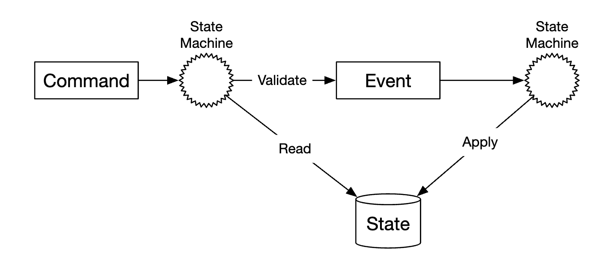
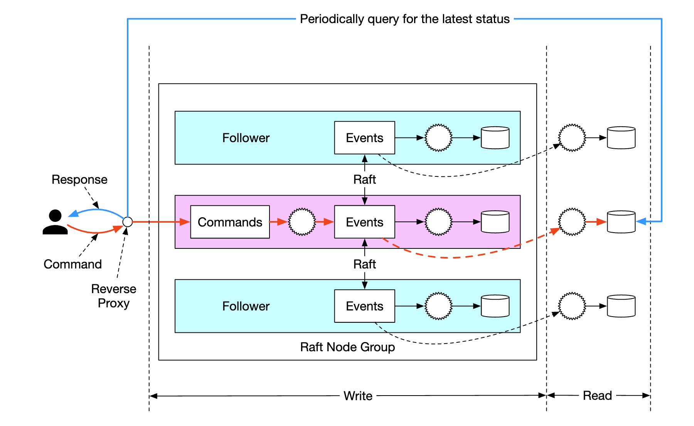
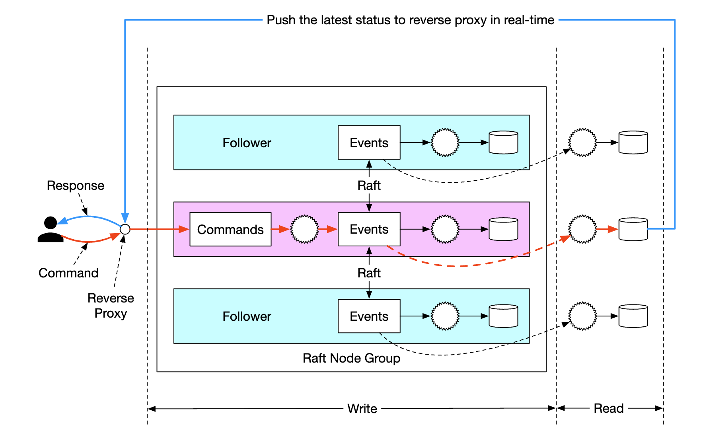

# Глава 27: Цифровой кошелёк

## Введение
У **платёжных платформ** обычно есть **сервис кошелька**, позволяющий клиентам хранить средства внутри приложения и выводить их позже.

Кошельком также можно оплачивать товары и услуги или переводить деньги другим пользователям сервиса **цифрового кошелька (digital wallet)**. Это может быть быстрее и дешевле, чем делать то же самое через обычные платёжные каналы.

<div style="margin-left:3rem">
    
</div>

---

## Шаг 1: Понять задачу и определить границы проектирования
 * К: Нужно ли сосредоточиться только на переводах между цифровыми кошельками? Должны ли мы поддерживать какие-то другие операции?
 * И: Пока сосредоточимся на переводах между цифровыми кошельками.
 * К: Сколько транзакций в секунду должна поддерживать система?
 * И: Будем считать, 1 млн TPS.
 * К: К цифровому кошельку предъявляются строгие требования корректности. Можно ли считать, что транзакционных гарантий достаточно?
 * И: Да, звучит хорошо.
 * К: Нужно ли нам доказывать корректность?
 * И: Это можно делать через сверку (reconciliation), но она лишь обнаруживает расхождения, не показывая их первопричину. Вместо этого мы хотим иметь возможность воспроизвести данные с самого начала, чтобы реконструировать историю.
 * К: Можно ли считать, что требование к доступности — 99,99%?
 * И: Да.
 * К: Нужно ли учитывать обмен валют?
 * И: Нет, это за рамками задачи.

Итого, вот что мы должны поддерживать:
 * Переводы баланса между двумя счетами
 * 1 млн TPS
 * Надёжность 99,99%
 * Поддержка транзакций
 * Поддержка воспроизводимости

### **Оценка «на салфетке»**
Традиционная реляционная база данных, развёрнутая в облаке, выдерживает ~1000 TPS.

Чтобы достичь 1 млн TPS, нам понадобится 1000 узлов базы данных. Но если у каждого перевода две «ноги» (списание и зачисление), то на самом деле нужно поддерживать 2 млн TPS.

Одна из целей нашего проектирования — увеличить TPS, который выдерживает один узел, чтобы узлов базы данных требовалось меньше.

| TPS на узел | Число узлов |
|--------------|-------------|
| 100          | 20 000      |
| 1 000        | 2 000       |
| 10 000       | 200         |

---

## Шаг 2: Предложить высокоуровневый дизайн и согласовать его

### **Дизайн API**
Для этого собеседования нам нужен всего один эндпоинт:
```
POST /v1/wallet/balance_transfer - переводит баланс с одного кошелька на другой
```

Параметры запроса — from_account, to_account, amount (строка, чтобы не потерять точность), currency, transaction_id (ключ идемпотентности).

Пример ответа:
```
{
    "status": "success"
    "transaction_id": "01589980-2664-11ec-9621-0242ac130002"
}
```

### **Решение с шардированием в памяти**
Наше приложение-кошелёк хранит балансы всех пользовательских счетов.

Хорошая структура данных для этого — `map<user_id, balance>`, которую можно реализовать на основе in-memory-хранилища Redis.

Поскольку один узел Redis не выдержит 1 млн TPS, нужно разбить наш кластер Redis на несколько узлов.

Пример алгоритма партиционирования:
```
String accountID = "A";
Int partitionNumber = 7;
Int myPartition = accountID.hashCode() % partitionNumber;
```

Для хранения числа партиций и адресов узлов Redis можно использовать Zookeeper — высокодоступное хранилище конфигурации.

Наконец, сервис кошелька — это сервис без состояния (stateless), отвечающий за выполнение операций перевода. Он легко масштабируется горизонтально:

<div style="margin-left:3rem">
    
</div>

Хотя это решение закрывает вопросы масштабируемости, оно не позволяет выполнять переводы баланса атомарно.

### **Распределённые транзакции**
Один из подходов к обработке транзакций — использовать протокол двухфазной фиксации (two-phase commit) поверх обычных шардированных реляционных баз данных:

<div style="margin-left:3rem">
    
</div>

Вот как работает протокол двухфазной фиксации (2PC):

<div style="margin-left:3rem">
    
</div>

 * Координатор (сервис кошелька) выполняет операции чтения и записи в нескольких базах данных как обычно
 * Когда приложение готово зафиксировать транзакцию, координатор просит все базы данных её подготовить (prepare)
 * Если все базы ответили «да», координатор просит их зафиксировать (commit) транзакцию
 * Иначе все базы получают команду отменить (abort) транзакцию

Недостатки подхода 2PC:
 * Низкая производительность из-за конкуренции за блокировки
 * Координатор — единая точка отказа

### **Распределённая транзакция через Try-Confirm/Cancel (TC/C)**
TC/C — это вариация протокола 2PC, работающая с компенсирующими транзакциями:
 * Координатор просит все базы данных зарезервировать ресурсы под транзакцию
 * Координатор собирает ответы от БД: если «да», базы получают команду try-confirm; если «нет» — try-cancel.

Важное отличие TC/C от 2PC: 2PC выполняет одну транзакцию, тогда как в TC/C выполняются две независимые транзакции.

Вот как TC/C работает по фазам:

| Фаза | Операция | A                    | C                    |
|-------|-----------|---------------------|---------------------|
| 1     | Try       | Изменение баланса: -$1 | Ничего не делать  |
| 2     | Confirm   | Ничего не делать    | Изменение баланса: +$1 |
|       | Cancel    | Изменение баланса: +$1 | Ничего не делать  |

Фаза 1 — try:

<div style="margin-left:3rem">
    
</div>

 * координатор запускает локальную транзакцию в БД счёта A, уменьшающую баланс A на 1$
 * БД счёта C получает инструкцию NOP, которая ничего не делает

Фаза 2a — confirm:

<div style="margin-left:3rem">
    
</div>

 * если обе БД ответили «да», начинается фаза подтверждения.
 * БД счёта A получает NOP, а БД счёта C — команду увеличить баланс C на 1$ (локальная транзакция)

Фаза 2b — cancel:

<div style="margin-left:3rem">
    
</div>

 * Если любая из операций фазы 1 не удалась, начинается фаза отмены.
 * БД счёта A получает команду увеличить баланс A на 1$, БД счёта C получает NOP

Вот сравнение 2PC и TC/C:

|      | Первая фаза                                            | Вторая фаза: успех                 | Вторая фаза: неудача                      |
|------|--------------------------------------------------------|------------------------------------|-------------------------------------------|
| 2PC  | транзакции ещё не завершены                            | Зафиксировать/отменить все транзакции | Отменить все транзакции                |
| TC/C | Все транзакции завершены — зафиксированы или отменены | При необходимости выполнить новые транзакции | Откатить уже зафиксированную транзакцию |

TC/C также называют распределённой транзакцией через компенсацию. Высокоуровневая операция обрабатывается в бизнес-логике.

Другие свойства TC/C:
 * не зависит от конкретной базы данных — лишь бы база поддерживала транзакции
 * Детали и сложность распределённых транзакций приходится обрабатывать в бизнес-логике

### **Сценарии отказов TC/C**
Если координатор падает посреди работы, ему нужно восстановить своё промежуточное состояние.
Это можно сделать с помощью таблиц статусов фаз, атомарно обновляемых внутри шардов базы данных:

<div style="margin-left:3rem">
    
</div>

Что содержит такая таблица:
 * ID и содержимое распределённой транзакции
 * статус фазы try — не отправлена, отправлена, получен ответ
 * название второй фазы — confirm или cancel
 * статус второй фазы
 * флаг нарушения порядка (out-of-order, объясняется ниже)

Одна из оговорок при использовании TC/C: пока распределённая транзакция выполняется, существует короткий момент, когда состояния счетов не согласованы друг с другом:

<div style="margin-left:3rem">
    
</div>

Это нормально при условии, что мы всегда восстанавливаемся из этого состояния и что пользователи не могут воспользоваться промежуточным состоянием, например потратить эти деньги.
Это гарантируется тем, что списания всегда выполняются раньше зачислений.

| Варианты фазы try   | Счёт A | Счёт C |
|---------------------|--------|--------|
| Вариант 1           | -$1    | NOP    |
| Вариант 2 (некорректный) | NOP | +$1   |
| Вариант 3 (некорректный) | -$1 | +$1   |

Обратите внимание, что вариант 3 из таблицы выше некорректен, потому что мы не можем гарантировать атомарное выполнение транзакций в разных базах данных, не полагаясь на 2PC.

Один из пограничных случаев, который нужно учесть, — выполнение с нарушением порядка:

<div style="margin-left:3rem">
    
</div>

Возможна ситуация, когда база данных получает операцию cancel раньше, чем try. Этот случай обрабатывается добавлением флага out-of-order в таблицу статусов фаз.
Получив операцию try, мы сначала проверяем, установлен ли флаг out-of-order, и если да — возвращаем ошибку.

### **Распределённая транзакция через сагу (Saga)**
Ещё один популярный подход — использовать саги, стандарт реализации распределённых транзакций в микросервисных архитектурах.

Вот как это работает:
 * все операции выстраиваются в последовательность. Каждая операция независима и выполняется в своей базе данных.
 * операции выполняются от первой к последней
 * если операция не удалась, весь процесс начинает откатываться к началу с помощью компенсирующих операций

<div style="margin-left:3rem">
    
</div>

Как координировать этот процесс? Есть два подхода:
 * Хореография — все сервисы, участвующие в саге, подписываются на соответствующие события и выполняют свою часть саги
 * Оркестрация — единый координатор указывает всем сервисам выполнять их работу в правильном порядке

Сложность хореографии в том, что бизнес-логика размазана по нескольким сервисам, взаимодействующим асинхронно.
Подход с оркестрацией хорошо справляется со сложностью, поэтому в системе цифрового кошелька обычно предпочитают именно его.

Вот сравнение TC/C и саги:

|                                           | TC/C            | Сага                     |
|-------------------------------------------|-----------------|--------------------------|
| Компенсирующее действие                   | В фазе cancel   | В фазе отката            |
| Централизованная координация              | Да              | Да (режим оркестрации)   |
| Порядок выполнения операций               | любой           | линейный                 |
| Возможность параллельного выполнения      | Да              | Нет (линейное выполнение) |
| Видимость частично несогласованного состояния | Да          | Да                       |
| Логика в приложении или в базе данных     | В приложении    | В приложении             |

Главное отличие в том, что TC/C распараллеливается, поэтому решение зависит от требований к задержке: если нужна низкая задержка, стоит выбрать подход TC/C.

Какой бы подход мы ни выбрали, нам всё равно нужно поддерживать аудит и воспроизведение истории для восстановления из ошибочных состояний.

### **Event sourcing**
В реальной жизни приложение цифрового кошелька может подвергнуться аудиту, и нам придётся ответить на определённые вопросы:
 * Знаем ли мы баланс счёта в любой момент времени?
 * Откуда мы знаем, что исторические и текущие балансы корректны?
 * Как доказать, что логика системы корректна после изменения кода?

Event sourcing (журналирование событий) — техника, которая помогает ответить на эти вопросы.

Она состоит из четырёх понятий:
 * команда (command) — намеренное действие из реального мира, например «перевести 1$ со счёта A на счёт B». Командам нужен глобальный порядок, поэтому они помещаются в очередь FIFO.
   * команды, в отличие от событий, могут завершаться неудачей и содержат долю случайности, например из-за ввода-вывода или некорректного состояния.
   * команда может порождать ноль или более событий
   * генерация событий может содержать случайность, например внешний ввод-вывод. Мы вернёмся к этому позже
 * событие (event) — исторический факт о том, что произошло в системе, например «переведён 1$ с A на B».
   * в отличие от команд, события — это факты, которые уже случились в нашей системе
   * как и команды, они должны быть упорядочены, поэтому помещаются в очередь FIFO
 * состояние (state) — то, что изменилось в результате события. Например, key-value-хранилище соответствий счетов и их балансов.
 * конечный автомат (state machine) — движет процессом event sourcing. Главным образом он валидирует команды и применяет события, обновляя состояние системы.
   * конечный автомат должен быть детерминированным, поэтому он не должен читать внешний ввод-вывод или полагаться на случайность.

<div style="margin-left:3rem">
    
</div>

Вот динамическое представление event sourcing:

<div style="margin-left:3rem">
    
</div>

Для нашего сервиса кошелька команды — это запросы на перевод баланса. Мы можем помещать их в FIFO-очередь, например Kafka:

<div style="margin-left:3rem">
    
</div>

Вот полная картина:

<div style="margin-left:3rem">
    
</div>

 * конечный автомат читает команды из очереди команд
 * состояние баланса читается из базы данных
 * команда валидируется. Если она корректна, генерируются два события — по одному на каждый счёт
 * читается следующее событие и применяется путём обновления баланса (состояния) в базе данных

Главное преимущество event sourcing — воспроизводимость. В этом дизайне все операции обновления состояния сохраняются как неизменяемая история всех изменений балансов.

Исторические балансы всегда можно восстановить, воспроизведя события с самого начала.
Поскольку список событий неизменяем, а конечный автомат детерминирован, воспроизведение любого промежуточного состояния гарантированно даст верный результат.

<div style="margin-left:3rem">
    
</div>

Все вопросы аудита, заданные в начале раздела, решаются с опорой на event sourcing:
 * Знаем ли мы баланс счёта в любой момент времени? — события можно воспроизвести с начала до интересующего нас момента
 * Откуда мы знаем, что исторические и текущие балансы корректны? — корректность можно проверить, пересчитав все события с начала
 * Как доказать, что логика системы корректна после изменения кода? — можно прогнать разные версии кода по одним и тем же событиям и убедиться, что результаты идентичны

Ответы на запросы клиентов об их балансе можно реализовать с помощью архитектуры CQRS — может существовать несколько конечных автоматов только для чтения, которые отвечают за запросы к историческому состоянию на основе неизменяемого списка событий:

<div style="margin-left:3rem">
    
</div>

---

## Шаг 3: Углублённое проектирование
В этом разделе мы рассмотрим оптимизации производительности, поскольку нам по-прежнему нужно масштабироваться до 1 млн TPS.

### **Высокопроизводительный event sourcing**
Первая оптимизация, которую мы рассмотрим, — сохранять команды и события в хранилище на локальном диске вместо внешнего хранилища вроде Kafka.

Это избавляет от сетевой задержки, а кроме того, поскольку мы только дописываем данные (append), такая операция обычно быстра даже для HDD.

Следующая оптимизация — кешировать недавние команды и события в памяти, чтобы не тратить время на их повторную загрузку с диска.

На низком уровне обе эти оптимизации можно реализовать с помощью команды mmap, которая сохраняет данные на локальный диск и одновременно кеширует их в памяти:

<div style="margin-left:3rem">
    
</div>

Следующая возможная оптимизация — хранить и состояние в локальной файловой системе с помощью SQLite, файловой локальной реляционной базы данных. RocksDB — тоже хороший вариант.

Для наших целей мы выберем RocksDB, потому что она использует LSM-дерево (log-structured merge-tree), оптимизированное для операций записи.
Производительность чтения оптимизируется кешированием.

<div style="margin-left:3rem">
    
</div>

Чтобы оптимизировать воспроизводимость, можно периодически сохранять снапшоты на диск — тогда не придётся каждый раз восстанавливать нужное состояние с самого начала. Снапшоты можно хранить как большие бинарные файлы в распределённом файловом хранилище, например HDFS:

<div style="margin-left:3rem">
    
</div>

### **Надёжный высокопроизводительный event sourcing**
Все сделанные оптимизации хороши, но они делают наш сервис сервисом с состоянием (stateful). Для надёжности нужно ввести какую-то форму репликации.

Прежде чем это делать, проанализируем, какие данные в нашей системе требуют высокой надёжности:
 * состояние и снапшот всегда можно восстановить, воспроизведя их из списка событий. Значит, гарантировать надёжность нужно только для списка событий.
 * может показаться, что список событий всегда можно восстановить из списка команд, но это не так, поскольку команды недетерминированы.
 * вывод: высокую надёжность нужно обеспечить только для списка событий

Чтобы добиться высокой надёжности событий, нужно реплицировать список на несколько узлов. Мы должны гарантировать:
 * отсутствие потери данных
 * что относительный порядок данных внутри файла журнала одинаков на всех репликах

Для этого можно применить алгоритм консенсуса, например Raft.

В Raft есть лидер, который активен, и последователи (followers), которые пассивны. Если лидер умирает, его место занимает один из последователей.
Пока работает больше половины узлов, система продолжает функционировать.

<div style="margin-left:3rem">
    
</div>

При этом подходе все узлы обновляют состояние на основе списка событий. Raft гарантирует, что у лидера и последователей одинаковый список событий.

### **Распределённый event sourcing**
Итак, мы спроектировали систему с высокой производительностью одного узла и высокой надёжностью.

Остаются ограничения, с которыми нужно справиться:
 * Ёмкость одной Raft-группы ограничена. В какой-то момент придётся шардировать данные и реализовать распределённые транзакции
 * В архитектуре CQRS цикл «запрос-ответ» медленный. Клиенту приходится периодически опрашивать систему, чтобы узнать, обновился ли его кошелёк

Опрос (polling) — не реальное время, поэтому пользователь может узнать об обновлении баланса с задержкой. Кроме того, при слишком высокой частоте опроса можно перегрузить сервисы запросов:

<div style="margin-left:3rem">
    
</div>

Чтобы снизить нагрузку на систему, можно ввести обратный прокси (reverse proxy), который отправляет команды от имени пользователя и опрашивает систему за него:

<div style="margin-left:3rem">
    
</div>

Это снижает нагрузку на систему, так как одним запросом можно получить данные сразу для нескольких пользователей, но всё ещё не решает задачу получения результата в реальном времени.

Последнее изменение, которое можно сделать, — заставить конечные автоматы только для чтения проталкивать (push) ответы обратному прокси, как только они готовы. Это создаёт у пользователя ощущение, что обновления происходят в реальном времени:

<div style="margin-left:3rem">
    
</div>

Наконец, чтобы масштабировать систему ещё сильнее, можно разбить её на несколько Raft-групп и реализовать поверх них распределённые транзакции с помощью оркестратора — через TC/C или саги:

<div style="margin-left:3rem">
    
</div>

Вот пример жизненного цикла запроса на перевод баланса в нашей итоговой системе:
 * Пользователь A отправляет распределённую транзакцию координатору саги с двумя операциями — `A-1` и `C+1`.
 * Координатор саги создаёт запись в таблице статусов фаз для отслеживания статуса транзакции
 * Координатор определяет, в какие партиции нужно отправить команды.
 * Raft-лидер партиции 1 получает команду `A-1`, валидирует её, преобразует в событие и реплицирует на остальные узлы Raft-группы
 * Результат события синхронизируется в конечный автомат чтения, который проталкивает ответ обратно координатору
 * Координатор создаёт запись об успешном выполнении операции и переходит к следующей — `C+1`
 * Следующая операция выполняется аналогично первой: определяется партиция, отправляется команда, она исполняется, конечный автомат чтения проталкивает ответ
 * Координатор создаёт запись о том, что операция 2 также успешна, и наконец сообщает клиенту результат

---

## Шаг 4: Подведение итогов
Вот как эволюционировал наш дизайн:
 * Мы начали с решения на in-memory Redis. Проблема этого подхода в том, что это недолговечное хранилище.
 * Затем мы перешли к реляционным базам данных, поверх которых выполняем распределённые транзакции через 2PC, TC/C или распределённую сагу.
 * Далее мы ввели event sourcing, чтобы все операции были доступны для аудита
 * Сначала мы сохраняли данные во внешнее хранилище — внешнюю базу данных и очередь, но это непроизводительно
 * Затем мы стали хранить данные в локальном файловом хранилище, используя производительность операций только на дозапись (append-only). Мы также применили кеширование для оптимизации пути чтения
 * Предыдущий подход, хоть и производительный, не был надёжным. Поэтому мы ввели консенсус Raft с репликацией, чтобы избежать единых точек отказа
 * Мы также применили CQRS с обратным прокси, управляющим жизненным циклом транзакции от имени наших пользователей
 * Наконец, мы разбили данные на несколько Raft-групп, оркестрируемых с помощью механизма распределённых транзакций — TC/C или распределённой саги
