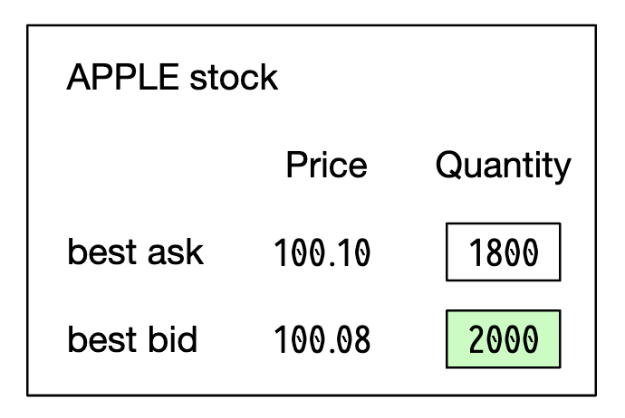
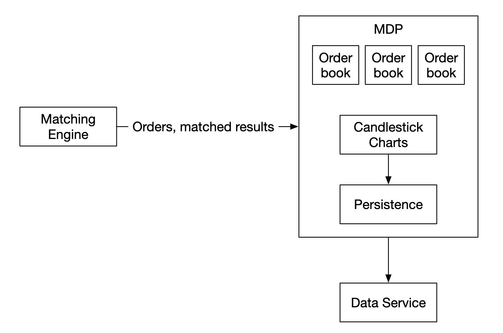
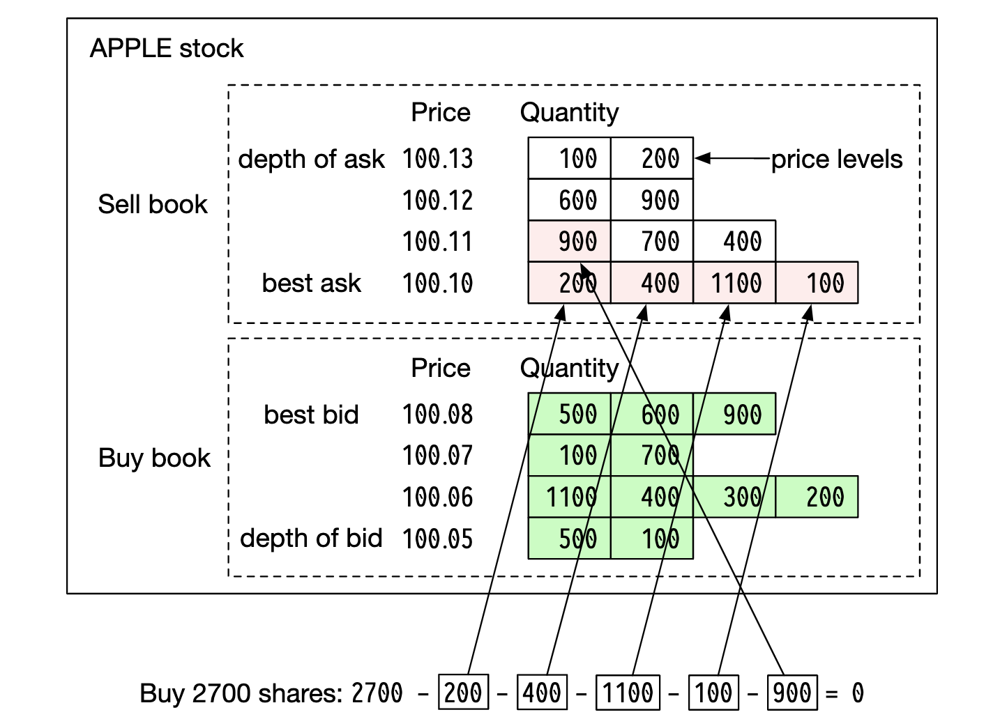
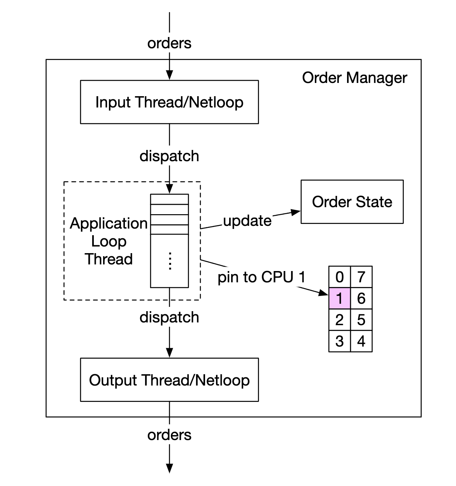
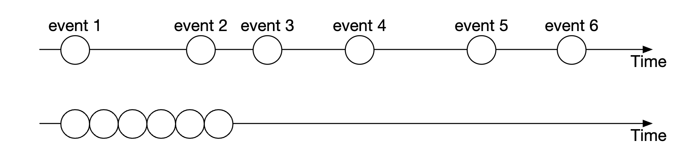

# Глава 28: Биржа

## Введение
В этой главе мы спроектируем **электронную фондовую биржу (stock exchange)**.

Её базовая функция — эффективно сводить покупателей и продавцов.

Крупнейшие фондовые биржи — **NYSE**, **NASDAQ** и другие.

<div style="margin-left:3rem">
    
</div>

---

## Шаг 1: Понять задачу и определить границы проектирования
 * К: Какими ценными бумагами мы будем торговать? Акции, опционы или фьючерсы?
 * И: Для простоты — только акции.
 * К: Какие типы заявок поддерживаются — размещение, отмена, замена? Что насчёт лимитных, рыночных, условных заявок?
 * И: Нужно поддерживать размещение и отмену заявки. Из типов заявок рассматриваем только лимитные.
 * К: Должна ли система поддерживать торговлю после закрытия рынка?
 * И: Нет, только обычные торговые часы.
 * К: Не могли бы вы описать базовые функции биржи?
 * И: Клиенты могут размещать и отменять лимитные заявки и получать сведения о совершённых сделках в реальном времени. Они должны видеть книгу заявок (order book) в реальном времени.
 * К: Каков масштаб биржи?
 * И: Десятки тысяч пользователей, торгующих одновременно, и ~100 тикеров. Миллиарды заявок в день. Также нужно поддерживать проверки рисков для соответствия требованиям.
 * К: Какие именно проверки рисков?
 * И: Ограничимся простыми — например, ограничить пользователя торговлей не более 1 млн акций Apple в день.
 * К: А как насчёт работы с кошельком пользователя?
 * И: Нужно убедиться, что у клиента достаточно средств до размещения заявки. Средства под отложенные заявки должны удерживаться до финализации заявки.

### **Нефункциональные требования**
Масштаб, названный интервьюером, намекает, что мы проектируем биржу малого или среднего размера.
Также нужно обеспечить гибкость, чтобы в будущем поддерживать больше тикеров и пользователей.

Другие нефункциональные требования:
 * Доступность — не менее 99,99%. Простои вредят репутации
 * Отказоустойчивость — нужны отказоустойчивость и механизм быстрого восстановления, чтобы ограничить последствия инцидента в продакшене
 * Задержка — задержка на полный цикл (round-trip) должна быть на уровне миллисекунд, с фокусом на 99-й перцентиль. Постоянно высокая задержка на 99-м перцентиле портит опыт отдельных пользователей
 * Безопасность — нужна система управления учётными записями. Для соответствия законодательству нужно поддерживать KYC для проверки личности пользователя. Также следует защищать публичные ресурсы от DDoS

### **Оценка «на салфетке»**
 * 100 тикеров, 1 млрд заявок в день
 * Обычные торговые часы — с 09:30 до 16:00 (6,5 ч)
 * QPS = 1 млрд / 6,5 / 3600 = 43000
 * Пиковый QPS = 5*QPS = 215000
 * Объём торгов значительно выше при открытии рынка

---

## Шаг 2: Предложить высокоуровневый дизайн и согласовать его

### **Азы предметной области**
Обсудим базовые понятия, связанные с биржей.

Брокер выступает посредником между биржей и конечными пользователями — Robinhood, Fidelity и т.д.

Институциональные клиенты торгуют большими объёмами через специализированное торговое ПО. Им нужен особый подход.
Например, дробление заявок при торговле большими объёмами, чтобы не влиять на рынок.

Типы заявок:
 * Лимитная — купить или продать по фиксированной цене. Она может не найти пару сразу или исполниться частично.
 * Рыночная — цена не указывается. Исполняется немедленно по текущей рыночной цене.

Цены:
 * Bid — наивысшая цена, по которой покупатель готов купить акцию
 * Ask — наименьшая цена, по которой продавец готов продать акцию

На рынке США есть три уровня ценовых котировок — L1, L2, L3.

Рыночные данные L1 содержат лучшие цены bid/ask и объёмы:

<div style="margin-left:3rem">
    
</div>

L2 включает больше ценовых уровней:

<div style="margin-left:3rem">
    
</div>

L3 показывает уровни и объём в очереди на каждом уровне:

<div style="margin-left:3rem">
    
</div>

Свеча (candlestick) показывает цены открытия и закрытия рынка, а также максимальную и минимальную цены за заданный интервал:

<div style="margin-left:3rem">
    
</div>

FIX — протокол обмена информацией о сделках с ценными бумагами, используемый большинством вендоров. Пример транзакции с ценными бумагами:
```
8=FIX.4.2 | 9=176 | 35=8 | 49=PHLX | 56=PERS | 52=20071123-05:30:00.000 | 11=ATOMNOCCC9990900 | 20=3 | 150=E | 39=E | 55=MSFT | 167=CS | 54=1 | 38=15 | 40=2 | 44=15 | 58=PHLX EQUITY TESTING | 59=0 | 47=C | 32=0 | 31=0 | 151=15 | 14=0 | 6=0 | 10=128 |
```

### **Высокоуровневый дизайн**

<div style="margin-left:3rem">
    
</div>

Торговый поток:
 * Клиент размещает заявку через торговый интерфейс
 * Брокер отправляет заявку на биржу
 * Заявка попадает на биржу через клиентский шлюз, который выполняет валидацию, ограничение частоты запросов, аутентификацию и т.д. Заявка передаётся менеджеру заявок
 * Менеджер заявок выполняет проверки рисков по правилам, заданным риск-менеджером
 * После прохождения проверок рисков менеджер заявок убеждается, что в кошельке достаточно средств для заявки
 * Заявка отправляется в движок сопоставления (matching engine). Когда пара найдена, движок сопоставления порождает два исполнения (fills) — для покупки и продажи. Оба получают порядковые номера, чтобы обеспечить детерминированность
 * Исполнения возвращаются клиенту

Поток рыночных данных (M1-M3):
 * движок сопоставления генерирует поток исполнений, отправляемый издателю рыночных данных
 * Издатель рыночных данных строит свечные графики и отправляет их сервису данных
 * Рыночные данные сохраняются в специализированном хранилище для аналитики в реальном времени. Брокеры подключаются к сервису данных за своевременными рыночными данными

Поток отчётности (R1-R2):
 * репортер собирает все необходимые поля для отчётности из заявок и исполнений и записывает их в БД
 * поля отчётности — client_id, price, quantity, order_type, filled_quantity, remaining_quantity

Торговый поток находится на критическом пути, остальные потоки — нет, поэтому требования к задержке у них различаются.

#### Торговый поток
Торговый поток лежит на критическом пути, поэтому он должен быть тщательно оптимизирован по задержке.

Его сердце — движок сопоставления, также называемый кросс-движком. Основные обязанности:
 * Поддерживать книгу заявок для каждого тикера — список заявок на покупку/продажу по тикеру.
 * Сопоставлять заявки на покупку и продажу — совпадение порождает два исполнения (fills), по одному для стороны покупки и продажи. Эта функция должна быть быстрой и точной
 * Раздавать поток исполнений в виде рыночных данных
 * Совпадения должны порождаться в детерминированном порядке. Это основа высокой доступности

Далее — секвенсер (sequencer). Это ключевой компонент, делающий движок сопоставления детерминированным: он присваивает порядковый ID каждой входящей заявке и каждому исходящему исполнению.

<div style="margin-left:3rem">
    
</div>

Мы нумеруем входящие заявки и исходящие исполнения по нескольким причинам:
 * своевременность и справедливость
 * быстрое восстановление/воспроизведение
 * гарантия exactly-once

В принципе, в качестве секвенсера можно было бы использовать Kafka, поскольку это по сути входящая и исходящая очередь сообщений. Однако мы реализуем его сами, чтобы добиться меньшей задержки.

Менеджер заявок управляет состоянием заявок. Он также взаимодействует с движком сопоставления — отправляет заявки и получает исполнения.

Обязанности менеджера заявок:
 * Отправляет заявки на проверки рисков — например, проверку, что объём торгов пользователя меньше 1 млн
 * Сверяет заявку с кошельком пользователя и убеждается, что средств достаточно для её исполнения
 * Отправляет заявку в секвенсер и далее в движок сопоставления. Для экономии пропускной способности движку сопоставления передаётся только необходимая информация о заявке
 * Исполнения (fills) возвращаются из секвенсера и затем отправляются брокерам через клиентский шлюз

Главная сложность реализации менеджера заявок — управление переходами состояний. Event sourcing — одно из жизнеспособных решений (обсуждается в углублённом разборе).

Наконец, клиентский шлюз принимает заявки от пользователей и отправляет их менеджеру заявок. Его обязанности:

<div style="margin-left:3rem">
    
</div>

Поскольку клиентский шлюз находится на критическом пути, он должен оставаться легковесным.

Для разных клиентов могут существовать разные клиентские шлюзы. Например, colo-движок — это сервер торгового движка, арендуемый брокером в дата-центре биржи:

<div style="margin-left:3rem">
    
</div>

#### Поток рыночных данных
Издатель рыночных данных получает результаты сопоставления от движка сопоставления и восстанавливает книгу заявок и свечные графики из потока исполнений.

Эти данные отправляются сервису данных, отвечающему за показ агрегированных данных подписчикам:

<div style="margin-left:3rem">
    
</div>

#### Поток отчётности
Репортер не находится на критическом пути, но тем не менее это важный компонент.

<div style="margin-left:3rem">
    
</div>

Он отвечает за историю торгов, налоговую отчётность, отчётность для регуляторов, расчёты (settlements) и т.д.
Задержка не является критичным требованием для потока отчётности. Важнее точность и соответствие требованиям.

### **Дизайн API**
Клиенты взаимодействуют с фондовой биржей через брокеров: размещают заявки, просматривают исполнения и рыночные данные, скачивают исторические данные для анализа и т.д.

Для взаимодействия клиентского шлюза с брокерами мы используем RESTful API.

Для институциональных клиентов используется проприетарный протокол, отвечающий их требованиям к низкой задержке.

Создание заявки:
```
POST /v1/order
```

Параметры:
 * symbol — тикер акции. String
 * side — покупка или продажа. String
 * price — цена лимитной заявки. Long
 * orderType — лимитная или рыночная (в нашем дизайне поддерживаются только лимитные). String
 * quantity — количество в заявке. Long

Ответ:
 * id — ID заявки. Long
 * creationTime — системное время создания заявки. Long
 * filledQuantity — успешно исполненное количество. Long
 * remainingQuantity — количество, которое ещё предстоит исполнить. Long
 * status — new/canceled/filled. String
 * остальные атрибуты совпадают с входными параметрами

Получение исполнения:
```
GET /execution?symbol={:symbol}&orderId={:orderId}&startTime={:startTime}&endTime={:endTime}
```

Параметры:
 * symbol — тикер акции. String
 * orderId — ID заявки. Необязательный. String
 * startTime — время начала запроса в формате epoch \[11\]. Long
 * endTime — время конца запроса в формате epoch. Long

Ответ:
 * executions — массив всех исполнений в заданном диапазоне (атрибуты ниже). Array
 * id — ID исполнения. Long
 * orderId — ID заявки. Long
 * symbol — тикер акции. String
 * side — покупка или продажа. String
 * price — цена исполнения. Long
 * orderType — лимитная или рыночная. String
 * quantity — исполненное количество. Long

Получение книги заявок:
```
GET /marketdata/orderBook/L2?symbol={:symbol}&depth={:depth}
```

Параметры:
 * symbol — тикер акции. String
 * depth — глубина книги заявок на каждую сторону. Int

Ответ:
 * bids — массив с ценой и объёмом. Array
 * asks — массив с ценой и объёмом. Array

Получение свечей:
```
GET /marketdata/candles?symbol={:symbol}&resolution={:resolution}&startTime={:startTime}&endTime={:endTime}
```

Параметры:
 * symbol — тикер акции. String
 * resolution — длина окна свечного графика в секундах. Long
 * startTime — время начала окна в формате epoch. Long
 * endTime — время конца окна в формате epoch. Long

Ответ:
 * candles — массив данных по каждой свече (атрибуты ниже). Array
 * open — цена открытия каждой свечи. Double
 * close — цена закрытия каждой свечи. Double
 * high — максимальная цена каждой свечи. Double
 * low — минимальная цена каждой свечи. Double

### **Модели данных**
В нашей бирже есть три основных типа данных:
 * Продукт, заявка, исполнение
 * книга заявок
 * свечной график

#### Продукт, заявка, исполнение
Продукты описывают атрибуты торгуемого тикера — тип продукта, торговый символ, символ для отображения в UI и т.д.

Эти данные меняются нечасто и используются в основном для отрисовки в UI.

Заявка представляет инструкцию на покупку/продажу. Исполнения — исходящий результат сопоставления.

Вот модель данных:

<div style="margin-left:3rem">
    
</div>

Заявки и исполнения встречаются во всех трёх наших потоках:
 * на критическом пути они обрабатываются в памяти для высокой производительности. Они сохраняются и восстанавливаются из секвенсера.
 * Репортер записывает заявки и исполнения в базу данных для сценариев отчётности
 * Исполнения пересылаются в сервис рыночных данных для восстановления книги заявок и свечного графика

#### Книга заявок
Книга заявок (order book) — это список заявок на покупку/продажу инструмента, организованный по ценовым уровням.

Эффективная структура данных для этой модели должна удовлетворять требованиям:
 * постоянное время поиска — получение объёма на ценовом уровне или между ценовыми уровнями
 * быстрые операции добавления/исполнения/отмены
 * запрос лучшей цены bid/ask
 * итерация по ценовым уровням

Пример исполнения в книге заявок:

<div style="margin-left:3rem">
    
</div>

После исполнения этой крупной заявки цена растёт, так как спред между bid и ask расширяется.

Пример реализации книги заявок в псевдокоде:
```
class PriceLevel{
    private Price limitPrice;
    private long totalVolume;
    private List<Order> orders;
}

class Book<Side> {
    private Side side;
    private Map<Price, PriceLevel> limitMap;
}

class OrderBook {
    private Book<Buy> buyBook;
    private Book<Sell> sellBook;
    private PriceLevel bestBid;
    private PriceLevel bestOffer;
    private Map<OrderID, Order> orderMap;
}
```

Для более эффективной реализации можно использовать двусвязный список вместо обычного:
 * Размещение новой заявки — O(1), потому что заявка добавляется в хвост списка.
 * Сопоставление заявки — O(1), потому что заявка удаляется из головы списка
 * Отмена заявки означает удаление заявки из книги заявок. Мы используем `orderMap` для поиска за O(1) и удаления за O(1) (благодаря тому, что `Order` хранит ссылку на предыдущий элемент списка).

<div style="margin-left:3rem">
    
</div>

Эта структура данных также используется в сервисах рыночных данных для восстановления книги заявок.

#### Свечной график
Данные свечей вычисляются в сервисах рыночных данных на основе обработки заявок за интервал времени:
```
class Candlestick {
    private long openPrice;
    private long closePrice;
    private long highPrice;
    private long lowPrice;
    private long volume;
    private long timestamp;
    private int interval;
}

class CandlestickChart {
    private LinkedList<Candlestick> sticks;
}
```

Некоторые оптимизации, чтобы не потреблять слишком много памяти:
 * Использовать заранее выделенные кольцевые буферы для хранения свечей, чтобы сократить число аллокаций
 * Ограничить число свечей в памяти, а остальные сохранять на диск

Для аналитики в реальном времени мы будем использовать колоночную in-memory базу данных (например, KDB). После закрытия рынка данные сохраняются в историческую базу данных.

---

## Шаг 3: Углублённое проектирование
Интересная особенность современных бирж: в отличие от большинства другого ПО, они обычно запускают всё на одном гигантском сервере.

Разберёмся в деталях.

### **Производительность**
Для биржи очень важна хорошая общая задержка на всех перцентилях.

Как снизить задержку?
 * Сократить число задач на критическом пути
 * Сократить время каждой задачи за счёт уменьшения использования сети/диска и/или уменьшения времени выполнения задачи

Для достижения первой цели мы освободили критический путь от всех посторонних обязанностей — даже логирование убрано ради оптимальной задержки.

Если следовать исходному дизайну, остаётся несколько узких мест — сетевая задержка между сервисами и использование диска секвенсером.

При таком дизайне мы можем достичь сквозной задержки в десятки миллисекунд. А хотим — десятки микросекунд.

Поэтому мы поместим всё на один сервер, а процессы будут взаимодействовать через mmap как хранилище событий:

<div style="margin-left:3rem">
    
</div>

Ещё одна оптимизация — использование цикла приложения (application loop, цикл while, выполняющий критически важные задачи), привязанного к одному и тому же CPU, чтобы избежать переключения контекста:

<div style="margin-left:3rem">
    
</div>

Ещё один побочный эффект использования цикла приложения — отсутствие конкуренции за блокировки, когда несколько потоков борются за один ресурс.

Теперь разберёмся, как работает mmap — это системный вызов UNIX, отображающий файл на диске в память приложения.

Есть трюк: можно создать файл в `/dev/shm`, что означает «shared memory» (разделяемая память). В этом случае обращений к диску нет вовсе.

### **Event sourcing**
Event sourcing подробно обсуждается в [главе о цифровом кошельке](../chapter28). Обращайтесь к ней за деталями.

Вкратце: вместо хранения текущих состояний мы храним неизменяемые переходы состояний:

<div style="margin-left:3rem">
    
</div>

 * Слева — традиционная схема
 * Справа — схема с event sourcing

Вот как выглядит наш дизайн на данный момент:

<div style="margin-left:3rem">
    
</div>

 * внешний мир взаимодействует с нашим клиентским шлюзом по протоколу FIX
 * Менеджер заявок получает событие о новой заявке, валидирует её и добавляет в своё внутреннее состояние. Затем заявка отправляется в ядро сопоставления
 * Если заявка сопоставлена, генерируется событие `OrderFilledEvent`, отправляемое через mmap
 * Остальные компоненты подписываются на хранилище событий и выполняют свою часть обработки

Ещё одна оптимизация — все компоненты держат у себя копию менеджера заявок, упакованного в виде библиотеки, чтобы избежать лишних вызовов при управлении заявками.

Секвенсер в этом дизайне меняется: он больше не хранилище событий, а единственный писатель (single writer), нумерующий события перед их отправкой в хранилище событий:

<div style="margin-left:3rem">
    
</div>

### **Высокая доступность**
Мы нацелены на доступность 99,99% — всего 8,64 с простоя в день.

Для этого нужно выявить единые точки отказа в архитектуре биржи:
 * развернуть резервные экземпляры критичных сервисов (например, движка сопоставления), находящиеся в режиме ожидания
 * агрессивно автоматизировать обнаружение сбоев и переключение на резервный экземпляр

Сервисы без состояния, такие как клиентский шлюз, легко масштабируются горизонтально добавлением серверов.

Для компонентов с состоянием: если экземпляр не лидер, он может обрабатывать входящие события, но не публиковать исходящие:

<div style="margin-left:3rem">
    
</div>

Чтобы обнаружить падение основной реплики, можно отправлять heartbeat-сигналы, выявляющие её неработоспособность.

Этот механизм работает только в пределах одного сервера.
Если мы хотим его расширить, можно настроить целый сервер как «горячую»/«тёплую» реплику и переключаться на него при сбое.

Для репликации хранилища событий между репликами можно использовать надёжный (reliable) UDP ради более быстрой передачи.

### **Отказоустойчивость**
А что если откажут даже «тёплые» экземпляры? Это маловероятное событие, но мы должны быть к нему готовы.

Крупные технологические компании решают эту проблему, реплицируя ключевые данные в дата-центры в нескольких городах, чтобы смягчить последствия, например, стихийных бедствий.

Вопросы, которые стоит рассмотреть:
 * Если основной экземпляр упал, как и когда переключаться на резервный?
 * Как выбрать лидера среди резервных экземпляров?
 * Какое время восстановления требуется (RTO — recovery time objective)?
 * Какую функциональность нужно восстанавливать? Может ли наша система работать в деградированном режиме?

Как это решать:
 * Система может отказать из-за бага (затрагивающего и основной экземпляр, и реплики) — можно использовать хаос-инжиниринг, чтобы выявлять пограничные случаи и подобные катастрофические исходы
 * Впрочем, поначалу переключение можно выполнять вручную, пока мы не накопим достаточно знаний о сценариях отказов системы
 * для определения того, какая реплика становится лидером при падении основного экземпляра, можно использовать выбор лидера (например, Raft)

Пример того, как работает репликация между разными серверами:

<div style="margin-left:3rem">
    
</div>

Пример термов при выборе лидера:

<div style="margin-left:3rem">
    
</div>

Подробности о том, как работает Raft, — [смотрите здесь](https://thesecretlivesofdata.com/raft/)

Наконец, нужно учесть и допустимые потери — сколько данных мы можем потерять, прежде чем ситуация станет критичной?
От этого зависит, как часто мы делаем резервные копии.

Для фондовой биржи потеря данных недопустима, поэтому резервные копии нужно делать часто и полагаться на репликацию Raft для снижения вероятности потери данных.

### **Алгоритмы сопоставления**
Небольшое отступление о том, как работает сопоставление, в псевдокоде:
```
Context handleOrder(OrderBook orderBook, OrderEvent orderEvent) {
    if (orderEvent.getSequenceId() != nextSequence) {
        return Error(OUT_OF_ORDER, nextSequence);
    }

    if (!validateOrder(symbol, price, quantity)) {
        return ERROR(INVALID_ORDER, orderEvent);
    }

    Order order = createOrderFromEvent(orderEvent);
    switch (msgType):
        case NEW:
            return handleNew(orderBook, order);
        case CANCEL:
            return handleCancel(orderBook, order);
        default:
            return ERROR(INVALID_MSG_TYPE, msgType);

}

Context handleNew(OrderBook orderBook, Order order) {
    if (BUY.equals(order.side)) {
        return match(orderBook.sellBook, order);
    } else {
        return match(orderBook.buyBook, order);
    }
}

Context handleCancel(OrderBook orderBook, Order order) {
    if (!orderBook.orderMap.contains(order.orderId)) {
        return ERROR(CANNOT_CANCEL_ALREADY_MATCHED, order);
    }

    removeOrder(order);
    setOrderStatus(order, CANCELED);
    return SUCCESS(CANCEL_SUCCESS, order);
}

Context match(OrderBook book, Order order) {
    Quantity leavesQuantity = order.quantity - order.matchedQuantity;
    Iterator<Order> limitIter = book.limitMap.get(order.price).orders;
    while (limitIter.hasNext() && leavesQuantity > 0) {
        Quantity matched = min(limitIter.next.quantity, order.quantity);
        order.matchedQuantity += matched;
        leavesQuantity = order.quantity - order.matchedQuantity;
        remove(limitIter.next);
        generateMatchedFill();
    }
    return SUCCESS(MATCH_SUCCESS, order);
}
```

Этот алгоритм сопоставления использует принцип FIFO для определения того, какие заявки на ценовом уровне сопоставлять первыми.

### **Детерминированность**
Функциональная детерминированность гарантируется применённой нами техникой секвенсера.

Фактическое время наступления события значения не имеет:

<div style="margin-left:3rem">
    
</div>

Детерминированность задержки — то, что нам нужно отслеживать. Её можно вычислять по мониторингу задержки на 99-м или 99,99-м перцентиле.

Всплески задержки могут вызывать, например, события сборщика мусора в Java.

### **Оптимизации издателя рыночных данных**
Издатель рыночных данных получает результаты сопоставления от движка сопоставления и на их основе восстанавливает книгу заявок и свечные графики.

Мы храним только часть свечей, так как память не бесконечна. Клиенты могут выбирать, насколько детальная информация им нужна. Более детальная информация может стоить дороже:

<div style="margin-left:3rem">
    
</div>

Кольцевой буфер (он же циклический буфер) — очередь фиксированного размера, у которой голова соединена с хвостом. Память выделяется заранее, чтобы избежать аллокаций. Эта структура данных также свободна от блокировок (lock-free).

Ещё одна техника оптимизации кольцевого буфера — padding (выравнивание), гарантирующее, что порядковый номер никогда не окажется в одной кеш-линии с чем-либо ещё.

### **Справедливость раздачи рыночных данных и мультикаст**
Нужно гарантировать, что подписчики получают данные одновременно: если один получит данные раньше другого, это даст ему важное знание о рынке, которым он может воспользоваться для манипулирования рынком.

Для этого при публикации данных подписчикам можно использовать мультикаст поверх надёжного UDP.

Данные могут передаваться через интернет тремя способами:
 * Юникаст — один источник, один получатель
 * Широковещание (broadcast) — от одного источника всей подсети
 * Мультикаст — от одного источника набору хостов в разных подсетях

В теории при использовании мультикаста все подписчики должны получать данные одновременно.

Однако UDP ненадёжен, и данные могут дойти не до всех. Впрочем, его можно усилить повторными передачами.

### **Колокация**
Биржи предлагают брокерам возможность разместить свои серверы в том же дата-центре, что и биржа.

Это резко снижает задержку и может считаться VIP-услугой.

### **Сетевая безопасность**
DDoS — серьёзный вызов для бирж, поскольку часть сервисов смотрит в интернет. Вот наши варианты:
 * Изолировать публичные сервисы и данные от приватных, чтобы DDoS-атаки не затрагивали самых важных клиентов
 * Использовать слой кеширования для данных, которые обновляются редко
 * Делать URL устойчивее к DDoS: например, предпочитать `https://my.website.com/data/recent` вместо `https://my.website.com/data?from=123&to=456`, потому что первый лучше кешируется
 * Нужен эффективный механизм списков разрешённых/запрещённых (allowlist/blocklist).
 * Для смягчения DDoS можно применять ограничение частоты запросов (rate limiting)

---

## Шаг 4: Подведение итогов
Другие интересные заметки:
 * не все биржи полагаются на размещение всего на одном большом сервере, но некоторые всё ещё так делают
 * современные биржи больше полагаются на облачную инфраструктуру, а также на автоматических маркет-мейкеров (AMM), чтобы не поддерживать книгу заявок
